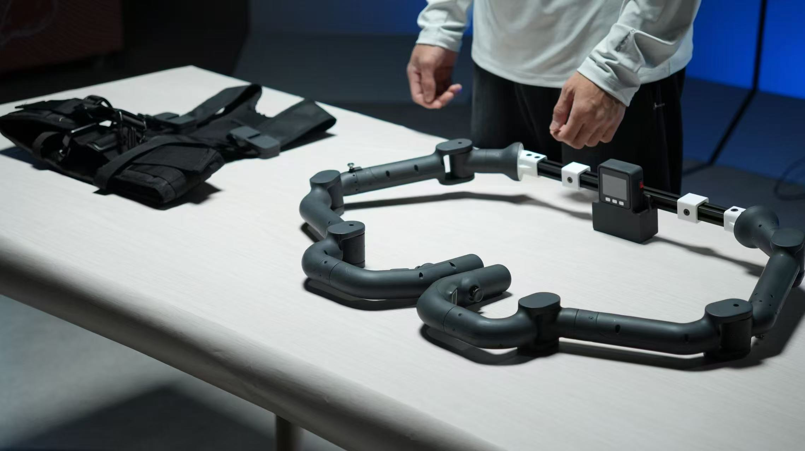
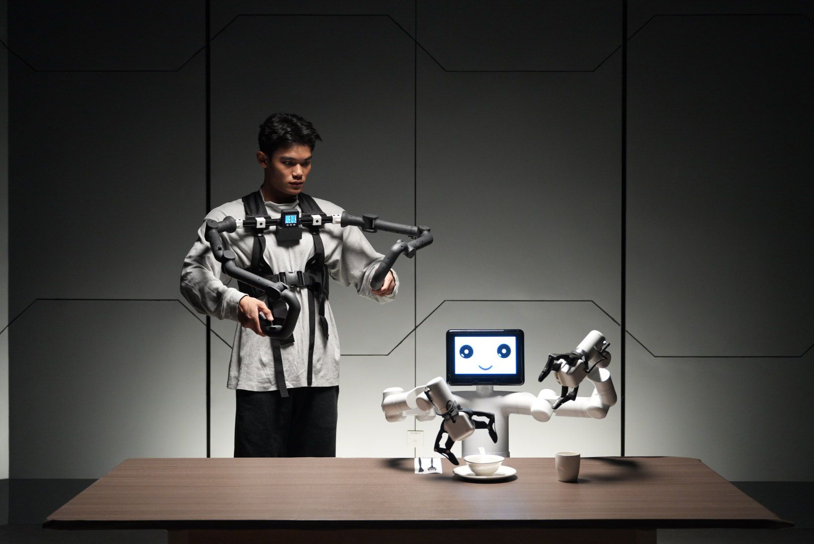

## 1. 产品概述

##### MyController S570 

 

##### 便携式穿戴，精准动作捕捉。

### 产品简介

myController S570 是大象机器人首款便携外骨骼数据采集设备，适配多类机器人，涵盖数据采集、遥操作、端到端应用开发等场景，助力研究人员与开发者，在教育培训中结合人形、轮式等机器人，拓宽教学科研实践，促进知识技能传播与掌握。

### 适用领域

科研与开发：在科研与开发方面，具备高达 100Hz 的数据采集速度，有力地保障了机器人端到端 AI 数据的收集以及动作捕捉工作的高效开展。借助数据复现与深度处理技术，能够充分满足复杂场景下机器人算法研究与开发的需求，为科研创新提供坚实的数据基石。

教育培训：在教育培训领域，其凭借可变构型的独特优势，可与 5 自由度、6 自由度、7 自由度等多种结构形态的机器人灵活结合。如此一来，便能为学生和科研人员创造极为直观的机器人控制体验，极大地助力学生快速提升对机器人的认知水平，推动机器人相关知识的普及与教育深化。

机器人遥操作：对于机器人遥操作，通过提供标准的 Python 驱动库以及 ROS 开发支持，达成了与多种机器人的无缝协作，成功实现机器人动作数据的收集以及远程遥操作控制功能。标准的数据格式与丰富的开源案例，显著降低了机器人遥控操作的门槛，即便是入门级开发者也能轻松上手，畅享机器人遥操作的便捷与乐趣。

### 产品优势
#### 极致轻盈，畅享持久体验
采用轻量化设计理念，单臂自重不足 800g，约等同于 3 部手机重量，极大减轻长时间穿戴负担，确保使用者能轻松驾驭，长时间使用无明显疲劳感。

#### 灵动随心，精准模拟人臂
具备 12 个自由度的高灵活性，可精准模拟人类手臂运动。无论是复杂的多角度动作，还是全方位的姿态变化，都能精准捕捉与遥控，为运动数据采集与分析提供强大支持。

#### 便捷交互，尽在掌握之间
末端控制装置独具匠心，双臂末端均配备握把，集成两个按钮与一个摇杆。这种设计让控制与交互变得极为直观，使用者能轻松实现各种操作指令的下达与设备状态的便捷调控。

#### 多元采集，满足数据渴求
拥有多样化的数据采集能力，通用型设计使其在数据采集领域大显身手。不仅能精准记录运动信息，还可对环境参数进行有效采集，充分满足科研与开发过程中对各类数据的多样化需求。

#### 开发无忧，助力创新升级
以开发友好性著称，全面兼容 Python 和 ROS 两大主流开发环境，无缝对接多种开发者工具。丰富的编程接口更是为各级开发者开辟了广阔的创新空间，无论是基础应用的快速搭建，还是高级应用的深度开发，都能轻松驾驭。

#### 精准感知，捕捉细微动作
内置全关节 4096 位高精度磁编码器传感器，凭借其卓越的精度，能够精准捕捉每一个细微的动作变化，并实现动作的完美复现。在动作捕捉领域树立了新的标杆，为高精度数据采集提供了坚实保障。

#### 高速采样，锁定数据精髓
具备高达 100Hz 的数据采样率，在高速运动场景下也能游刃有余。可精准捕捉瞬间的细微动作变化，确保采集到的数据完整、准确且高质量，为后续的数据分析与应用提供可靠的数据源泉。

#### 多元连接，适配多样场景
支持 USB、无线网络（OTA 固件支持）、蓝牙等多种连接方式，用户可根据不同应用场景灵活选择。无论是室内近距离的稳定连接，还是室外远程的便捷操控，都能轻松实现，极大增强了设备的应用灵活性与场景适应性。

#### 实时洞察，提升交互质感
配备 2 英寸显示屏与定制软件，能够实时反馈设备状态与数据信息。使用者无需借助外部设备，即可直观了解设备运行情况，及时调整操作策略，显著提升了用户交互体验与操作便捷性。

#### 模块构建，灵活应变需求
采用模块化设计理念，机身结构清晰明了。不仅方便后续的升级与维护工作，还能根据不同用户的个性化需求进行定制化配置。轻松应对各种复杂多变的应用场景，为用户提供量身定制的解决方案。

### 设计目标

| **设计目标**           | **功能实现**                                                                                                                                |
| ---------------------- | ------------------------------------------------------------------------------------------------------------------------------------------- |
| **通用多功能平台**     | myController S570  适用于教育、研究和商业展示等多种应用场景。其六自由度与两组 750mm 和 650mm 的臂展支持在各种工作环境中执行复杂的运动控制，如精准定位和路径规划。  |
| **科研和教育支持**     | myController S570  适合机器学习和人工智能研究，能执行高精度的实验和技术演示。它支持端到端数据训练与复现，以及基础的视觉任务，是实验室中的理想设备。 |
| **可编程性与扩展性**   | myController S570  的高度可编程性允许用户根据新兴技术自定义和编程，满足未来的技术需求，实现优化操作和实验结果。                                     |
| **技术创新与知识传播** | 在商业展示中，myController S570  可作为展示最新科技成果的平台载体，旨在提高公众对科技的理解和兴趣，推动科技创新向商业化转化。                       |

### 产品特点

| **特征描述** | **内容** |
|--------------------------|-------------------------------------------------------------------------------|
| **14 自由度模块化设计** | 灵活性与可扩展性的完美结合，适合复杂操作。 |
| **工业级数字伺服电机** | 保证机械臂的精准控制和长期稳定运行。 |
| **高精度编码器** | 提供精确的位置、速度和加速度信息，优化性能。 |
| **支持多种开发环境** | 包括 Python 和 ROS，满足不同开发需求。 |
| **支持本地化拖动示教** | 直观的学习和操作方式，不依赖外部设备。 |
| **高速数据接口** | 开放多种状态接口，支持复杂应用。 |
| **定制化嵌入式软件** | 提供用户友好的操作界面，简化复杂任务。 |
| **内置 2 寸显示屏** | 实时显示机械臂状态和操作反馈。 |
| **多连接方式支持** | 灵活的场景应用，无缝接入现有系统。 |
| **中心对称式构型** | 确保均衡稳定，提高操作精度。 |

### 产品价值

|                        |                                                                                                                 |
| ---------------------- | --------------------------------------------------------------------------------------------------------------- |
| **增强实验和研究能力** | myController S570  为研究人员提供了一个能够进行高精度操作的平台，帮助进行复杂数据分析和算法验证。                       |
| **提高教育质量**       | 在教育环境中，该设备能够提供实践操作的机会，帮助学生更好地理解理论，并培养实际操作能力。                        |
| **增加商业和展示机会** | myController S570  不仅限于实验室使用，其在技术展会和公众演示中的应用，能够吸引观众和潜在客户，增强技术展示的互动性和吸引力。 |

### 行业贡献

|                        |                                                                                                            |
| ---------------------- | ---------------------------------------------------------------------------------------------------------- |
| **促进 STEM 教育**     | 通过提供高级的教学工具，激发学生对科学、技术、工程和数学领域的兴趣，培养未来的创新者。                     |
| **推动技术采用**       | 通过提供易于使用且高度灵活的机器人平台，降低技术门槛，使更多机构能够接触和利用先进的机器人技术。           |
| **激发创新和个人发展** | 为开发者和工程师提供一个开放的平台，支持跨学科的学习和创新，为机器人技术及相关领域的未来发展培养关键人才。 |

## 2. 产品应用

 

### 用户群体

|                              |                                                                                                                                                                    |
| ---------------------------- | ------------------------------------------------------------------------------------------------------------------------------------------------------------------ |
| **高等教育机构和研究实验室** | myController S570  是专为高精度实验和技术演示而设计的教学与科研工具。它能有效支持复杂数据分析、算法开发和验证活动，显著提升研究质量和教育效果。                            |
| **技术开发者和工程师**       | 支持 Python 和 ROS 两种开发环境，myController S570  适合需要个性化编程和系统集成的专业人员。其模块化设计和高度可编程性使其成为开发和测试新控制算法或机器人应用的理想平台。 |
| **商业展示和公共展览组织者** | myController S570  以其精密操作展示优势，成为科技展示和产品演示的首选设备。动态演示不仅吸引观众，还增强参与感，有效推广科技创新和产品。                                    |
| **创新企业和初创公司**       | myController S570  为寻求集成尖端机器人技术以提升产品功能或优化生产流程的企业提供强大支持。其出色的性能和适应性使其成为探索新技术和解决方案的理想选择。              |

### 应用场景

| 用户群体               | 应用场景                                                                                       | 优势目标                                                                                                                                       |
| ---------------------- | ---------------------------------------------------------------------------------------------- | ---------------------------------------------------------------------------------------------------------------------------------------------- |
| 教育领域教师和学生     | - STEM 教育 - 机器人项目 - 跨学科研究项目 - 机器人学科教具                            | - 提高学生对科技的兴趣 - 增强动手能力和解决问题的能力 - 促进创新思维和团队合作 - 作为机器人结构设计、电路设计和力学分析等学科建设工具 |
| 技术开发者和工程师     | - 原型开发 - 实验研究 - 算法测试和验证 - 机器人运动学验证 - 机器人复合场景应用验证 | - 加速研究进展 - 连接理论与实践 - 推进技术创新 - 验证机器人运动学和复合场景应用                                                       |
| 商业演示和营销专业人士 | - 展览展示 - 技术演示 - 品牌推广                                                         | - 吸引潜在客户和投资者 - 展示公司技术实力和创新产品 - 提升品牌影响力                                                                     |
| 工程师和技术开发人员   | - 机器人运动学验证 - 机器人远程遥控场景探索和开发 - 机器学习、AI 和基于视觉任务       | - 探索和开发机器人远程遥控应用 - 扩展机器人技术应用和场景的实用性                                             |

## 3. 支持的扩展开发

|                |                                                                                                                                                                                                                                                  |
| -------------- | ------------------------------------------------------------------------------------------------------------------------------------------------------------------------------------------------------------------------------------------------ |
| **Python**     | - 提供关节角度控制、伺服电机控制、伺服电机参数配置、笛卡尔坐标系控制等接口。 - 支持更高级的运动控制和精准定位，适合进行复杂的机器人学研究和应用开发。 - 驱动库可通过 PyPI 下载安装，提供全面的接口支持，适合需求更为复杂的教育或研究项目。 |
| **ROS**        | - 支持 MoveIt 基本功能，如键盘控制和基础路径规划，提供 ROS1 和 ROS2 双版本支持。 - 通过 RVIZ 仿真环境加强实时机械臂显示和状态信息采集，适合进行更高级的机器人路径规划和操作研究。                                                             |
| **硬件接口**   | - 包括 USB 等，方便连接各种传感器和执行器。                                                                                                                                                                                                  |
| **软件库**     | - 提供丰富的开源库和 API 来简化开发过程。                                                                                                                                                                                                        |
| **系统兼容性** | - 兼容 Windows、Linux、MacOS，适应多种开发环境。                                                                                                                                                                                                 |

## 4. 购买地址

如果您有兴趣购买该设备，请点击下面的链接：  
淘宝：[https://shop504055678.taobao.com](https://shop504055678.taobao.com)  
Shopify：[https://shop.elephantrobotics.com/](https://shop.elephantrobotics.com/)  
速卖通：[https://elephantrobotics.aliexpress.com/store/1101941423](https://elephantrobotics.aliexpress.com/store/1101941423)

---
[← 上一章](../../2-ProductInformation/1-ProductIntroduction/1.1-ProductVideo.md) | 
[下一章 →](../2-ProductParameters/ProductParameters.md)