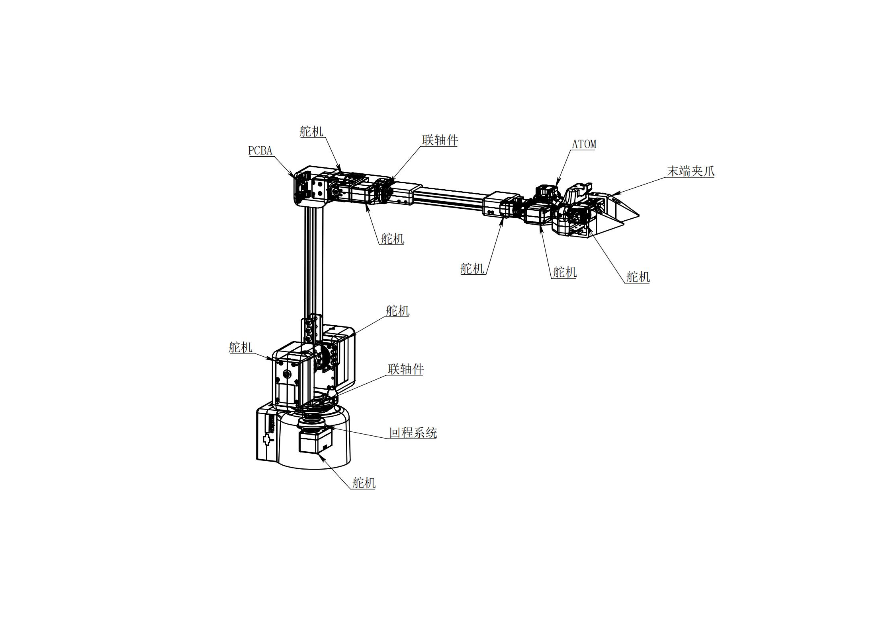
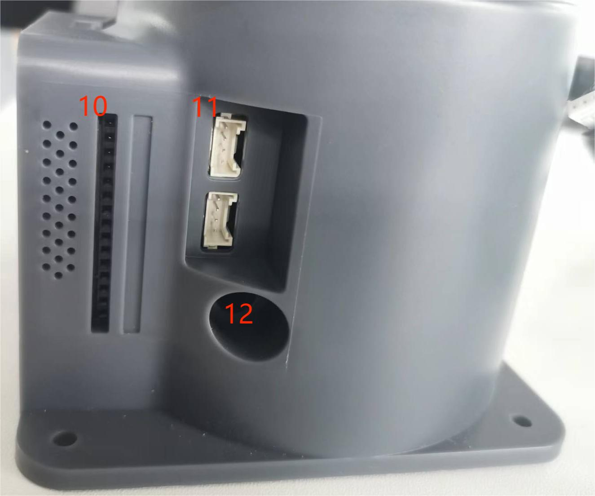

# 1. Robot Parameter Description - myArm M750

> In Chapter One, we discussed the selling points and design philosophy of the product, providing you with a panoramic view of the product's high-level understanding. Now, let's move on to Chapter Two - Robot Parameter Description. This chapter will be key to your understanding of the technical details of the product. A detailed understanding of these technical parameters will not only help you fully recognize the advanced and practical nature of our products but also ensure that you can use these technologies more effectively to meet your specific needs.

---

# 1  Product Specification Parameters
## 1.1 Machine Parameters

<!--  -->

|     Specification    |      Parameter        |
|:--------------|:-----------------|
| Model        | myArm  M750    |
|DOF           |	6+1       |
|Reach     |	750            |
|Span	         |	1500mm          |
|Weight	        |	3.2kg           |
|Power Supply       |		24V5A                |
|Repeatability	|±1mm                  |
|Accuracy        |	5 - 8mm                |
|Payload	     |	Rated 500g, Peak 1Kg      |
|Servo Quantity	   |8	                     |
|Servo Type	    |Industrial high precision digital servo motor     |
|Rotation Capability	    |+/- 180°	               |
|End Effector	   |Parallel Grip, Optional Camera Adapter       |
|USB Connection	   |Type-C	                   |
|Atom End	  |5*5 LED Matrix	            |
|Communication Frame Rate	   |>50Hz	                   |

## 1.2 Software Basic Function Support

| Feature/Development Environment | Usage |
| :------------: | :--------: |
| Joint Motion | Supported |
| Cartesian Motion | Supported |
Wireless Control  |	Supported
Emergency Stop	|  Supported
Windows	|  Supported
Linux	|  Supported
MAC	    |  Supported
ROS	    |  Supported
Python	|  Supported
MyBlockly	|  Supported
MyStudio	|  Supported
Serial Control Protocol	| Supported
     

---

# 2 Control Core Parameters

## 2.1 Main Controller Specification Table

| **Indicator** | **Parameter**                                                          |
| :------- | :---------------------------------------------------------------- |
| Main Control   | M5Stack-basic                                                     |
| Main Control Model | ESP32                                                             |
| CPU      | 240MHz dual-core   600 DMIPS、520KB SRAM  Wi-Fi、Dual-mode Bluetooth |
| Bluetooth     | 2.4G/5G                                                           |
| Wireless     | 2.4G 3D Antenna                                                   |
| Input     | IN1, IN2, IN3, IN4, IN5, IN6                                      |
| Output     | OUT1, OUT2, OUT3, OUT4, OUT5, OUT6                                |

## 2.2 Auxiliary Controller 1 Specification Table

| **Indicator**           | **Parameter**                                                        |
| :----------------- | :-------------------------------------------------------------- |
| Auxiliary Control           | Atom                                                            |
| Auxiliary Control Model       | ESP32                                                           |
| Auxiliary Controller Core Parameters | 240MHz  dual-core   600 DMIPS 520KB SRAM   Wi-Fi、Dual-mode Bluetooth |
| Auxiliary Controller Flash   | 4MB                                                             |
| LCD Display           | 2.0"@320\*240 ILI9342C IPS panel  Brightness 853nit           |
| C Type               | \*1                                                             |

## 2.3 Auxiliary Controller 2 Specification Table

| **Indicator**           | **	Parameter**                                                        |
| :----------------- | :-------------------------------------------------------------- |
| Auxiliary Control           | Pico                                                            |
| Auxiliary Control Model       | ESP32                                                           |
| Auxiliary Controller Core Parameters | 240MHz dual-core   600 DMIPS，520KB SRAM。Wi-Fi、  Dual-mode Bluetooth |
| Auxiliary Controller Flash Memory     | 4MB                                                             |
| TypeC              | \*1                                                             |

---

# 3 Structural Size Parameters

> ！This chapter uses millimeters as the unit of distance and degrees as the unit of angle.

## 3.1 Product Size and Workspace

## 3.2  Base Mounting Size

- The base needs to be installed with a flange and can be fixed to the corresponding fixed base with M6 screws.
- Before use, please confirm that the installed base can withstand 3 times the weight of the machine to prevent the product from loosening during use due to increased movement speed, which could cause product damage.

Figure 1 Base Front View

## 3.3 Arm End

- The end of the mechanical arm is compatible with Lego component holes and threaded holes.

## 3.4 Product Display

<!-- [PDF Views](<../../resources/2-ProductFeature/320%202022款技术图示(1).pdf>)  -->

## 3.5 3D Model Download

[M750 Model Download](https://download-elephantrobotics.oss-cn-shenzhen.aliyuncs.com/Product_3d_files/myArm300/%E5%A4%96%E5%8F%91_myarm%20M750.STEP)

<!-- Download link: [https://download.elephantrobotics.com/Product_3d_files/myCobot_320_M5_2022v1.2_230708.STEP](https://download.elephantrobotics.com/Product_3d_files/myCobot_320_M5_2022v1.2_230708.STEP) -->

<!-- <iframe
    src=""
    width="100%"
    height="600px"
    allowfullscreen="true"
    webkitallowfullscreen="true"
    mozallowfullscreen="true"
    frameborder="0">
</iframe> -->

---

# 4 Electrical Characteristics Parameters

## 4.1 Base Electrical Interface Overview

Figure 1 Base Front View

Figure 2 Base Left View

Figure 3 Base Right View

| No | Interface Name         | Definition       | Function             | Remarks                |
| :--- | :--------------- | :--------- | :--------------- | :------------------ |
| 1    | Type C           | Communication Interface   | Communication with PC       | For development use            |
| 2    | Screen             | Display       | Used together with buttons   |                     |
| 3    | 	Button             | 	Button A     | Used together with the display	 |                     |
| 4    |                  | Button B     |                  |                     |
| 5    |                  | Button C     |                  |                     |
| 6    | Switch             | Power Switch   | Controls the power supply to the controller | With light (light on when powered)    |
| 7    | DC/IO Interface       | GND        | GND              |                     |
|      |                  | IN6        | Digital Input Signal 1~6 | Only input in NPN mode |
|      |                  | IN5        |                  |                     |
|      |                  | IN4        |                  |                     |
|      |                  | IN3        |                  |                     |
|      |                  | IN2        |                  |                     |
|      |                  | IN1        |                  |                     |
|      |                  | 24V        | DC24V            |                     |
| 8    | Type C           | Communication Interface   | Communication with PC       | For development use            |
| 9    | Power DC Input Interface | DC24V Input | DC24V Input       |                     |
| 10   | DC/IO Interface       | 24V        | DC24V            |                     |
|      |                  | OUT1       | Digital Output Signal 1~6 | Only output in PNP mode |
|      |                  | OUT2       |                  |                     |
|      |                  | OUT3       |                  |                     |
|      |                  | OUT4       |                  |                     |
|      |                  | OUT5       |                  |                     |
|      |                  | OUT6       |                  |                     |
|      |                  | GND        | GND              |                     |
| 11   | Emergency Stop Interface         | STOP       | Emergency stop circuit interface     |                     |

#### 4.1.1 Type C: The C-type interface is used for connection and communication with personal computers and is available for developers.

#### 4.1.2 Screen: The screen is used to display the communication status of myArm and to calibrate the robot to move to the origin through a 2-inch IPS screen.

#### 4.1.3 Buttons A, B, and C are used to operate the screen in a coordinated manner.

#### 4.1.4 Power Switch: The power switch is used to control the main power input. If turned off, the controller will also be powered off.

#### 4.1.5 24V Output: Built-in DC24V is available for users.

#### 4.1.6 Digital Input/Output: Including 6 digital input signals and 6 digital output signals, used for interaction with other devices and as an important part of构成 an automated system together with other devices.

Digital Input/Output: Including 6 digital input signals and 6 digital output signals, used for interaction with other devices and as an important part of构成 an automated system together with other devices.

It should be noted that the output signals are in PNP form, and the input signals are in NPN form. Here is the external wiring diagram:

 

> PNP Link 

 

#### 4.1.7 Power DC Input Interface: The KPPX-4P R7BFDC power socket is used. The 24V 9.2A DC power adapter provided by the manufacturer can also be used to power the myCobot320.

#### 4.1.8 The emergency stop circuit terminal is connected to the emergency stop button box and can be used to control the emergency stop of the robot.

> **Note**: When using the robot, an emergency stop switch must be connected, and it is essential to ensure that the emergency stop switch circuit is always connected.

## 4.2 Robot Arm End Electrical Interface

#### 4.2.1 Robot Arm End Introduction

A. The side interface of the robot arm end is shown in Figure 2-1:：

 

 

Figure 2-1 Robot Arm End

| No. | Interface Name         | Definition       | Function             | Remarks                |
| :--- | :--------------- | :--------- | :--------------- | :------------------ |
| 9   | End IO Interface         | End Tool IO Interface	   | Interact with external devices     | For development use            |
| 10    | End Grove Interface           |       |   |                     |
| 11   | Type C Interface        |    |Can be used for communication with PC and firmware updates	  |                     |
| 12   | End Atom        | LED   | Used for 5X5 RGB LED (G27) display and button function (G39)          |
| 13   | Servo Interface     | Connect to servo      | Connect to external device servos   |                     |

#### 4.2.2 End Interface Description

A. Table 2-1 shows the definition of the end IO port.

Tag Name|	Signal Name|	Function	|Remarks
| ------ | ------ | ------------------------------- | ---- |
| 5V0    | 5V     | 5V  Power                        |      |
| GND    | GND    | Mainboard Power Ground                 |      |
| 3V3    | 3V3    | 3.3V Power                       |      |
| G22    | G22    | 3.3V-OUT-PIN Output/3.3V-INT Input |      |
| G19    | G19    | 3.3V-OUT-PIN Output/3.3V-INT Input |      |
| G23    | G23    | 3.3V-OUT-PIN Output/3.3V-INT Input |      |
| G33    | G33    | 3.3V-OUT-PIN Output/3.3V-INT Input |      |

​ Table 2-1 End IO Port

B. End Grove Interface: Grove Interface 4 is defined as shown in Figure 2-2.

 

> Figure 2-2 End Grove Interface

C. Type C Interface: Can be used for communication with PC and firmware updates.

D. Atom：Used for 5X5 RGB LED (G27) display and button function (G39).

E. Servo Interface: Used for end expansion grippers, currently supports the use of matching adaptive grippers.

# 5 Cartesian Coordinate System

## 5.1 Joint Coordinate System
The joint coordinate system is based on the rotating joints of the robot arm. The white dashed lines in the figure below represent the rotation axes of each joint, the red arrows indicate the rotation direction of the joints, and q1~q6 represent the 1st to 6th joint coordinate systems
 

## 5.2 Base Coordinate System

The base coordinate system is fixed at the base of the robot arm. Its origin and axis direction are determined during the kinematic algorithm modeling. Generally, the origin is set at the center point of the base.

 

 ## 5.3 Tool Coordinate System

The tool coordinate system is a coordinate system fixed at the end of the robotic arm, and its origin and coordinate axis direction are determined during the modeling of the kinematic algorithm, and the origin is generally determined at the center point of the flange at the end of the robotic arm.

 

 ## 5.4 Kinematic Model
The figure below shows the kinematic model of the robot arm, with the indicated position being the zero point of the algorithm model
 
 
 ### 5.4.1 Zero Position Calibration
在运动学模型中，实际的零点在2、3关节上存在一些偏置，考虑到校准的方便，用户使用零位校准时对齐刻度线即可，无需对齐模型上的实际零点。
 
 
 ### 5.4.2 MDH Parameters
DH parameters are used to describe the relative relationship between adjacent links:

- a_i: Distance along x_i: from z_i to z_i+1

- alpha_i：Rotation around x_i: from z_i to z_i+1

- d_i: Distance along z_i: from x_i-1 to x_i

- θ_i: Rotation around z_i: from x_i-1 to x_i

<!-- Here is an article to refer to
[https://blog.csdn.net/hitgavin/article/details/104442034](https://blog.csdn.net/hitgavin/article/details/104442034)  -->

 ### 5.4.3 MDH Parameter List

| Joint | theta   | d     | a_i-1 |alpha_i-1 | offset |
| :--- | :------ | :---- | :---  | :----    | :----- |
| 1    | theta_1 | 173.9 | 0     | 0        | 0      |
| 2    | theta_2 | 0     | 0     | -PI/2    | -PI/2  |
| 3    | theta_3 | 0     |308.315| 0        | 0      |
| 4    | theta_4 | 327.9 | 0     | -PI/2    | 0      |
| 5    | theta_5 | 0     | 0     | PI/2     | 0      |
| 6    | theta_6 | 207   | 0     | -PI/2    | PI     |

 ### 5.4.4 Joint Limit
| Joint | Min   | Max  |
| :---  | :---- | :----|
| 1     | -165  | 165  |
| 2     | -80   | 100  |
| 3     | -100  | 80   |
| 4     | -160  | 160  |
| 5     | -90   | 120  |
| 6     | -180  | 180  |

# 2. Robot Parameter Description - MyArm C650

> In Chapter One, we discussed the selling points and design philosophy of the product, providing you with a panoramic view of the product's high-level understanding. Now, let's move on to Chapter Two - Robot Parameter Description. This chapter will be key to your understanding of the technical details of the product. A detailed understanding of these technical parameters will not only help you fully recognize the advanced and practical nature of our products but also ensure that you can use these technologies more effectively to meet your specific needs.

## 1.Robot Specification Parameters

<!--  -->

| Specification | Parameter                |
| :----------- | :------------------ |
| DOF          | 6+1                 |
| Reach        | 650                 |
| Span         | 1300mm              |
| Weight       | 1.8kg               |
| Power Supply | 12V5A               |
| Repeatability | ±1mm                |
| Accuracy       | 5 - 8mm             |
| Payload     | -                   |
| Servo Quantity     | 8                   |
| Servo Type     | High Precision Digital Servo Motor  |
| Rotation Capability     | +/- 180°            |
| End Effector   | Dual Finger Remote Control + Dual Button Control |
| USB Connection     | Type-C              |
| Atom End    | 5\*5 LED Matrix     |
| Communication Frame Rate     | >50Hz               |

## 2.Control Core Parameters

### Main Controller Specification Table

| **Indicator** | **Parameter**                                                          |
| :------- | :---------------------------------------------------------------- |
| **Main Control**   | M5Stack-basic                                                     |
| **Main Control Model** | ESP32                                                             |
| **CPU**      | 240MHz dual-core.   600 DMIPS、520KB SRAM。  Wi-Fi、Dual-mode Bluetooth |
| **Bluetooth**     | 2.4G/5G                                                           |
| **Wireless**     | 2.4G 3D Antenna                                                   |
| **Input**     | 1, 2, 3, 5, 18, 19, 21, 22, 23, 25, 26, 35, 36                    |
| **Output**     | Shared with input                                                        |
| **LCD  Display**         | 2.0" @ 320*240 ILI9342C IPS panel, maximum brightness 853nit         |
| **Physical Buttons**           | 

### Auxiliary Controller Specification Table

| **Indicator** |**Parameters**                                                        |
| :----------------- | :-------------------------------------------------------------- |
| **Auxiliary Control**            | Atom                                                            |
| **Auxiliary Control Model**        | ESP32                                                           |
| **Auxiliary Controller Core Parameters**  | 240MHz dual-core.  600 DMIPS，520KB SRAM。  Wi-Fi、Dual-mode Bluetooth |
| **Auxiliary Controller Flash Memory**    | 4MB                                                             |
| **LED Matrix**         | 5*5 LED matrix                                         |
| **LCD Display**           | 2.0"@320\*240 ILI9342C IPS panel，  Maximum brightness 853nit           |
| **C Type**                | \*1                                                             |
| **Auxiliary Control Extended IO**      | G19, G21, G22, G23, G25, G33                          |
|

---

## 3. Structural Size Parameters尺寸参数

> ！This chapter uses millimeters as the unit of distance and degrees as the unit of angle.

### Product Size and Workspace

### Base Mounting Size

- The base needs to be installed with a flange and can be fixed to the corresponding fixed base with M6 screws.
- Before use, please confirm that the installed base can withstand 3 times the weight of the machine to prevent the product from loosening during use due to increased movement speed, which could cause product damage.

Figure 1 Base Front View

### Arm End

- The end of the mechanical arm is compatible with Lego component holes and threaded holes.

### Product Display

<!-- [PDF Views](<../../resources/2-ProductFeature/320%202022款技术图示(1).pdf>) -->

### 3D Model Download

[C650Model Download](https://download-elephantrobotics.oss-cn-shenzhen.aliyuncs.com/Product_3d_files/myArm300/%E5%A4%96%E5%8F%91_myarm%20C650.STEP)

<!-- Download link: [https://download.elephantrobotics.com/Product_3d_files/myCobot_320_M5_2022v1.2_230708.STEP](https://download.elephantrobotics.com/Product_3d_files/myCobot_320_M5_2022v1.2_230708.STEP) -->

<!-- <iframe
    src=""
    width="100%"
    height="600px"
    allowfullscreen="true"
    webkitallowfullscreen="true"
    mozallowfullscreen="true"
    frameborder="0">
</iframe> -->

# 4.Electrical Characteristics Parameters

## Base Electrical Interface Overview

  
Figure 4.1 Base Front View

  
Figure 4.2 Base Left View

  
Figure 4.3 Base Right View

| No. | Interface Name         | Definition       | Function             | Remarks                |
| :--- | :--------------- | :--------- | :--------------- | :------------------ |
|  1 |      Functional Interface Group One      | I/O Interface  |   GPIO Pins   |           |
| 2    | 	Screen             | Display	       | Used together with buttons   |                     |
| 3    | Button             | Button A     | Used together with the display |                     |
| 4    |                  | Button B     |                  |                     |
| 5    |                  | Button C     |                  |     |
 |6   |       Functional Interface Group Two        |  I/OInterface  | GPIO Pins |    |
|7    | Reset Button            | 	System Reset	   | Resets the main controller    | |
| 8   | Type C Interface        |    |Can be used for communication with PC and firmware updates	  |                     |
| 9  |  Grove Interface 1           |       |   |                     |
|10   | Functional Interface Group Three	            |  I/OInterface  |   GPIOPins  | |
| 11  |   Grove Interface 2   |    ||                     |
|   |   Grove Interface 3   |    ||                     |
|12   |Power DC Input Interface | DC24V Input | DC24V Input       |                     |

#### A.Functional Interface Group One interface definitions are as follows:
| Label	  |  Type  |  Function  | Remarks |               
| :--- | :--------------- | :--------- | :--------------- | 
|  18 |    I/O     |   GPIO18   |  Not available when using TF card   |
|  19 |    I/O     |   GPIO19   |  Not available when using TF card   | 
|  23 |    I/O     |   GPIO23   |  Not available when using TF card   | 
|  22 |    I/O     |   GPIO22   |   |              
|  21 |    I/O     |   GPIO21   |   |   
|  GND|   P    |   GND  |   |   
|  3V3|    P    |   GPIO22   |   |   
|  5V |    P    |   DC 5V   |   |   

#### B.Functional Interface Group Two and Functional Group Three interfaces are consistent, with the following definitions:
| Label	  |  Type  |  Function  | Remarks |                 
| :--- | :--------------- | :--------- | :--------------- | 
|  3 |    I/O     |   GPIO3   |  Not available when using TypeC or Grover 3   |
|  1 |    I/O     |   GPIO1   | Not available when using TypeC or Grover 3  | 
|  16 |    I/O     |   GPIO16   |  Not supported  | 
|  17 |    I/O     |   GPIO17   |  Not supported |              
|  2 |    I/O     |   GPIO2   |   |   
|  5 |    I/O     |   GPIO5   |     |
|  25 |    I/O     |   GPIO25   | Not supported  | 
|  26 |    I/O     |   GPIO26   |  Not available when using Grover 2  | 
|  35 |    I/O     |   GPIO35   |  Not supported |              
|  36 |    I/O     |   GPIO36   | Not available when using Grover 2  |  
|  RST|  -    |  Controller reset  |  Not supported |   
|  BAT|  -    |  	BTTERY  |  Not supported | 
|  3V3|    P    |   GPIO22   |   |  
|  5V |    P    |   DC 5V   |   | 
|  GND|   P    |   GND  |   |   
 

> **注意**: I/O:The function signal includes both input and output combinations.

#### C.Grover Interface: Grover interface definitions are as follows:

  
图 4.4 Grover接口1定义图

  
图 4.5 Grover接口2定义图

  
图 4.6 Grover接口3定义图

#### D.Screen: The screen is used to display the communication status of myArm and to calibrate the robot to move to the origin through a 2-inch IPS screen.

#### E.Buttons A, B, and C are used to operate the screen in a coordinated manner.

#### F. Reset Button: Used to reset the main control system.

#### G.Type C: The C-type interface is used for connection and communication with personal computers and is available for developers.

## Robot Arm End Electrical Interface

#### 1. Robot Arm End Introduction

A. The side interface of the robot arm end is shown in Figure 2-1:

 

 

Figure 2-1 Robot Arm End

| No. | Interface Name         | Definition       | Function   |  Remarks|                       
| :--- | :--------------- | :--------- | :--------------- | :------------------ |
| 13   | End Atom        | LED   | Used for 5X5 RGB LED (G27) display and button function (G39)	          | |
| 14   | Type C Interface        |    |Can be used for communication with PC and firmware updates	  |                     |
| 15    | End Grove Interface           |       |   |  |
| 16  | End IO Interface         | End Tool IO Interface	   | Interact with external devices     | For development use            |   
| 17  | Servo Interface	| Connect to servo	|Connect to external device serv                        |

#### 2.End Interface Description

A. The table below defines the end IO ports.

| Tag Name | Signal Name	|Function	|Remarks|
| ------ | ------ | ------------------------------- | ---- |
| 5V0    | 5V     | 5V Power                         |      |
| GND    | GND    | Ground                  |      |
| 3V3    | 3V3    | 3.3V Power                       |      |
| G22    | G22    | 3.3V-OUT-PIN Output/3.3V-INT Input |      |
| G19    | G19    | 3.3V-OUT-PIN Output/3.3V-INT Input |      |
| G23    | G23    | 3.3V-OUT-PIN Output/3.3V-INT Input |      |
| G33    | G33    | 3.3V-OUT-PIN Output/3.3V-INT Input |      |

B. End Grove Interface: Grove Interface 4 is defined as shown in the figure.

 

> 

C. Type C Interface: Can be used for communication with PC and firmware updates.

D. Atom: Used for 5X5 RGB LED (G27) display and button function (G39).

E. Servo Interface: Used for end expansion grippers, currently supports the use of matching adaptive grippers.
---

# 5 Cartesian Coordinate System

## 5.1 Joint Coordinate System
The joint coordinate system is based on the rotating joints of the robotic arm. The white dashed lines in the figure below represent the rotation axes of each joint, the red arrows indicate the rotation direction of the joints, and q1~q6 represent the 1st to 6th joint coordinate systems.
 

## 5.2 Base Coordinate System

The base coordinate system is fixed at the base of the robotic arm. Its origin and axis direction are determined during kinematic algorithm modeling, and the origin is generally set at the center point of the base.

 

 ## 5.3 Tool Coordinate System

The tool coordinate system is fixed at the end of the robotic arm. Its origin and axis direction are determined during kinematic algorithm modeling, and the origin is generally set at the center point of the法兰盘 at the end of the robotic arm.

 

 ## 5.4 Kinematic Model
The figure below shows the kinematic model of the robotic arm, with the indicated position being the zero point of the algorithm model.
 
 
 ### 5.4.1 Zero Position Calibration
In the kinematic model, the actual zero point has some offset on joints 2 and 3. For ease of calibration, users can align the scale line when calibrating to zero, without needing to align with the actual zero point on the model.
 

 

 ### 5.4.2 MDH Parameters

DH parameters are used to describe the relative relationship between adjacent links:

- a_i: Distance along x_i: from z_i to z_i+1

- alpha_i: Rotation around x_i: from z_i to z_i+1

- d_i: Distance along z_i: from x_i-1 to x_i

- θ_i: Rotation around z_i: from x_i-1 to x_i

 ### 5.4.3 MDH Parameter List 

 | Joint | alpha_i-1 | a_i-1    | d     | theta   | offset |
| :--- | :---- | :--- | :---- | :------ | :----- |
| 1    | 0     | 0    | 154 | theta_1 | 0      |
| 2    | -PI/2  | 0    | 0     | theta_2 | -PI/2  |
| 3    | 0     | 308.3 | 0     | theta_3 | 0      |
| 4    | -PI/2     | 0 |327.9    | theta_4 | 0  |
| 5    | PI/2  | 0    | 0 | theta_5 | 0      |
| 6    | -PI/2 | 0    | 131.3  | theta_6 | PI      |

# 3、Robot Parameter Description--TRACER
 
## 3.1 Robot Dimension Parameters

| Parameter Name   | Parameter Value |  
| :--- | :--- | 
| Robot Height | 685 |
| Robot Width | 570 |
| Robot Length | 155 |
| Curb Weight   | 28~30 | 
| Wheelbase | 360 |
| Battery Type | Lithium Battery 24V 15Ah | 
| Battery Parameters | DC Brushless | 
| Motor | 2 X 150W | 
| Parking Type | Servo Brake/Safety Edge | 
| Steering Type | Differential Steering | 
| Motor Sensor | Photoelectric 1024 | 
| Protection Level | IP22 | 
| Maximum Speed（m/s） | 1.8 | 
| Minimum Turning Radius（mm） | On-the-spot Turn | 
| Maximum Climbing Ability（°） | 8° |
| Ground Clearance（mm） | 30 | 
| Maximum Endurance Time（h） | 8 | 
| Maximum Range(km) | 40km | 
| Charging Time（h） | 2h | 
| Operating Temperature（℃） | -10 ~ 40°C | 
| Control Mode | Remote Control/Command Control Mode | 
| Remote Controller | 2.4G/Maximum Distance 200M | 
| Communication Interface | CAN | 

### For specific parameters, please refer to the
[User Manual](https://agilexsupport.yuque.com/staff-hso6mo/ttpor0/rto97he0o03b0rpm)

---

[← Previous Chapter ](../1-ProductIntroduction/1-ProductIntroduction.md) | [Next Chapter →](../../3-BasicSettings/3-UserInstructions/UserInstructions.md)

