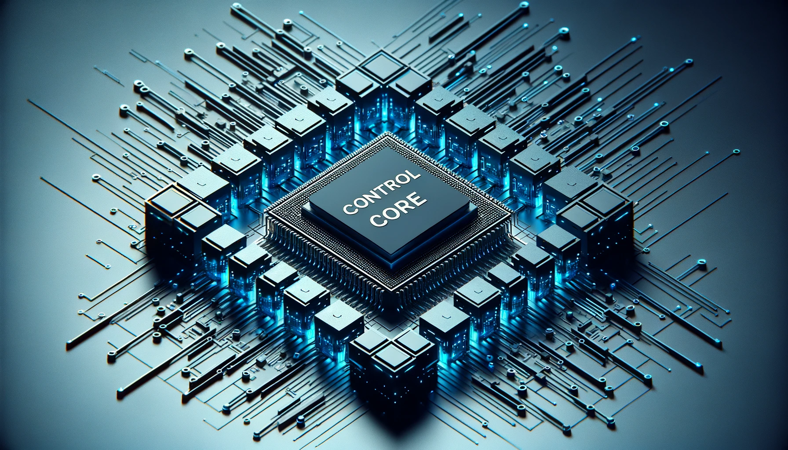

# I. Robot Parameter Description -- MyController S570

> In the first chapter, we explored the product's selling points and design concepts, providing you with a panoramic view for a high-level understanding of the product. Now, let's move on to Chapter 2 — Robot Parameter Description. This chapter will be key to understanding the technical details of the product. By understanding these technical parameters in detail, you will not only appreciate the advanced and practical nature of our product but also be able to effectively use these technologies to meet your specific needs.

---

# 1 Product Specifications

## 1.1 Robot Parameters

<!--  -->

| Specification   | Parameter       |
|:----------------|:----------------|
| Model          | MyController S570 |
| DOF            | 12 (6+6)         |
| Horizontal Extension Range | 570 |
| Total Span     | 1500mm           |
| Weight         | 1.5kg            |
| Power Specification | 8.4V2A      |
| Rotation Ability | +/- 180°        |
| End Effector   | Dual-finger control + dual-button control |
| USB Connection | Type-C           |
| Atom End       | 5*5 LED matrix   |
| Communication Frame Rate | Up to 100Hz |

## 1.2 Basic Software Functionality Support

| Function/Development Environment | Availability |
| :-------------------------------- | :----------- |
| USB Control                        | Supported    |
| Wireless Control                   | Supported    |
| Windows                            | Supported    |
| Linux                              | Supported    |
| MAC                                | Supported    |
| ROS                                | Supported    |
| Python                             | Supported    |

---

# 2 Core Control Parameters

## 2.1 Main Controller Specifications

| **Indicator** | **Parameter**                                                      |
| :------------ | :---------------------------------------------------------------- |
| Main Control  | M5Stack-basic                                                     |
| Main Control Model | ESP32                                                         |
| CPU           | 240MHz Dual-core.   600 DMIPS, 520KB SRAM.   Wi-Fi, dual-mode Bluetooth |
| Bluetooth     | 2.4G/5G                                                           |
| Wireless      | 2.4G 3D Antenna                                                   |
| Inputs        | IN1, IN2, IN3, IN4, IN5, IN6                                      |
| Outputs       | OUT1, OUT2, OUT3, OUT4, OUT5, OUT6                                |

## 2.2 Auxiliary Controller

| **Indicator**     | **Parameter**                                                   |
| :---------------- | :------------------------------------------------------------- |
| Auxiliary Control  | Atom                                                           |
| Auxiliary Control Model | ESP32*2                                                      |
| Auxiliary Controller Core Parameters | 240MHz Dual-core.   600 DMIPS, 520KB SRAM.   Wi-Fi, dual-mode Bluetooth |
| Auxiliary Controller Flash | 4MB                                                           |
| LCD Display        | 2.0"@320*240 ILI9342C IPS Panel,   Max Brightness 853nit    |
| Type C             | *1                                                              |

#### 2.3 Programming Ports

| Label              | Function                  | Notes |
| ------------------ | ------------------------- | ----- |
| Current Position   | Read                      |       |
| Current Speed      | Read                      |       |
| Current Acceleration | Read                     |       |
| Button Status      | Read                      |       |
| 4-Directional Sensor Status | Read               |       |
| Gyroscope Data     | Read                      |       |
| LED Light Color    | Read/Write                |       |

#### 2.4 Related Documentation Support

| Label              | Function                  | Notes |
| ------------------ | ------------------------- | ----- |
| 3D-Step            | Supported                 |       |
| 2D Specifications  | Supported                 |       |

---

[← Previous Chapter](../1-ProductIntroduction/1-ProductIntroduction.md) | [Next Chapter →](../../4-FunctionsAndApplications/6-SDKDevelopment/6.1-S570/Wayofwearing.md)
