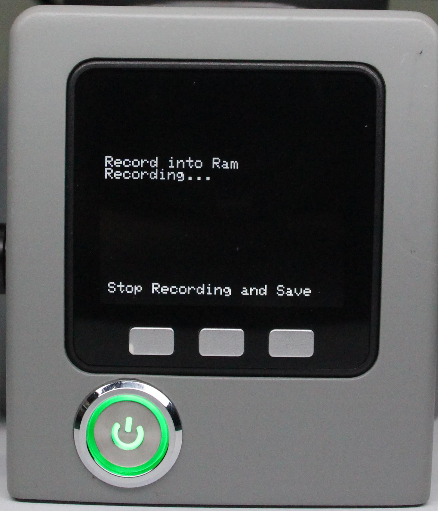

# 拖动示教

机器人拖动示教是指操作者可以直接拖动机器人的关节，使其做出理想的姿势，然后进行相应的记录。

cobot 是较早具备这一功能的系统。这种示教方式避免了传统示教的各种弊端，是机器人应用的一项前瞻性技术。

在本章中，我们将教你如何轻松上手，体验 cobot 拖动教学的乐趣。

它们的大致步骤如下：

**Step 1**:选中Maincontrol点击OK进入拖动示教界面。

**Step 2**: 按下录制按钮Record。

**Step 3**: 选择储存路径，按下Ram。

**Step 4**: 拖动机械臂各关节，移动至您预想的位置，完成一组运动。

**Step 5**: 按下任意键停止录制，保存记录。

**Step 6**: 按下播放按钮Play。

**Step 7**: 按下Ram，机械臂开始播放已保存的记录。

**Step 8**: 按下Pause可暂停运动，按下Stop可停止运动，按下Play可恢复运动。

**Step 9**: 点击Exit退出此功能。

---

[← 上一页](./5.1.1-MinirobotGuide.md) | [下一页 →](./5.1.3-calibrate.md)