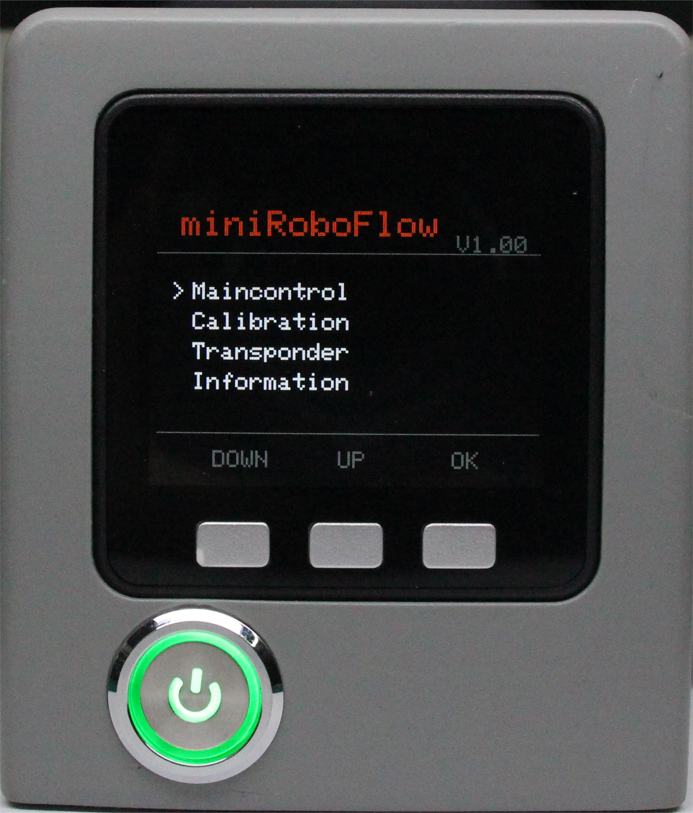

# 零位校准

默认机器人交付前已执行过此操作。无需重复操作。错误使用此功能可能会损坏机器人。如果您的机器人在无异常情况下工作，**请勿使用**。感谢您的合作。

校准机械臂是精确控制机械臂的前提，而设置关节零点和初始化电机电位则是后续高级开发的基本工作。

在本章中，我们将教您如何校准机械臂以及测试和验证关节。

**Step 1**: 选中Calibration，点击OK进入零位校准界面。

**Step 2**: 按下A键 ，开始校准机械臂。

**Step 3**: 首先拖动机械臂使一号关节到达零位状态（零位刻度线对齐）。

**Step 4**: 按照屏幕提示的关节序号(1-7),拖动机械臂使每个关节到达零位（零位刻度线对齐）。

**Step 5**: 依次按下NEXT，进入下一个电机校准，直至出现Already Calibrate all!! ，即完成校准。

**Step 6**: 按下EXIT ,可退出校准。

**Step 7**: 按下B键，测试机械臂各关节零位,此时机械臂会在各关节零位附近进行小幅度的运动。只有在完成零位校准后，才能使用test测试各关节。

**Step 8**: 按下C键，退出此功能。

---

[← 上一页](./5.1.2-maincontrol.md) | [下一页 →](./5.1.4-transponder.md)