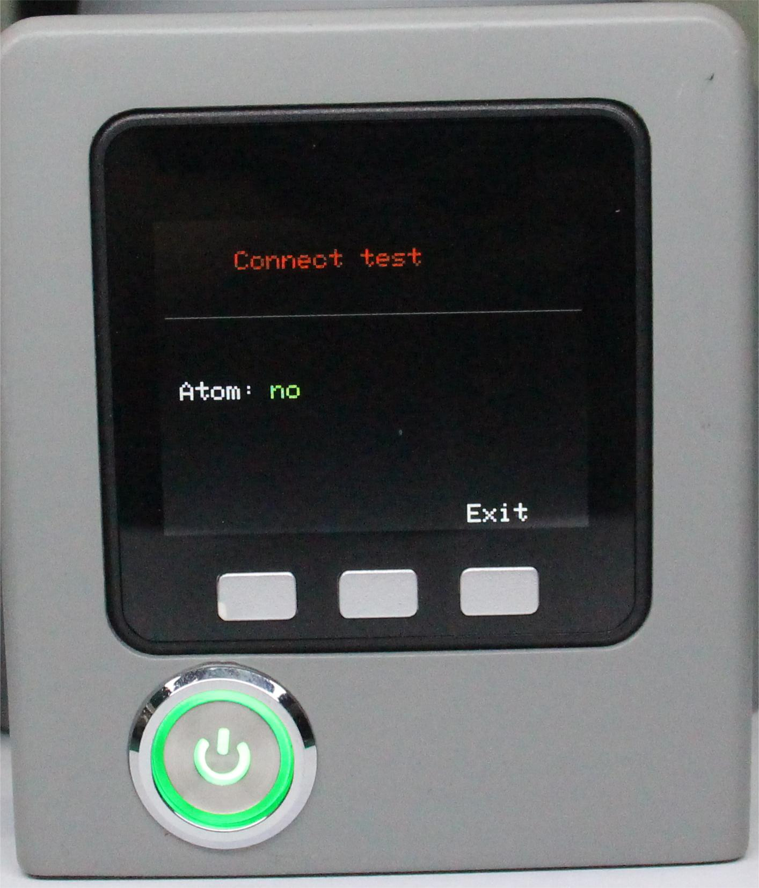
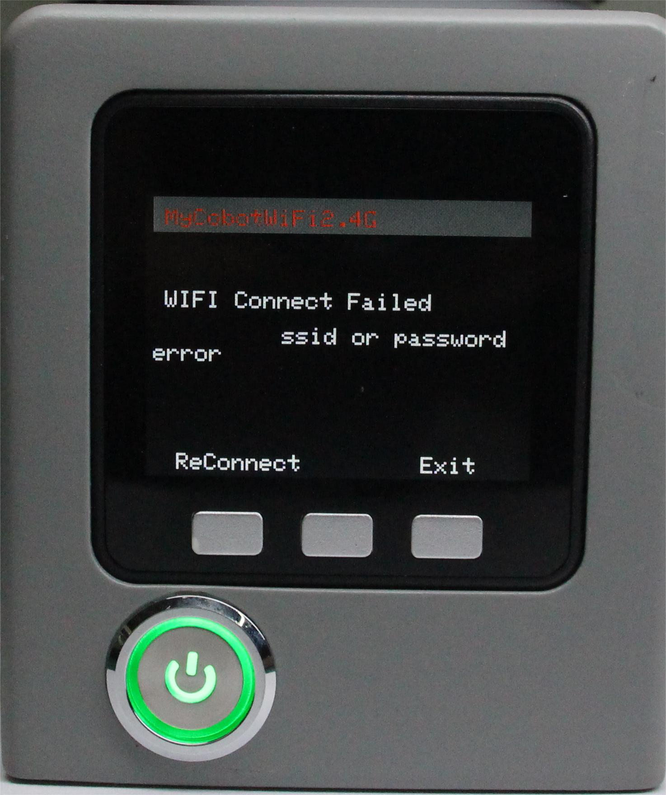

# 通信转发

本章介绍如何使用内置软件的扩展开发功能。该功能允许您扩展设备的连接选项，并支持不同的开发环境和方法。

目前，通信转发支持三种连接方式：USB、Wi-Fi 和蓝牙。它们适用于不同的功能开发场景。

- USB 和 Wi-Fi 用于连接其他主控设备，通过机器人通信协议，可以控制机器人执行相应命令。
- 蓝牙用于连接移动控制软件，可通过手机实现快速移动控制。

**Step 1**: 确认Type-C正确连接你的设备，选中Transponder点击OK进入通信转发界面。

**Step 2**: 使用串口连接，选中USB UART点击OK进入串口界面。串口界面检测Atom的连接(ok表示连接正常，否则显示no)。

**Step 3**: 使用WiFi连接，需要将WiFi名称设置为：MyCobotWiFi2.4G，密码设置为：mycobot123。选中WiFi点击OK自动搜索WiFi并连接。

**Step 4**: 点击Exit退出此功能。

---

[← 上一页](./5.1.3-calibrate.md) | [下一页 →](./5.1.5-information.md)