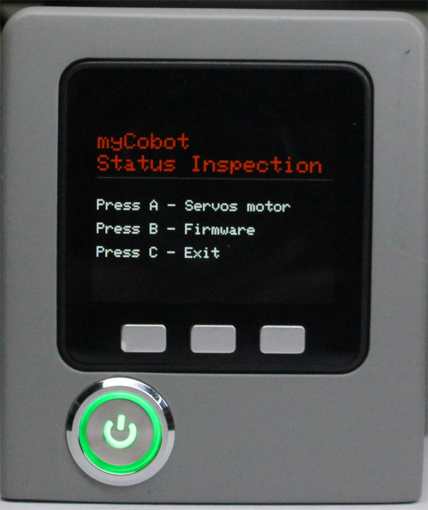
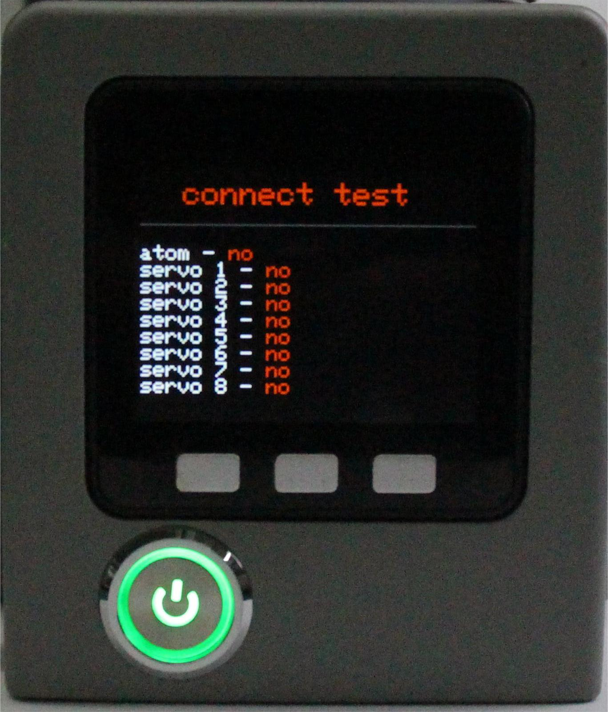
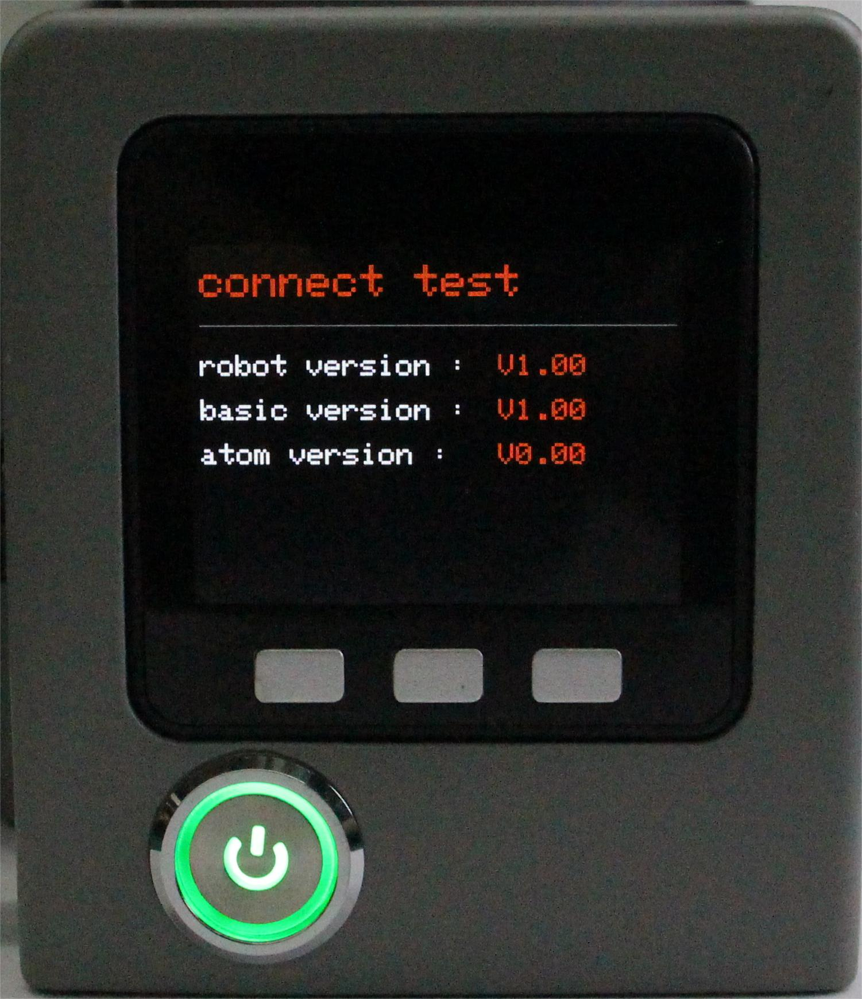

# 状态信息

本章介绍如何使用基本软件检查设备状态。使用前请确保设备的软件版本和固件版本均保持不变（出厂默认版本）。如果您对软件或固件进行了任何修改，请确保您的操作符合本章中列出的要求。

目前，支持查看的信息分为电机连接状态以及机械臂内置固件版本号。

**Step 1**: 选中Information点击OK进入状态信息界面。

**Step 2**: 按下A键，开始连接检测。屏幕显示Atom以及电机连接状态。

**Step 3**: 按下B键，开始检测版本信息，屏幕显示固件版本。

**Step 4**: 按下C键，退出此功能。

---

[← 上一页](./5.1.4-transponder.md) | [下一页 →](./5.1.6-flash.md)