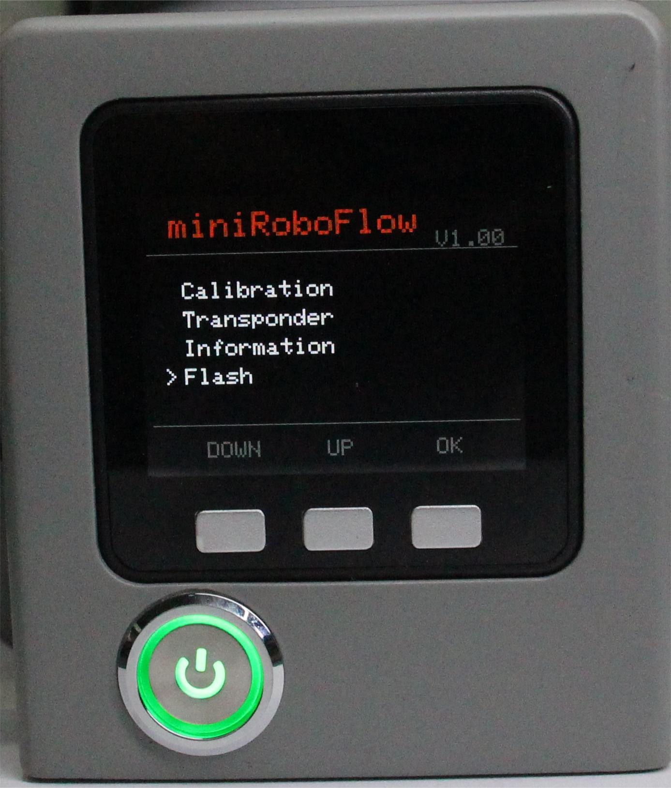
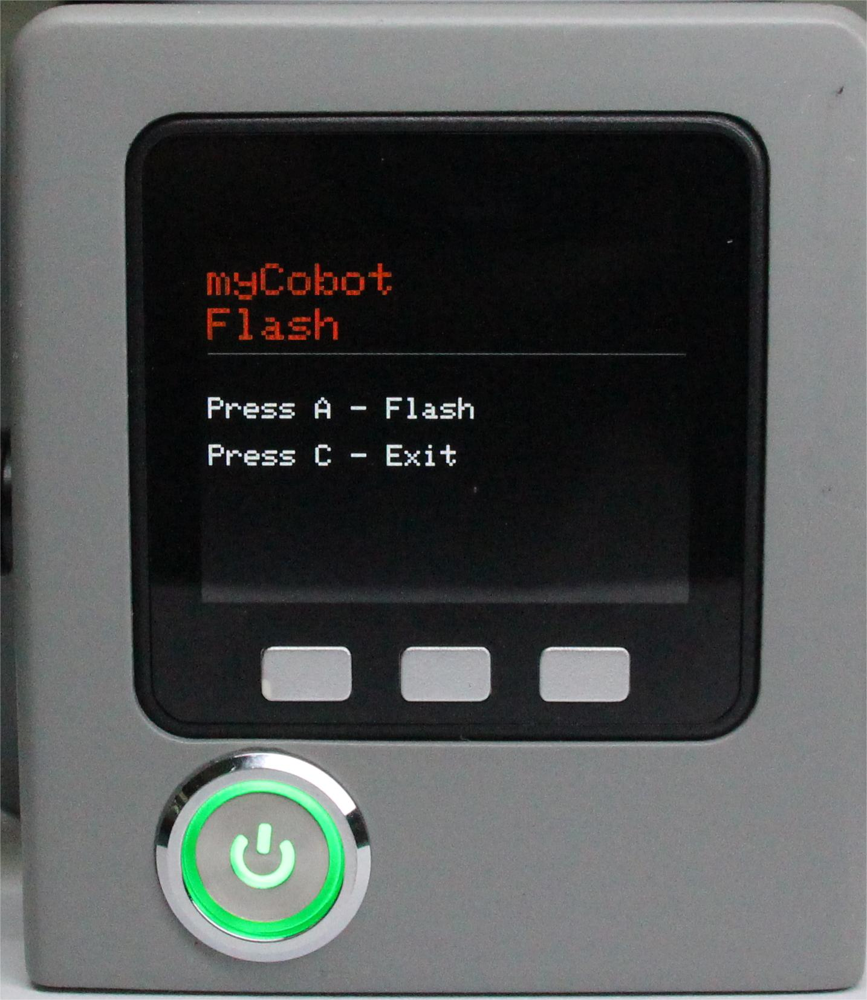

# 烧录

本章介绍如何使用内置软件的烧录功能，主要用于更新固件版本。

**Step 1**: 选中Flash点击OK进入烧录界面。

**Step 2**: 按下A键，准备烧录。机器会在一段时间内重启，在此时间内烧录pico固件，注意在Flash按下的时候开始进行pico固件烧录。

**Step 3**: 按下C键，退出此功能。

---

[← 上一页](./5.1.5-information.md) | [下一节 →](../5.2-C650-Minirobot/README.md)