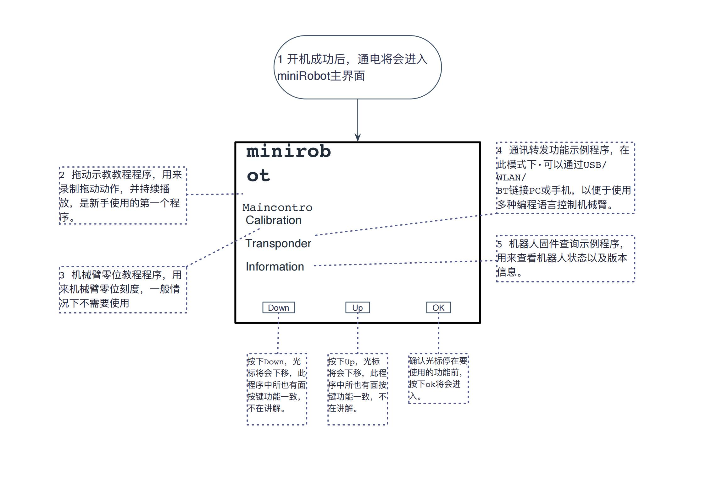

# 出厂固件介绍

MyArm M750 版本内置由 Elephant Robotics 独立开发的 miniRoboflow 应用软件。通过简单的按钮交互，即可实现拖动示教、通信转发、状态检查和零点校准等功能。

内置软件的用户界面简单明了，易于使用。通过通信转发功能，您可以使用各种编程语言和开发环境控制机器人，从而轻松实现机器人控制。

## miniRoboFlow

**miniRoboFlow** 它有六个主要章节：

- [**使用指南**](5.1.1-MinirobotGuide.md)
  - Minirobot 是一款通过结合机械臂底座的 3 个按键以及屏幕显示对 MyArm 机械臂进行控制的应用。它的功能有拖动示教、通信转发、零位校准、状态信息等），便于操作人员与大象机器人进行交互，正确使用大象机器人。
- [**拖动示教**](5.1.2-maincontrol.md)
  - 机器人拖动示教：操作者可以直接拖动机器人关节，使其做出理想的姿势，然后通过\*\*按钮操作将动作保存在机器人中。cobot 是较早具备这一功能的系统。这种示教方式避免了传统示教的各种弊端，具有广阔的发展前景。  
    这种示教方式避免了传统示教方式的各种弊端，是机器人应用的一项前瞻性技术。
- [**零位校准**](5.1.3-calibrate.md)
  - 校准机械臂是精确控制机械臂的前提，而设置关节零点和初始化电机电位则是后续高级开发的基本工作。
- [**通信转发**](5.1.4-transponder.md)
  - 对于微控制器机械臂来说，通信的及时性至关重要。对于这类机械臂，我们经常向底部的**M5Stack-basic**发送控制指令。通过通信转发，终端执行器对指令进行分析，然后执行目标动作。目前，**MyArm M750**有三种通信方式： **串口、蓝牙和 WIFI**。
- [**状态信息**](5.1.5-information.md)
  - 链接测试是一种检测功能，利用机械臂中的电机和**Atom**的连接状态进行检测。通过该功能，用户可以轻松排除设备故障。在链接测试过程中，可以看到机械臂设备的连接状态，包括**伺服器的连接**和 **Atom 的通信状态**。在微控制器设备中，M5Stack-basic 会显示其当前固件的版本。
- [**烧录功能**](5.1.6-flash.md)
  - 介绍如何使用内置软件的烧录功能，主要用于更新固件版本。

---

[← 上一页](../README.md) | [下一节 →](../5.2-C650-Minirobot/README.md)