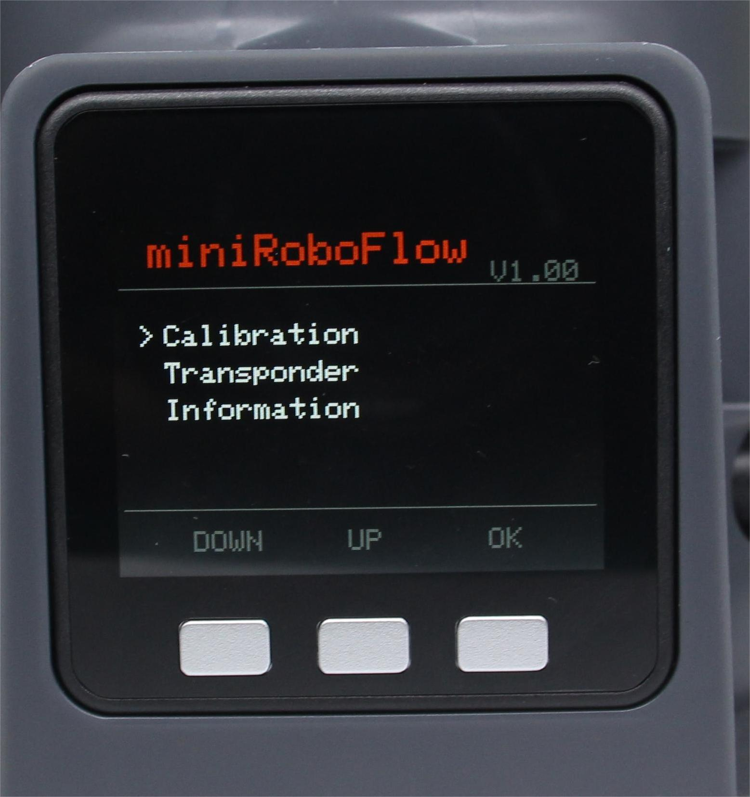
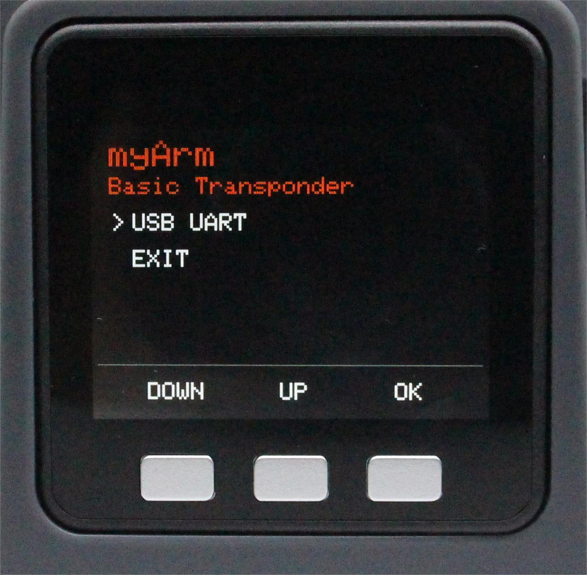

# 通信转发

本章介绍如何使用内置软件的扩展开发功能。该功能允许您扩展设备的连接选项，并支持不同的开发环境和方法。

目前，通信转发仅支持USB通信。

**Step 1**: 确认Type-C正确连接你的设备，选中Transponder点击OK进入通信转发界面。

**Step 2**: 使用串口连接，选中USB UART点击OK进入串口界面。串口界面检测Atom的连接(ok表示连接正常，否则显示no)。

**Step 3**: 点击Exit退出此功能。

---

[← 上一页](./5.2.2-calibrate.md) | [下一页 →](./5.2.4-information.md)