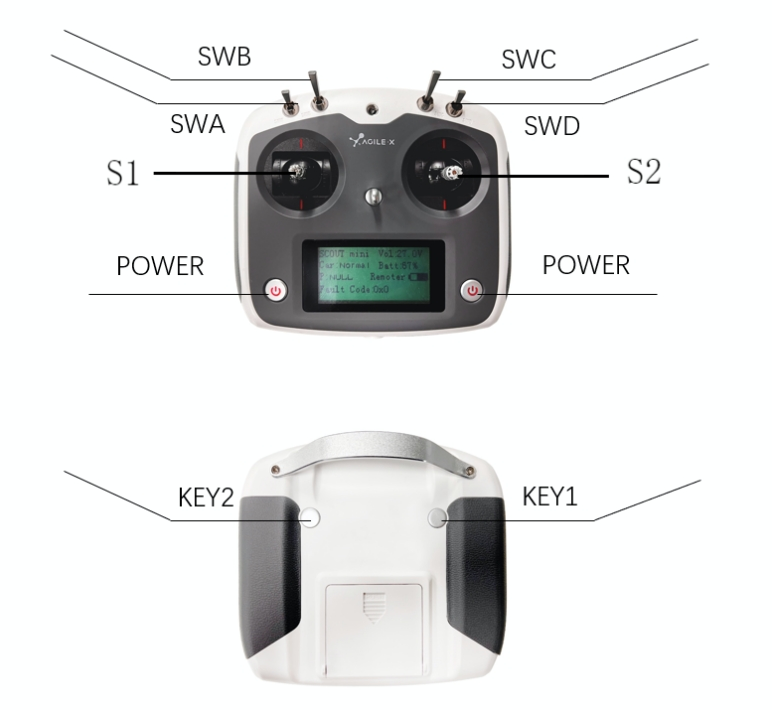
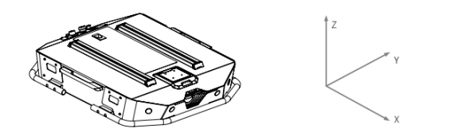

# Tracer 小车遥控功能

## 1. 遥控器说明

使⽤遥控器可以轻松控制TRACER通⽤机器⼈底盘，其定义及其功能如下：

**按键的功能定义为：** SWA、SWD 暂时未被启用，其中 SWB 为控制模式选择按钮，拨⾄最
上⽅为指令控制模式，拨⾄中间为遥控控制模式;SWC 为灯光控制按钮；S1 为油门按钮，控
制TRACER前进和后退；S2 控制旋转，POWER为电源按钮，同时按住即可开关机 。

**遥控界⾯说明:**

| 参数 | 说明 |
| :------------: | :--------: |
| Tracer | ⻋型 |
| Vol | 电池电压 |
| Car | 底盘状态 |
| Batt | 底盘电量百分比 |
| P      | 驻车 |
| Remoter        | 遥控器电量 |
| Fault Code     | 错误信息 |

## 2. 控制指令与运动说明

我们将地⾯移动⻋辆根据 ISO 8855 标准建立坐标参考系，如下：

TRACER 车体与建立的参考坐标系 X 轴为平⾏状态。

- 在 **遥控器控制模式**下，遥控器摇杆S1往前推动则为往 X 正方向运动，S1 往后推动则往 X 负方向运动，S1 推动至最⼤值时，往X正方向运动速度最⼤，S1推动⾄最小值时，往 X 负方向运动速度最大；遥控器摇杆S2 左右控制⻋体的旋转运动，S2往左推动⻋体则由 X 轴正方向往 Y 正方向旋转，S2往右推动⻋体则由 X 轴正方向往 Y 负方向旋转，S2往左推动⾄最⼤值时，逆时针方向旋转线速度最⼤，S2往右推动⾄最⼤值时，顺时针旋转线运动速度⼤。

- 在 **控制指令模式**下，线速度的正值表示往X轴正方向运动，线速度的负值表示往X轴负⽅向运动；⻆速度的正值表示⻋体由X轴正方向往 Y 轴正⽅向运动，⻆速度的负值表示⻋体由 X 轴正⽅向往Y轴负⽅向运动。

**注意：使用遥控器摇杆进行操作时，需缓慢轻推摇杆，避免速度过快。当小车顶部有载重时，速度过快容易出现重心不稳，影响运动控制的平稳性。**

## 3. 使用与操作

**检查**

检查⻋体状态。检查⻋体是否有明显异常；如有，请联系售后⽀持。

**关闭操作**

旋转旋钮开关，即可切断电源。

**启动**

- 急停开关状态。确认急停按钮均处于释放状态；
- 旋转旋钮开关，正常情况下，电压表正常显示电池电压，前灯正常亮起。
  
**急停**

按下⻋体左右尾部的急停开关即可。

**遥控控制基本操作流程**

正常启动 TRACER 移动机器底盘后，启动遥控器，将控制模式选择为遥控控制模式，即可通过遥KO控控制 TRACER平台运动。

---

[← 上一节](../5.2-SoftwareUsageInstructions/README.md) | [下一章 →](../../6-SDKDevelopment/README.md)