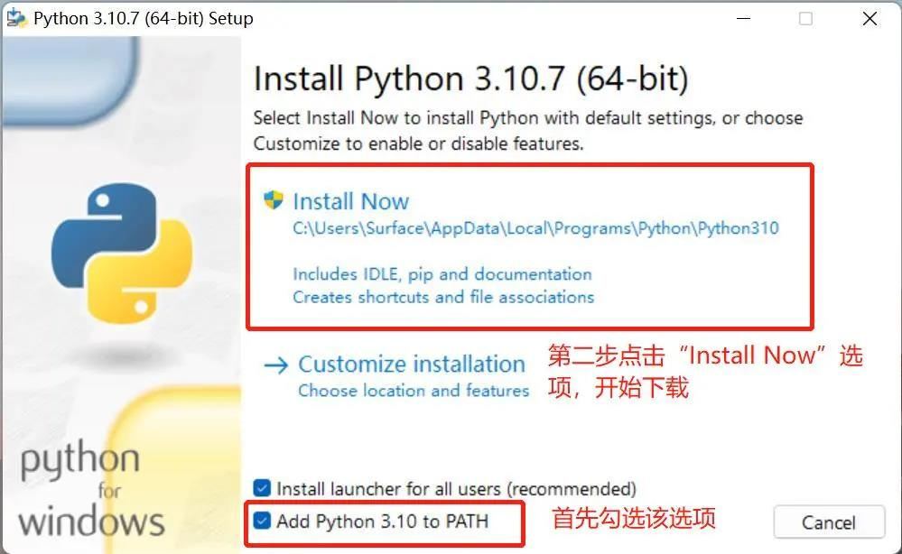
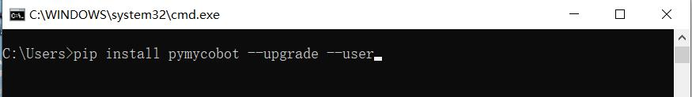

# Environment Setup

pymycobot is a Python package for serial communication with myArm, supporting Python2, Python3.5, and later versions.

Before using pymycobot to control the robotic arm, you need to set up the Python environment. The following section provides detailed instructions on how to download and install Python.

## 1. Python Download and Installation

Currently, Python has two versions: 2.x and 3.x. These two versions are incompatible with each other. This section uses version `3.x` as an example, as it is becoming increasingly popular.

### 1.1 Install Python

> **Note:** Before installation, please confirm whether your computer is 64-bit or 32-bit. Right-click `My Computer`, select `Properties`. As shown in the image below, it is a 64-bit operating system, so choose the 64-bit Python installation package.
>
> 
>
> 

- **Official Python download site: [http://www.python.org/download/](http://www.python.org/download/)**
- **Click the `Downloads` option to start downloading Python, then click `Add Python 3.10 to PATH`, and click `Install Now` to begin the installation of Python.**





- **Once the “Setup was successful” message appears, the installation is complete.**


### 1.2 Run Python

After installation is successful, open the Command Prompt window (`Win+R`, type `cmd` and press Enter), then type `python`. Two scenarios may occur.

**Scenario 1:**


The message displayed on the screen indicates that Python has been successfully installed. The prompt `>>>` indicates the Python interactive environment. You can input Python code, and the execution result will appear immediately.

**Scenario 2:**

If you input an incorrect command (e.g., `pythonn`), you will see an error message:


> **Note:** The error message generally means that the environment variable is not configured properly. You can refer to section 1.3 to configure the environment variable.

### 1.3 Configure Environment Variables

Since Windows uses the `Path` environment variable to locate `python.exe`, if it is not found, an error will occur. If you missed selecting `Add Python 3.10 to PATH` during installation, you need to manually add the path of `python.exe` to the `Path` variable, or reinstall Python and make sure to select `Add Python 3.10 to PATH`.

Here are the steps to manually add the path of `python.exe`:

- Right-click `My Computer` → select `Properties` → select `Advanced System Settings` → click the `Environment Variables` button at the bottom right:


- Environment variables include user variables and system variables. For user variables, you can use the downloaded program via the `cmd` command. Write the absolute path of the target program into the user variables.


- After completing the above steps, open the Command Prompt window (`Win+R`, type `cmd`, press Enter), type `python`, and if the following message appears, it means the setup was successful:


## 2 PyCharm Installation and Usage

PyCharm is a powerful Python editor with cross-platform support. This section introduces the installation steps of PyCharm on Windows.

**Download Link**: **[PyCharm](http://www.jetbrains.com/pycharm/download/#section=windows)**

### 2.1 Download and Installation

1. **Download Link**: [PyCharm Download Page](http://www.jetbrains.com/pycharm/download/#section=windows)
   - PyCharm offers two versions: Professional and Community. It is recommended to install the free Community version.

2. **Installation Process**:
   - After downloading, run the installer.
   - Click `Next` to continue.
   - Select the options according to your preferences, then click `Next`.
   - Click `Install` to begin the installation.
   - After the installation is complete, click `Finish` to end the process.

### 2.2 Create a Project

1. **Launching PyCharm**:
   - Double-click the PyCharm icon on the desktop to open PyCharm.
   - Click `New Project` to create a new project.

2. **Setting up Python Interpreter**:
   - When creating the project, you need to configure the Python interpreter.
   - Click `Add Interpreter`, select `New`, locate the `python.exe` in the Python installation directory, and check the `Inherit global site-package` option.

3. **Setting the Project Location**:
   - Choose a location to store the PyCharm project in the `Location` field.

4. **Create a Python File**:
   - In PyCharm, right-click the document icon in the project, select `New`, and then choose `Python File`. Enter the file name and create it.

5. **Write Code**:
   - After creating the file, the code editor will open, and you can start writing your Python code.


## **3 Preparation Work**

- **Firmware Programming**: The firmware is the system's control program for driving the robot. [**MyStudio**](https://docs.elephantrobotics.com/docs/gitbook-en/4-BasicApplication/4.1-myStudio/).

  - **M5Stack Version**: The `Basic` at the bottom needs to be programmed with `minirobot`. After the programming is complete, select the `Transponder` function (this function is used to receive and forward the commands sent by the bottom Basic, thus executing the target action). Click `Press A`, and if the prompt `Atom: OK` appears, the programming is successful. Additionally, the Atom at the end of the M5 version is programmed with the latest version of atomMain, which is pre-programmed from the factory and does not require programming.
  - **Pi \ JetsonNano Version**: The Atom at the end of the Pi and JetsonNano versions is programmed with the latest version of atomMain, which is pre-programmed from the factory and does not require programming.

- **Installing pymycobot**: Open a console terminal (shortcut `Win+R`, type `cmd` to open the terminal), and enter the following command:

  ```python
  pip install pymycobot --upgrade --user
  ```

  

- Source code installation. Open a console terminal (shortcut key 'Win+R', enter 'cmd' to enter the terminal) and enter the following command to install:

  ```python
  git clone https://github.com/elephantrobotics/pymycobot.git <your-path>
  # Where <your-path> fill in your installation address, do not fill in the default in the current path
  
  cd <your-path>/pymycobot
  # Go to the pymycobot folder in the download package
  
  # Run one of the following commands based on your version of python
  # Install
   python2 setup.py install
  # or
   python3 setup.py install
  ```

- Update pymycobot

```bash
pip install pymycobot --upgrade
```

## 4 Import pymycobot

After the above preparatory work is completed, the robot arm is controlled through Python code. The myArm Master 750 version is used as an example.

- Enter the following code to import our library:

```python
from pymycobot import MyArmM
```

> ** Note: **
>
> 1. If the red wavy line does not appear at the bottom of the code, the pymycobot installation was successful.
> 2. If there is a red wavy lines, please visit https://github.com/elephantrobotics/pymycobot * * * * manually download pymycobot and put it in python library.
>
> 


---

[← Previous](../README.md) | [Next page →](2_API.md)