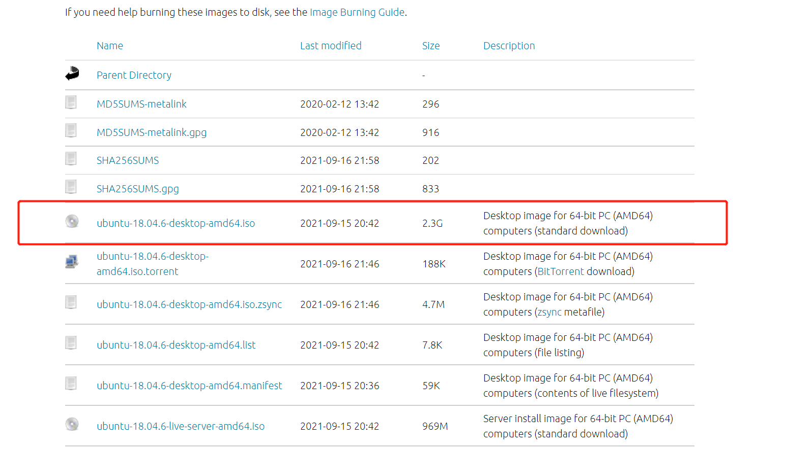
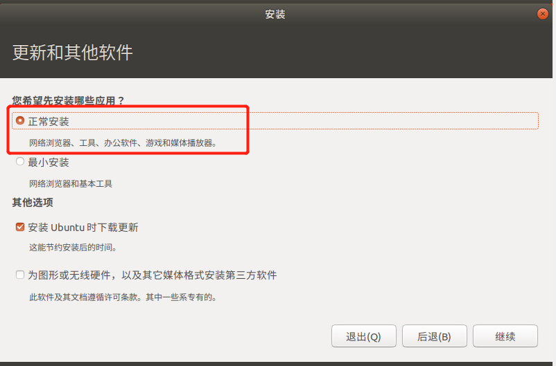
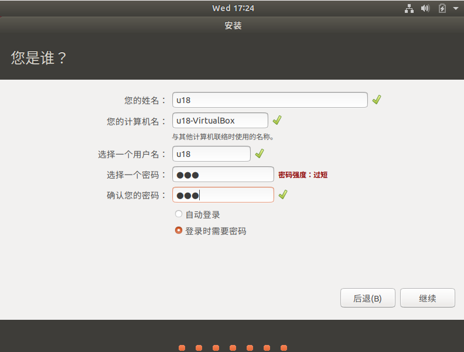
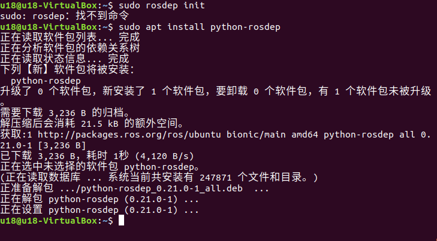

# MyController S570
## Installing Different Versions of Ubuntu System on Linux
### 1 Virtual Machine Installation

Go to the [official website](https://www.virtualbox.org/wiki/Downloads) to download the VirtualBox virtual machine or visit the [official website](https://www.vmware.com/products/desktop-hypervisor.html) to download the VM Ware virtual machine.

Of course, if you already have a virtual machine, you can skip this step.  
We choose to download VirtualBox because it is free.

### 2 Create a Virtual Machine
#### 2.1 Create a Virtual Machine

**Select "New" in the control panel**  
Enter the name of the virtual machine and the location to store it, select the virtual machine type as Linux, and choose the 64-bit Ubuntu version, then proceed to the next step.  

Configure the memory size according to your needs and proceed to the next step.  

Select **Create a Virtual Hard Disk Now**, and proceed to create.  

Choose the **VDI** type for the virtual hard disk, then proceed to the next step.  

Allocate the virtual hard disk size. Since you need to install the Ubuntu system and will be performing operations within this system, it is recommended to set the size to no less than 20GB.  
  

#### 2.2 Import Ubuntu System
##### 2.2.1 Download Ubuntu System.

Choose the Ubuntu version according to your needs for installation.

Note: ROS2 requires the 20.04 version.  
> [16.04 Version](https://releases.ubuntu.com/16.04.7/)  
> [18.04 Version](https://releases.ubuntu.com/18.04.6/)  
> [20.04 Version](https://old-releases.ubuntu.com/releases/20.04.3/)

**The installation method and process for the three versions are the same. Here, we will use the 18.04 version as an example.**  
  

After downloading, you will have the following file:  
  

##### 2.2.2 Import Ubuntu into the Virtual Machine

Find the virtual machine you previously installed in VirtualBox, go to **Settings**, and assign a disk controller under **Storage**:  
  
  
Then open the virtual machine to start the Ubuntu installation and click Start.

##### 2.2.3 Ubuntu Installation

Wait for the system to boot, and when the **Welcome** screen appears, select "Chinese (Simplified)" and click the "Install Ubuntu" button;  
  

Click the "Continue" button;  
  

Select "Erase disk and install Ubuntu", and click the "Install Now" button;  
  

Click the "Continue" button in the dialog box that pops up;  
  

Set the geographical location and click the "Continue" button;  
  

Set the username and password, and click the "Continue" button;  
  

Wait for the system to install; please be patient.  
  

Once installation is complete, click the "Restart Now" button in the dialog box to finish the installation.  

## 3 ROS environment construction
### 3.1 ROS installation

The basic development environment needs to install the robot operating system ROS, MoveIt and git version manager. The following describes the installation methods and processes respectively.

3.1.1 version selection

ROS have one-to-one relationship with ubuntu, different versions of ubuntu correspond to different versions of the ROS, reference website below: http://wiki.ros.org/Distributions

Here are the ROS versions that Ubuntu supports:
Ubuntu 16.04 / ROS Kinetic
Ubuntu 18.04 / ROS Melodic
Ubuntu 20.04 / ROS Noetic

** Please install the ROS version according to the Ubuntu version you have installed **

If the version is different, the download will fail. Here we choose the system as
Ubuntu 18.04, corresponding to ROS version ROS Melodic

NOTE: currently, we do not provide any references to Windows installation ROS, if necessary, please refer to [https://www.ros.org/install/] (https://www.ros.org/install/)

## 3.1.2 Start installation
### 1 Add source

There is no ROS software source in Ubuntu's own software source list, so you need to configure the ROS software source to the software list repository before you can download ROS. Open a console terminal (Ctrl+Alt+T) and enter the following command:

- Official Source: 
> sudo sh -c 'echo "deb http://packages.ros.org/ros/ubuntu $(lsb_release -sc) main" > /etc/apt/sources.list.d/ros-latest.list'

- If the download speed is slow, you are advised to select a nearby mirror source to replace the preceding command. For example, Tsinghua University is:

> sudo sh -c '. /etc/lsb-release && echo "deb http://mirrors.tuna.tsinghua.edu.cn/ros/ubuntu/ `lsb_release -cs` main" > /etc/apt/sources.list.d/ros-latest.list'

You will be asked to enter the user password. Enter the user password you set when installing Ubuntu.

### 2 Set the secret key

Configure the public network key, this step is to let the system confirm that our path is safe, so that there is no problem to download the file, otherwise it will be deleted immediately after downloading:

> sudo apt-key adv --keyserver 'hkp://keyserver.ubuntu.com:80' --recv-key C1CF6E31E6BADE8868B172B4F42ED6FBAB17C654

The command output is as follows:  
  

### 3 Install

After adding a new software source, you need to ** update the software source list **, open a console terminal (Ctrl+Alt+T), and enter the following command:
> sudo apt-get update

To install ROS, open a console terminal (Ctrl+Alt+T) and enter the following command according to your Ubuntu version:

> \# Ubuntu 16.04  
> sudo apt install ros-kinetic-desktop-full

> \# Ubuntu 18.04  
> sudo apt install ros-melodic-desktop-full

> \# Ubuntu 20.04  
> sudo apt install ros-noetic-desktop-full

A full ROS installation is recommended to prevent the loss of libraries and dependencies.

The installation process takes a long time and requires patience

- If the following error message is displayed on the console terminal during installation, change the software source list in /etc/apt/sources.list. 
  

- Open a console terminal (Ctrl+Alt+T) and enter the following command:

> sudo gedit /etc/apt/sources.list

- Replace all official software sources in sources.list with the following Alibaba Cloud software sources:

\# Ubuntu 16.04 version:

deb http://mirrors.aliyun.com/ubuntu/ xenial main  
deb-src http://mirrors.aliyun.com/ubuntu/ xenial main  

deb http://mirrors.aliyun.com/ubuntu/ xenial-updates main  
deb-src http://mirrors.aliyun.com/ubuntu/ xenial-updates main  

deb http://mirrors.aliyun.com/ubuntu/ xenial universe
deb-src http://mirrors.aliyun.com/ubuntu/ xenial universe  
deb http://mirrors.aliyun.com/ubuntu/ xenial-updates universe  
deb-src http://mirrors.aliyun.com/ubuntu/ xenial-updates universe  

deb http://mirrors.aliyun.com/ubuntu/ xenial-security main  
deb-src http://mirrors.aliyun.com/ubuntu/ xenial-security main  
deb http://mirrors.aliyun.com/ubuntu/ xenial-security universe  
deb-src http://mirrors.aliyun.com/ubuntu/ xenial-security universe  

\# Ubuntu 18.04 version：

deb http://mirrors.aliyun.com/ubuntu/ bionic main restricted universe multiverse  
deb-src http://mirrors.aliyun.com/ubuntu/ bionic main restricted universe multiverse  

deb http://mirrors.aliyun.com/ubuntu/ bionic-security main restricted universe multiverse  
deb-src http://mirrors.aliyun.com/ubuntu/ bionic-security main restricted universe multiverse  

deb http://mirrors.aliyun.com/ubuntu/ bionic-updates main restricted universe multiverse  
deb-src http://mirrors.aliyun.com/ubuntu/ bionic-updates main restricted universe multiverse  

deb http://mirrors.aliyun.com/ubuntu/ bionic-proposed main restricted universe multiverse  
deb-src http://mirrors.aliyun.com/ubuntu/ bionic-proposed main restricted universe multiverse  

deb http://mirrors.aliyun.com/ubuntu/ bionic-backports main restricted universe multiverse  
deb-src http://mirrors.aliyun.com/ubuntu/ bionic-backports main restricted universe multiverse  

\# Ubuntu 20.04 version：

deb http://mirrors.aliyun.com/ubuntu/ focal main restricted universe multiverse  
deb-src http://mirrors.aliyun.com/ubuntu/ focal main restricted universe multiverse  

deb http://mirrors.aliyun.com/ubuntu/ focal-security main restricted universe multiverse  
deb-src http://mirrors.aliyun.com/ubuntu/ focal-security main restricted universe multiverse  

deb http://mirrors.aliyun.com/ubuntu/ focal-updates main restricted universe multiverse  
deb-src http://mirrors.aliyun.com/ubuntu/ focal-updates main restricted universe multiverse  

deb http://mirrors.aliyun.com/ubuntu/ focal-proposed main restricted universe multiverse  
deb-src http://mirrors.aliyun.com/ubuntu/ focal-proposed main restricted universe multiverse  

deb http://mirrors.aliyun.com/ubuntu/ focal-backports main restricted universe multiverse  
deb-src http://mirrors.aliyun.com/ubuntu/ focal-backports main restricted universe multiverse  

- After the configuration, the contents of the sources.list file are as follows. Click Save and exit.
    

- To update the software source list, enter in the console terminal:

> sudo apt-get update

- Enter the instructions to install ROS in the console terminal:

> \# Ubuntu 16.04  
sudo apt install ros-kinetic-desktop-full

> \# Ubuntu 18.04  
sudo apt install ros-melodic-desktop-full

> \# Ubuntu 20.04  
sudo apt install ros-noetic-desktop-full

** The installation process takes a long time and requires patience **

### 4 Configure the ROS environment to the system

rosdep allows you to easily install the source code that you want to compile, or that is required by some of the ROS core components of the system, by executing the following commands from the terminal to open a console terminal (Ctrl+Alt+T).

If rosdep is not installed on your system, use the command sudo apt install python-rosdep to install it.

If your Ubuntu system is version 20.04, run the sudo apt install python3-rosdep command to install it, and then execute the rosdep initialization command.
    

** Initialize rosdep: **
> sudo rosdep init

If an error message like the one below appears:  
    

** Workaround: ** Modify the hosts file and enter the following command in the console terminal:

> sudo gedit /etc/hosts

At the end of the file content, add the IP addresses of the following two urls to achieve access:

> 199.232.28.133 raw.githubusercontent.com  
> 151.101.228.133 raw.github.com  

      

After the modification is complete, execute in the console terminal:  
> sudo rosdep init  
> rosdep update

After the initialization, in order to avoid the need to reactivate the ROS function path every time the terminal window is closed, we can configure the path to the environment variable **, so that the ROS function path can automatically take effect every time a new terminal is opened. Open a console terminal (Ctrl+Alt+T) :
## 3.1.3 Setting up the ros environment
Bash

Run the following command:
> # Ubuntu 16.04
> \# Adds the ros environment to the environment variable of the current console
> echo "source /opt/ros/kinetic/setup.bash" >> ~/.bashrc

> \# Ubuntu 18.04  
> echo "source /opt/ros/melodic/setup.bash" >> ~/.bashrc

> \# Ubuntu 20.04  
> echo "source /opt/ros/noetic/setup.bash" >> ~/.bashrc

> source ~/.bashrc

Install ROS extra dependencies

Enter the following command **Install ROS Extra dependencies** in the terminal to open a console terminal (Ctrl+Alt+T) :
> sudo apt-get install python-rosinstall python-rosinstall-generator python-wstool build-essential

If your Unbutu system is version 20.04, run the following command to install it:

> sudo apt install python3-rosdep python3-rosinstall python3-rosinstall-generator python3-wstool build-essential

> \# Ubuntu 16.04  
>sudo apt install ros-kinetic-joint-state-publisher-gui

> \# Ubuntu 18.04   
>sudo apt install ros-melodic-joint-state-publisher-gui

> \# Ubuntu 20.04   
> sudo apt install ros-noetic-joint-state-publisher-gui  

## 3.1.4 Verifying installation

The startup of ROS system requires a ROS Master, that is, a node manager, and we can start ROS Master by entering the roscore command in the terminal.

To verify that ROS is installed successfully, open a console terminal (Ctrl+Alt+T) and execute the following command on the terminal:

> roscore

If the following information is displayed, the ROS installation is successful  
      
The roscore command starts a node manager, which is used for node management. In a ros system, there is and only one, which is the prerequisite for ros nodes to run. Therefore, before starting ros nodes, the first step needs to execute roscore.

More detailed installation instructions, you can refer to the official installation guide, website: http://wiki.ros.org/ROS/Installation

# 2. MoveIt installation
MoveIt is the component of a series of mobile operation function packages in ros, mainly including motion planning, collision detection, kinematics, 3D perception, operation control and other functions.

## 2.1 Update the software source list

Open a console terminal (Ctrl+Alt+T) and enter the following command in the terminal window to update the software source list:
> sudo apt-get update

## 2.2 Install MoveIt

Open a console terminal (Ctrl+Alt+T) and execute the MoveIt installation by entering the following command in the terminal window:
> sudo apt-get install ros-noetic-moveit

# 3. Git Installation

## 3.1 Add Software Source

To install Git, add the software source for Git to Ubuntu’s software repository. Open a terminal (shortcut Ctrl+Alt+T) and enter the following command in the terminal window:

> sudo add-apt-repository ppa:git-core/ppa

## 3.2 Update Software Source List

Open a terminal (shortcut Ctrl+Alt+T), and enter the following command to update the software source list:

> sudo apt-get update

## 3.3 Install Git

Open a terminal (shortcut Ctrl+Alt+T), and enter the following command to install Git:

> sudo apt-get install git

## 3.4 Verify Installation

Check the Git version. Open a terminal (shortcut Ctrl+Alt+T) and enter the following command:

> git --version

If the terminal shows the Git version number as below, the installation is successful:

## 3.5 Usage

Git will be required for downloading ROS packages later. You can refer to the following links for Git usage:

- [Git Documentation](https://git-scm.com/book/zh/v2)  
- [Git Tutorial](https://www.runoob.com/git/git-tutorial.html)

---

# mycobot_ros Installation

`mycobot_ros` is a ROS package developed by ElephantRobotics, designed for their desktop six-axis robotic arm series.

Project repository: [https://github.com/elephantrobotics/mycobot_ros](https://github.com/elephantrobotics/mycobot_ros)

## Prerequisites

Before installing the package, make sure you have a ROS workspace. Here is an example command to **create a workspace**. The default workspace is named `catkin_ws`. Open a terminal (shortcut Ctrl+Alt+T) and enter the following commands:

> mkdir -p ~/catkin_ws/src  # Create the folder  
> cd ~/catkin_ws/src        # Enter the folder  
> catkin_init_workspace     # Initialize the current directory as a ROS workspace  
> cd ..                     # Go back to the parent directory  
> catkin_make               # Build the workspace code

**After creation, a folder will be generated:**  

**Add the workspace environment**  
Bash  
The default ROS1 workspace is `catkin_ws`.  
###### Ubuntu 16.04  
> echo "source ~/catkin_ws/devel/setup.bash" >> ~/.bashrc  

###### Ubuntu 18.04  
> echo "source ~/catkin_ws/devel/setup.bash" >> ~/.bashrc

###### Ubuntu 20.04  
> echo "source ~/catkin_ws/devel/setup.bash" >> ~/.bashrc

Then run:  
> source ~/.bashrc  

## 2. Installation

**NOTE:**

This package depends on ROS and MoveIt. Make sure that ROS and MoveIt are installed successfully before proceeding.  
This package interacts with the actual robotic arm through the Python API - `pymycobot`.  
API project repository: [https://github.com/elephantrobotics/pymycobot](https://github.com/elephantrobotics/pymycobot)

Quick installation:  
> pip install pymycobot --upgrade

If you encounter the following error when running the command `pip install pymycobot --upgrade`:  

Follow the instructions to install `pip`:

> sudo apt install python-pip

> If you are using Ubuntu 20.04, run:  
  > sudo apt install python3-pip to install pip. Once pip is installed, run:  
  > pip install pymycobot --upgrade  

Note: The installation relies on Git, so make sure Git is installed on your computer.

The default ROS1 workspace is `catkin_ws`.

**Open the terminal:**  
> cd ~/catkin_ws/src  # Enter the src folder in the workspace  
> git clone https://github.com/elephantrobotics/mycobot_ros.git     # Clone the repository from GitHub  
> cd ..       # Go back to the workspace  
> catkin_make # Build the workspace code  
> cd ..  
> source devel/setup.bash # Add environment variables  

## **At this point, the environment setup is complete.**

### For future programming, we also need to download Visual Studio Code (VS Code).

#### Here is the simplest method: **Install it from the Ubuntu Software Center [Simple and Convenient]**  
   

**After installation, we also need to set up the Python environment.**

To run Python files is very simple, click on the left extension panel (Ctrl+Shift+X), search for "Python", and install the extension.  
  

Once installed, you can create a new Python file by clicking "File" on the top left, selecting the file type as Python, write your Python code, and then run it from the menu bar.

---

# Introduction and Usage of RViz

RViz is a 3D visualization platform in ROS that allows for graphical display of external information and also enables sending control information to objects, thereby facilitating robot monitoring and control.  

## 1. RViz Installation and Interface Overview

If you installed ROS with the full installation option, RViz has already been installed, and you can try running it directly. If not, you can install RViz separately:

- **Ubuntu 16.04**  
  > sudo apt-get install ros-kinetic-rviz

- **Ubuntu 18.04**  
  > sudo apt-get install ros-melodic-rviz

- **Ubuntu 20.04**  
  > sudo apt-get install ros-noetic-rviz

After installation, open a new terminal (shortcut Ctrl+Alt+T) and enter the following command:

> roscore

Then, open another new terminal (Ctrl+Alt+T) and enter the command to open RViz:

> rosrun rviz rviz or rviz

After opening RViz, the following interface will be displayed:  

## 2. Description of Each Area

- The left panel displays the list of displays, which are used to render certain content in the 3D world, and may have some available options in the display list.
- The top part is the toolbar, which allows users to select various functional tools.
- The central area is the 3D view: it is the main screen where various data can be viewed in 3D. The background color, fixed frame, and grid can be set in the Global Options and Grid sections in the left panel.
- The bottom area shows the time, including system time and ROS time.
- The right area is for setting the viewpoint, allowing different observation angles.

This section is a brief overview. For more detailed information, you can refer to the [User Guide](http://wiki.ros.org/rviz/UserGuide).

---

[← Previous](../5.1-BasedOnPythonDevelopmentAndUse/5_tracer_example.md) | [Next page →](2_workcode.md)

