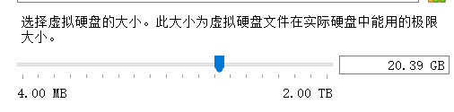
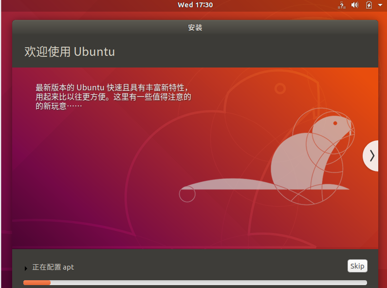
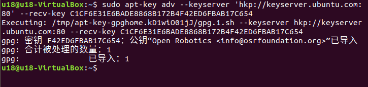
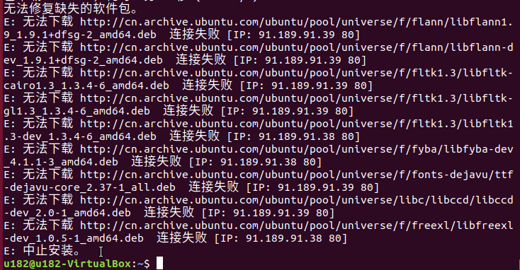
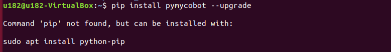

# MyController S570
## 在Linux中安装不同版本的ubuntu系统
### 1 虚拟机安装

前往[官方网站](https://www.virtualbox.org/wiki/Downloads)下载虚拟机Virtual Box 或者前往[官方网站](https://www.vmware.com/products/desktop-hypervisor.html)下载虚拟机 VM ware

当然，如果您已经拥有您的虚拟机，您可以跳过该步骤。  
我们选择下载Virtual box，因为它是免费的。

### 2 新建虚拟机
#### 2.1 创建虚拟机

**在控制中选择新建**  
输入虚拟机名称和虚拟机存放的位置，选择虚拟机类型为Linux，选择ubuntu64位版本，进行下一步。

按照自己的需求配置内存大小，进行下一步。  

选择现在**创建虚拟硬盘**，进行创建。   

虚拟硬盘类型选择**VDI**类型，进行下一步。  

分配虚拟硬盘大小，由于需要安装ubuntu系统，而且还会在该系统中进行操作，建议大小不要低于20G。   
  

#### 2.2 导入ubuntu系统
##### 2.2.1 下载ubuntu系统。

请根据自己的需要选择ubuntu版本进行安装

注意： ROS2需要下载20.04版本。  
> [16.04版本](https://releases.ubuntu.com/16.04.7/)  
> [18.04版本](https://releases.ubuntu.com/18.04.6/)  
> [20.04版本](https://old-releases.ubuntu.com/releases/20.04.3/)

**三种版本的安装方法和过程都是相同的，这里以18.04版本作为例子进行安装**  
  

下载完成后有如图文件：  
  

##### 2.2.2 导入ubuntu到虚拟机中

在Virtual box中找到之前安装的虚拟机，进入**设置**，并在**存储**中给控制器分配光盘：
  
  
然后打开虚拟机进行ubuntu安装，并点击启动。  

##### 2.2.3 ubuntu安装

等待系统启动，进入**欢迎**界面，选中“中文（简体）”，并点击“安装 Ubuntu”按钮；
  

点击“继续”按钮；  
  

选中“清除整个磁盘并安装 Ubuntu”选项，点击“现在安装”按钮；
  

在弹出的对话框中点击“继续”按钮；  
   

设置地理位置，点击“继续”按钮；  
  

设置用户名和密码，点击“继续”按钮；  
   

进入系统安装界面，请耐心等待；  
    

待安装完成，在弹出的对话框中，点击“现在重启”按钮，完成安装。  

##  3 ROS 环境搭建
### 3.1 ROS 安装

基本的开发环境搭建需要安装机器人操作系统 ROS、MoveIt 以及 git 版本管理器，以下分别介绍其安装方法及流程。

### 3.1.1 版本选择

ROS 跟 ubuntu 有一一对应的关系，不同版本的 ubuntu 对应不同版本的 ROS，参考网站见下：  http://wiki.ros.org/Distributions

这里给出对应Ubuntu支持的 ROS 版本:  
        Ubuntu 16.04 / ROS Kinetic  
        Ubuntu 18.04 / ROS Melodic  
        Ubuntu 20.04 / ROS Noetic  

**请根据自己安装的Ubuntu版本进行对应ROS版本的安装**

如果版本不同，下载将会失败.在这里我们选择的系统为
 Ubuntu 18.04, 对应 ROS 版本为 ROS Melodic

NOTE: 目前我们不提供 windows 安装 ROS 的任何参考, 若有需要请参考 [https://www.ros.org/install/](https://www.ros.org/install/)

## 3.1.2 开始安装
### 1 添加源

Ubuntu 本身的软件源列表中没有 ROS 的软件源，所以需要先将 ROS 软件源配置到软件列表仓库中，才能下载 ROS 。打开一个控制台终端(快捷键Ctrl+Alt+T),输入如下指令：  

- 官方源：  
> sudo sh -c 'echo "deb http://packages.ros.org/ros/ubuntu $(lsb_release -sc) main" > /etc/apt/sources.list.d/ros-latest.list'

- 若下载速度缓慢，推荐就近选择一个镜像源替换上面的命令。例如，Tsinghua University为：  

> sudo sh -c '. /etc/lsb-release && echo "deb http://mirrors.tuna.tsinghua.edu.cn/ros/ubuntu/ `lsb_release -cs` main" > /etc/apt/sources.list.d/ros-latest.list'

这里会要求输入用户密码，输入安装 Ubuntu 时设置的用户密码即可。

### 2 设置秘钥

配置公网秘钥,这一步是为了让系统确认我们的路径是安全的的，这样下载文件才没有问题，不然下载后会被立刻删掉：

> sudo apt-key adv --keyserver 'hkp://keyserver.ubuntu.com:80' --recv-key C1CF6E31E6BADE8868B172B4F42ED6FBAB17C654

执行结果显示如下：  
  

### 3 安装

在加入了新的软件源后，需要**更新软件源列表**，打开一个控制台终端(快捷键Ctrl+Alt+T),输入如下指令：  
> sudo apt-get update  

执行安装 ROS，打开一个控制台终端(快捷键Ctrl+Alt+T),请按照自己的Ubuntu版本选择输入以下指令：

> \# Ubuntu 16.04  
> sudo apt install ros-kinetic-desktop-full

> \# Ubuntu 18.04  
> sudo apt install ros-melodic-desktop-full

> \# Ubuntu 20.04  
> sudo apt install ros-noetic-desktop-full

这里推荐安装完整的 ROS，防止库和依赖的缺失。

安装过程耗时比较长，需要耐心等待

- 若安装过程中，控制台终端出现如下错误信息，则需要更换/etc/apt/sources.list中的软件源列表。  
  

- 打开一个控制台终端(快捷键Ctrl+Alt+T)，输入如下指令：

> sudo gedit /etc/apt/sources.list

- 将sources.list中的官方软件源全部替换成下面的阿里云软件源：

\# Ubuntu 16.04版本：

deb http://mirrors.aliyun.com/ubuntu/ xenial main  
deb-src http://mirrors.aliyun.com/ubuntu/ xenial main  

deb http://mirrors.aliyun.com/ubuntu/ xenial-updates main  
deb-src http://mirrors.aliyun.com/ubuntu/ xenial-updates main  

deb http://mirrors.aliyun.com/ubuntu/ xenial universe
deb-src http://mirrors.aliyun.com/ubuntu/ xenial universe  
deb http://mirrors.aliyun.com/ubuntu/ xenial-updates universe  
deb-src http://mirrors.aliyun.com/ubuntu/ xenial-updates universe  

deb http://mirrors.aliyun.com/ubuntu/ xenial-security main  
deb-src http://mirrors.aliyun.com/ubuntu/ xenial-security main  
deb http://mirrors.aliyun.com/ubuntu/ xenial-security universe  
deb-src http://mirrors.aliyun.com/ubuntu/ xenial-security universe  

\# Ubuntu 18.04版本：

deb http://mirrors.aliyun.com/ubuntu/ bionic main restricted universe multiverse  
deb-src http://mirrors.aliyun.com/ubuntu/ bionic main restricted universe multiverse  

deb http://mirrors.aliyun.com/ubuntu/ bionic-security main restricted universe multiverse  
deb-src http://mirrors.aliyun.com/ubuntu/ bionic-security main restricted universe multiverse  

deb http://mirrors.aliyun.com/ubuntu/ bionic-updates main restricted universe multiverse  
deb-src http://mirrors.aliyun.com/ubuntu/ bionic-updates main restricted universe multiverse  

deb http://mirrors.aliyun.com/ubuntu/ bionic-proposed main restricted universe multiverse  
deb-src http://mirrors.aliyun.com/ubuntu/ bionic-proposed main restricted universe multiverse  

deb http://mirrors.aliyun.com/ubuntu/ bionic-backports main restricted universe multiverse  
deb-src http://mirrors.aliyun.com/ubuntu/ bionic-backports main restricted universe multiverse  

\# Ubuntu 20.04版本：

deb http://mirrors.aliyun.com/ubuntu/ focal main restricted universe multiverse  
deb-src http://mirrors.aliyun.com/ubuntu/ focal main restricted universe multiverse  

deb http://mirrors.aliyun.com/ubuntu/ focal-security main restricted universe multiverse  
deb-src http://mirrors.aliyun.com/ubuntu/ focal-security main restricted universe multiverse  

deb http://mirrors.aliyun.com/ubuntu/ focal-updates main restricted universe multiverse  
deb-src http://mirrors.aliyun.com/ubuntu/ focal-updates main restricted universe multiverse  

deb http://mirrors.aliyun.com/ubuntu/ focal-proposed main restricted universe multiverse  
deb-src http://mirrors.aliyun.com/ubuntu/ focal-proposed main restricted universe multiverse  

deb http://mirrors.aliyun.com/ubuntu/ focal-backports main restricted universe multiverse  
deb-src http://mirrors.aliyun.com/ubuntu/ focal-backports main restricted universe multiverse  

- 配置完成后，sources.list文件内容如下所示，点击保存并退出。
    

- 更新软件源列表，在控制台终端输入:

> sudo apt-get update

- 在控制台终端输入安装ROS的指令：

> \# Ubuntu 16.04  
sudo apt install ros-kinetic-desktop-full

> \# Ubuntu 18.04  
sudo apt install ros-melodic-desktop-full

> \# Ubuntu 20.04  
sudo apt install ros-noetic-desktop-full

**安装过程耗时比较长，需要耐心等待**

### 4 配置 ROS 环境到系统

rosdep 让你能够轻松地安装被想要编译的源代码，或被某些 ROS 核心组件需要的系统依赖，在终端依次执行以下命令，打开一个控制台终端(快捷键Ctrl+Alt+T)。  

如果您的系统没有安装rosdep,请使用命令sudo apt install python-rosdep进行安装。  

如果您的安装的Ubuntu系统是20.04版本，请使用命令sudo apt install python3-rosdep进行安装，完成后执行rosdep初始化命令。  
    

**初始化 rosdep：**
> sudo rosdep init

若出现如下图所示的错误提示：  
    

**解决方法：** 修改hosts文件，控制台终端输入下面的指令：

> sudo gedit /etc/hosts

在文件内容末端，加入以下两个网址的IP地址实现访问：

> 199.232.28.133 raw.githubusercontent.com  
> 151.101.228.133 raw.github.com  

      

修改完成后，在控制台终端执行：  
> sudo rosdep init  
> rosdep update

初始化完成后，为了避免每次关掉终端窗口后都需要重新生效 ROS 功能路径，我们可以**把路径配置到环境变量中**，这样在每次打开新的终端时便可自动生效 ROS 功能路径 在终端依次执行以下命令，打开一个控制台终端(快捷键Ctrl+Alt+T)：  
## 3.1.3 设置ros环境
Bash

执行以下命令：  
> \# Ubuntu 16.04  
> \# 将 ros 环境加入到当前控制台的环境变量  
> echo "source /opt/ros/kinetic/setup.bash" >> ~/.bashrc

> \# Ubuntu 18.04  
> echo "source /opt/ros/melodic/setup.bash" >> ~/.bashrc

> \# Ubuntu 20.04  
> echo "source /opt/ros/noetic/setup.bash" >> ~/.bashrc

> source ~/.bashrc

安装 ROS 额外依赖项

在终端输入以下命令**安装ROS额外依赖项**，打开一个控制台终端(快捷键Ctrl+Alt+T)：  
> sudo apt-get install python-rosinstall python-rosinstall-generator python-wstool build-essential  

如果你的Unbutu系统是20.04版本，请执行以下命令安装：

> sudo apt install python3-rosdep python3-rosinstall python3-rosinstall-generator python3-wstool build-essential

> \# Ubuntu 16.04  
>sudo apt install ros-kinetic-joint-state-publisher-gui

> \# Ubuntu 18.04   
>sudo apt install ros-melodic-joint-state-publisher-gui

> \# Ubuntu 20.04   
> sudo apt install ros-noetic-joint-state-publisher-gui  

## 3.1.4 验证安装

ROS 系统的启动需要一个 ROS Master，即节点管理器，我们可以在终端输入 roscore 指令来启动 ROS Master。

为了验证 ROS 是否安装成功，打开一个控制台终端(快捷键Ctrl+Alt+T)，在终端执行以下命令：

> roscore

当显示如下界面，则表示 ROS 安装成功  
      
roscore命令启动了一个节点管理器，其作用就是用于节点管理，在一个ros系统中，有且只有一个，它是ros节点运行的前提，所以在执行启动ros节点前，第一步都需要执行roscore。

更多更详细的安装指导，可以参考官方的安装指导，网址: http://wiki.ros.org/ROS/Installation

# 二、MoveIt安装
MoveIt 是 ros 中一系列移动操作的功能包的组成，主要包含运动规划，碰撞检测，运动学，3D 感知，操作控制等功能。

## 2.1 更新软件源列表

打开一个控制台终端(快捷键Ctrl+Alt+T)，在终端窗口输入以下命令，以更新软件源列表：
> sudo apt-get update

## 2.2 安装 MoveIt

打开一个控制台终端(快捷键Ctrl+Alt+T)，在终端窗口输入以下命令，执行 MoveIt 的安装：
> sudo apt-get install ros-noetic-moveit

# 三、 git 安装
## 3.1 添加软件源
将 git 安装的软件源添加到 ubuntu 的软件源列表中，打开一个控制台终端(快捷键Ctrl+Alt+T)，在终端窗口输入以下命令：
>sudo add-apt-repository ppa:git-core/ppa

## 3.2 更新软件源列表
打开一个控制台终端(快捷键Ctrl+Alt+T)，在终端窗口输入以下命令，以更新软件源列表：
> sudo apt-get update

## 3.3 安装 git
打开一个控制台终端(快捷键Ctrl+Alt+T)，在终端窗口输入以下命令，执行 git 的安装：
> sudo apt-get install git

## 3.4 验证安装
读取 git 版本，打开一个控制台终端(快捷键Ctrl+Alt+T)，在终端窗口输入以下命令：
> git --version

在终端中可以显示 git 版本号，如下，即为安装成功
>

## 3.5 使用

在后续下载 ros 包需要用到git，git 的使用可以参考下面链接：  
https://git-scm.com/book/zh/v2    
https://www.runoob.com/git/git-tutorial.html

# mycobot_ros 安装

mycobot_ros 是 ElephantRobotics 推出的，适配旗下桌面型六轴机械臂系列 的ROS 包。

项目地址：[https://github.com/elephantrobotics/mycobot_ros/tree/mycontroller_s570](https://github.com/elephantrobotics/mycobot_ros/tree/mycontroller_s570)

##  前提

在安装包之前，请保证拥有 ros 工作空间。  
这里我们给出**创建工作空间**的样例命令，默认为catkin_ws, 打开一个控制台终端(快捷键Ctrl+Alt+T)，在命令行输入以下命令：

>mkdir -p ~/catkin_ws/src  # 创建文件夹  
>cd ~/catkin_ws/src        # 进入文件夹  
>catkin_init_workspace     # 把当前目录初始化为一个ROS工作空间  
>cd ..                     # 返回上级目录  
>catkin_make               # 构建工作区中的代码

**创建好之后会生成一个文件夹**    
 

**添加工作空间的环境**  
Bash  
官方默认的 ROS1 工作区是 catkin_ws。  
###### Ubuntu 16.04  
echo "source ~/catkin_ws/devel/setup.bash" >> ~/.bashrc  

###### Ubuntu 18.04  
echo "source ~/catkin_ws/devel/setup.bash" >> ~/.bashrc

###### Ubuntu 20.04  
echo "source ~/catkin_ws/devel/setup.bash" >> ~/.bashrc

source ~/.bashrc  

## 2 安装

**NOTE：**

本包依赖于ROS和MoveIT，使用前确保以成功安装ROS和MoveIT。  
本包与真实机械臂的交互依赖于PythonApi - pymycobot  
Api项目地为：[https://github.com/elephantrobotics/pymycobot](https://github.com/elephantrobotics/pymycobot)  

快速安装：pip install pymycobot --upgrade

执行pip install pymycobot --upgrade命令时，若出现如下图错误提示：  
   

根据提示输入以下命令安装pip

> sudo apt install python-pip
>
>> 如果你的Ubuntu系统是20.04版本，请执行命令sudo apt install python3-pip安装pip pip安装完成后，终端再次执行  
>>
>> pip install pymycobot --upgrade
>
>> 安装方式依赖于Git，请确保电脑中已安装Git。

官方默认的 ROS1 工作区是 catkin_ws。  

**打开终端：**
> cd ~/catkin_ws/src  # 进入工作区的src文件夹中  
> git clone https://github.com/elephantrobotics/mycobot_ros.git     # 克隆github上的代码  
> cd ..       # 返回工作区  
> catkin_make # 构建工作区中的代码  
> cd ..  
> source devel/setup.bash # 添加环境变量  

## **至此，环境搭建部分完成**

### 为了后续的编程，我们还需要下载一个 VS code
#### 这里我们就选择最方便的一种方法： **在Ubuntu Software中安装【简单、方便】**  
   
   

**安装好之后，我们还需要安装一下python环境**  
要想运行python文件很简单，点击左边扩展(ctrl+shift+X)--搜索python，下载安装即可      
     
      

安装好后就可以点击左上文件，选择新建文件，选择文件类型为python，编写自己的python代码，然后点击上方菜单栏的运行就可以  

# rviz的简单介绍及使用

rviz是ROS中一款三维可视化平台，一方面能够实现对外部信息的图形化显示，另外还可以通过 rviz 给对象发布控制信息，从而实现对机器人的监测与控制。  
1 rviz的安装及界面简介  
在安装ros时，如果执行的完全安装，rviz已经安装好了,您可以直接尝试运行；如果没有完全安装，可单独安装rviz:  
> - **Ubuntu16.04**
> - sudo apt-get install ros-kinetic-rviz

> - **Ubuntu18.04**  
> - sudo apt-get install ros-melodic-rviz

> - **Ubuntu20.04**  
> - sudo apt-get install ros-noetic-rviz  

安装完成后，请先打开一个新的终端(快捷键Ctrl+Alt+T),输入如下指令：  
> roscore

然后再打开一个一个新的终端(快捷键Ctrl+Alt+T)输入命令打开rviz  

> rosrun rviz rviz 或 rviz

打开rviz,显示如下界面：  
   

## 1 各个区域介绍

- 左侧为显示器列表，显示器是在3D世界中绘制某些内容的东西，并且可能在显示列表中具有一些可用的选项。
- 上方是工具栏，允许用户用各种功能按键选择多种功能的工具
- 中间部分为3D视图: 它是可以用三维方式查看各种数据的主屏幕。3D视图的背景颜色、固定框架、网格等可以在左侧显示的全局选项（Global Options）和网格（Grid）项目中进行详细设置。
- 下方为时间显示区域，包括系统时间和ROS时间等。
- 右侧为观测视角设置区域，可以设置不同的观测视角。

本部分我们只进行粗略的介绍，如果您想了解更多详细的内容，可以前往[用户指南](http://wiki.ros.org/rviz/UserGuide)进行查看。

---

[← 上一节](../5.1-BasedOnPythonDevelopmentAndUse/5_tracer_example.md) | [下一页 →](2_workcode.md)

