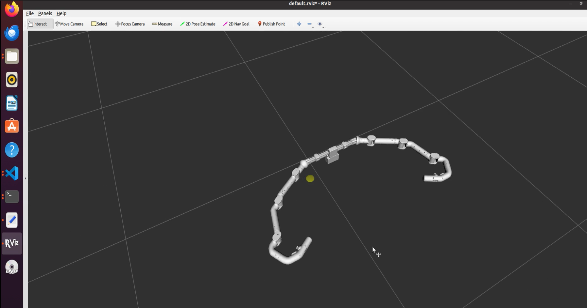
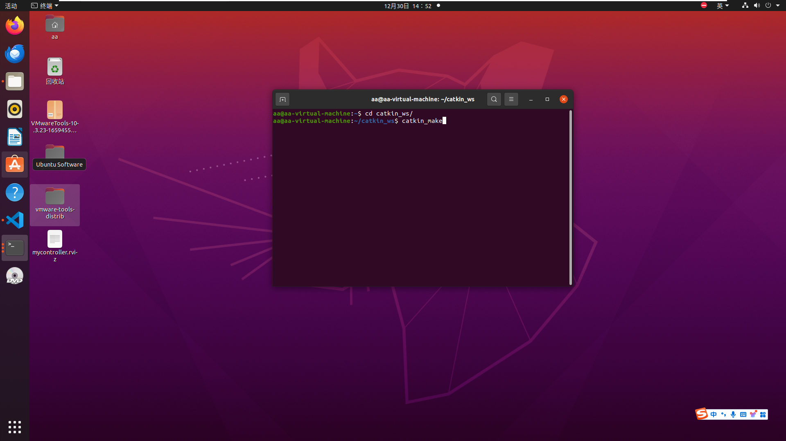
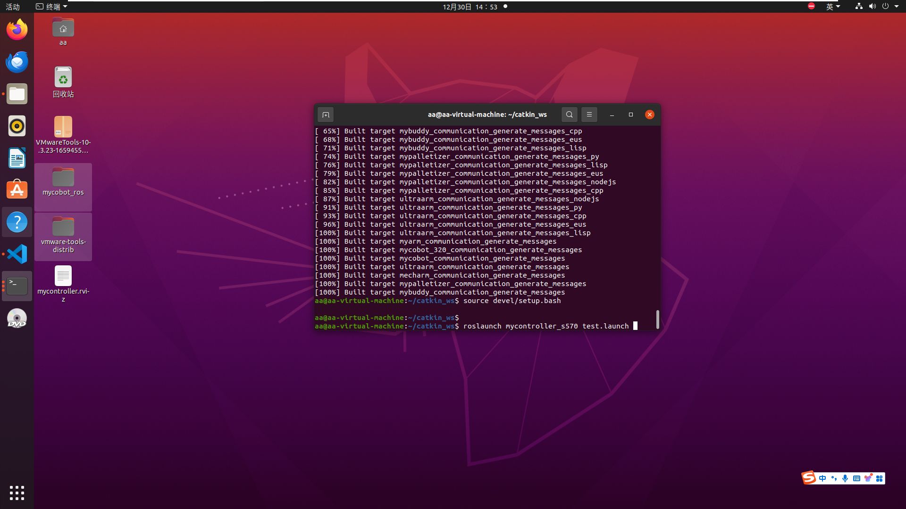
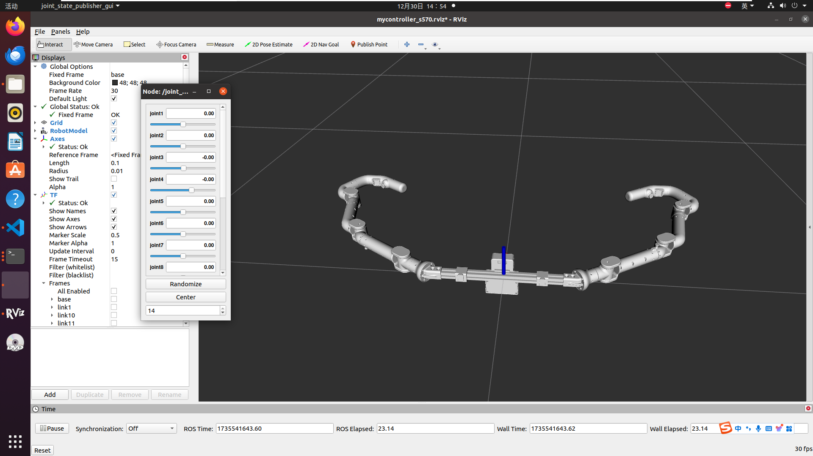
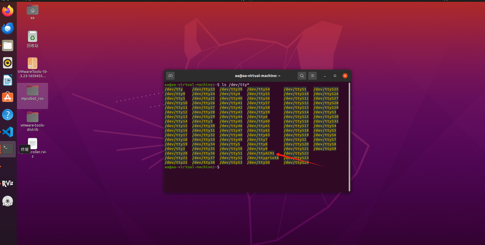
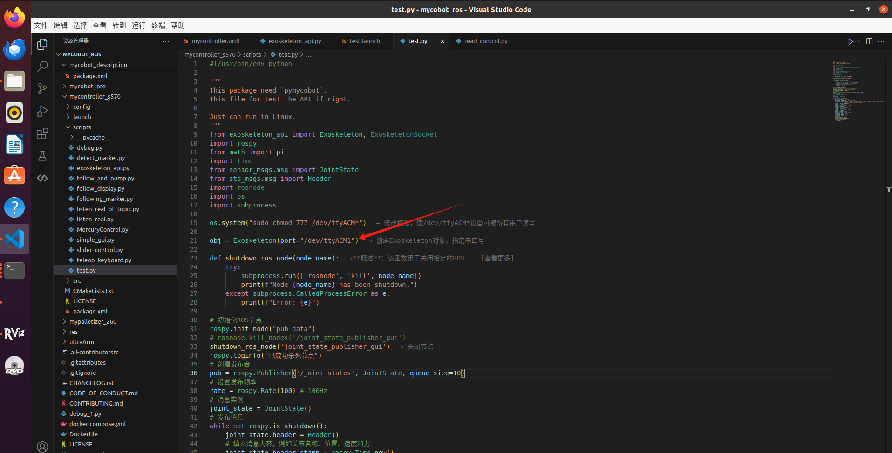
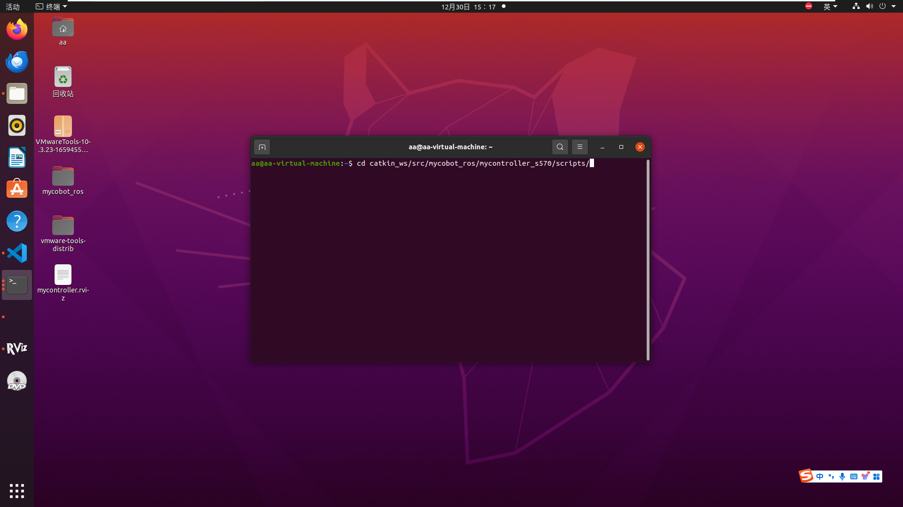

# I. Simulation

We provide some **static simulations** and **dynamic simulations** to interact with the MyController S570.

## 1.1 Static Simulation
Static simulation here refers to interacting with the MyController S570 in the simulation using the sliding module in rviz.

To do this, open a terminal in the workspace and enter the following commands:
> source devel/setup.bash # Add environment variables  
> roslaunch myarm_m test02.launch  

**This will also open rviz and generate the simulation model of MyController S570.**

  

## 1.2 Dynamic Simulation
① First turn on the switch on MyController S570, and check whether the screen displays normally (that is, the Angle of each joint and the information of the button appear).  
② Connect the MyController S570 to the computer through the serial port

③ In the system, open the terminal command line and enter:  
> cd catkin_ws  
> catkin_make  
> source devel/setup.bash  
> roslaunch mycontroller_s570 test.launch  

    
  

**At the same time, rviz will be opened to generate a simulation model of MyController S570**  
  

④ Create a terminal and enter: (You can view the serial port number of the S570 connecting to the system)  
> ls /dev/tty*

  

⑤ Open the script file, modify the serial port number, and save:  
  

⑥ Create a new terminal and enter:
> cd catkin_ws/src/mycobot_ros/mycontroller_s570/scripts  
>
> python3 test.py

  

  

**At this point, the exoskeleton successfully achieved model following motion**

Effects Video:    

<video src="../../../resources/4-FunctionsAndApplications/6-SDKDevelopment/5.2-DevelopmentAndUseBasedOnROS1/s570/myController S570 ROS Demo EN.mp4" controls="controls" width="600" height="400">Your browser does not support playing this video!</video>

---

[← Previous Page](1_download.md) | [Next Page →](3_ROScode.md)
