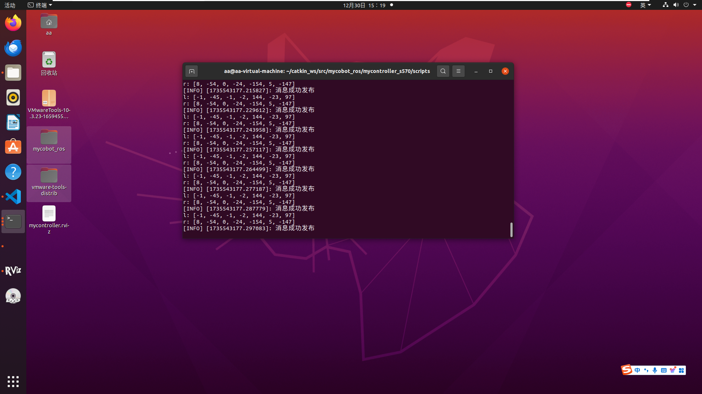

# 一、仿真

我们提供一些 **静态仿真** 和 **动态仿真**， 用以和 MyController S570 交互。  

## 1.1 静态仿真
这里的静态仿真是指：用rviz中的滑动模块与仿真中的MyController S570 交互  
在工作空间打开终端命令行中输入:  
> source devel/setup.bash # 添加环境变量  
> roslaunch myarm_m test02.launch  
  

**同时会打开rviz，生成MyController S570的仿真模型**

  

## 1.2 动态仿真
①首先打开MyController S570上的开关，并自行检查屏幕是否显示正常（即出现每个关节的角度以及按钮的信息）  
②通过串口将MyController S570与电脑连接

③在系统中打开终端命令行中依次输入:
> cd catkin_ws  
> catkin_make  
> source devel/setup.bash  
> roslaunch mycontroller_s570 test.launch  

  
  

**同时会打开rviz，生成MyController S570的仿真模型**
  

④新建一个终端并输入：(可以查看S570连接系统的串口号)
> ls /dev/tty*

  

⑤打开脚本文件，修改串口号，并保存：  
  

⑥新建一个终端并依次输入：
> cd catkin_ws/src/mycobot_ros/mycontroller_s570/scripts  
>
> python3 test.py

  

  

**至此，外骨骼成功实现模型跟随运动**

效果视频：  

<video src="../../../resources/4-FunctionsAndApplications/6-SDKDevelopment/5.2-DevelopmentAndUseBasedOnROS1/s570/myController S570 ROS .mp4" controls="controls" width="600" height="400">您的浏览器不支持播放该视频！</video>

---

[← 上一页](1_download.md) | [下一页 →](3_ROScode.md)

