# 1. Introduction

ROS provides some useful command-line tools to retrieve various information about different nodes. The commonly used commands are as follows:

- `rosnode`: Manage nodes  
- `rostopic`: Manage topics  
- `rosservice`: Manage services  
- `rosmsg`: Manage msg messages  
- `rossrv`: Manage srv messages  
- `rosparam`: Manage parameters  

Official reference: [http://wiki.ros.org/ROS/CommandLineTools](http://wiki.ros.org/ROS/CommandLineTools)

# 2. rosnode

`rosnode` is used to retrieve node information.  
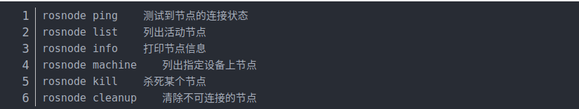  

# 3. rostopic

`rostopic` includes a command-line tool for displaying debugging information related to ROS topics, such as publishers, subscribers, publish rate, and ROS messages. It also includes an experimental Python library to dynamically retrieve and interact with topic information.  
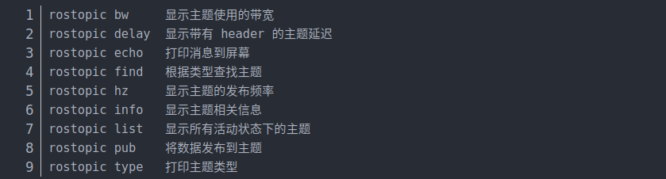  

### 3.1 rostopic list

Invoke the command directly, and the console will print the list of topic names in the current running state.  
`rostopic list -v`: Get detailed information about the topics (e.g., the number of publishers and subscribers).  

### 3.2 rostopic pub

You can invoke the command to publish messages to the subscribers.  
For example, publishing a string message to a subscriber in the RoboWare auto-generated Publish/Subscribe model case.  
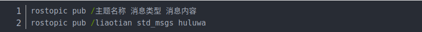  

Example of publishing a movement message for the turtle:  
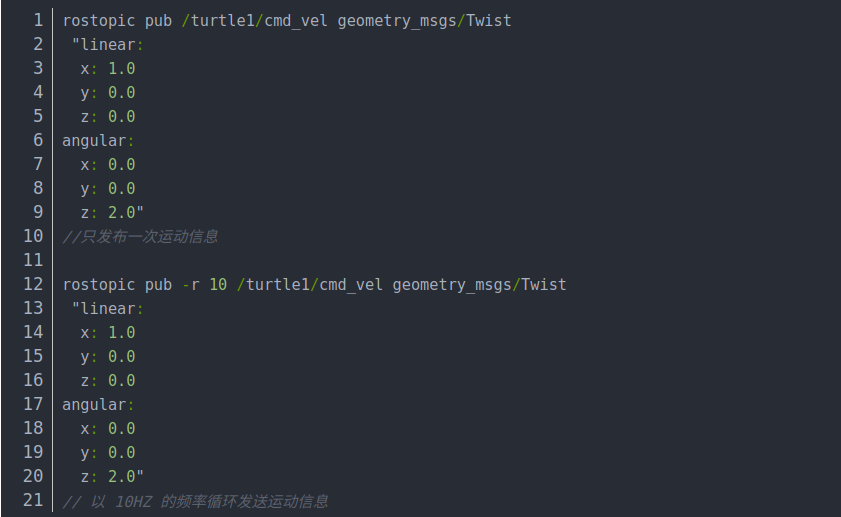  

### 3.3 rostopic echo
Get the current message published by a specified topic.  

### 3.4 rostopic info
Get detailed information about the current topic:  
1. Message type  
2. Publisher information  
3. Subscriber information  

# 4. rosservice

`rosservice` contains command-line tools for listing and querying ROS services.  
If calling certain services, and the workspace is not configured with the path, you may need to enter the workspace and invoke `source devel/setup.bash`.  
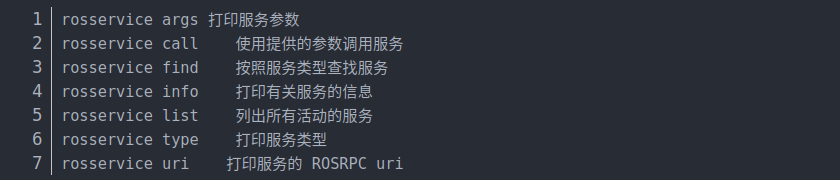  

### 4.1 rosservice args
Print service parameters  
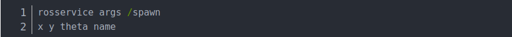  

### 4.2 rosservice call

Call a service to generate a **new turtle**.  
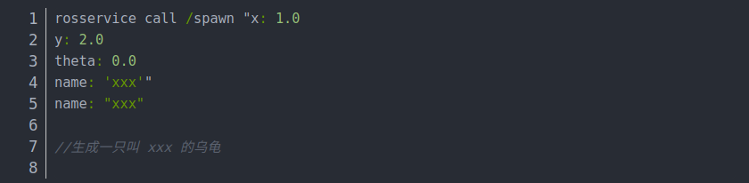  

# 5. rosmsg

`rosmsg` is a command-line tool used to display information about ROS message types.  
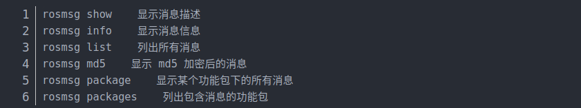  

### 5.1 rosmsg package

List all msg files in a package.  
  

### 5.2 rosmsg show

Display the message description.  
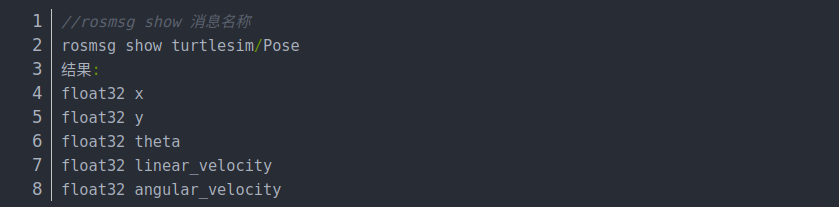  

# 6. rossrv

`rossrv` is a command-line tool used to display information about ROS service types, similar to `rosmsg`.  
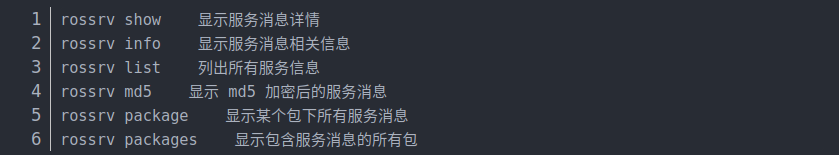  

### 6.1 rossrv package  
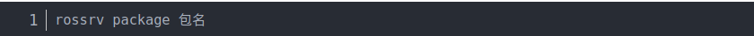  

### 6.2 rossrv show

Display the service description.  
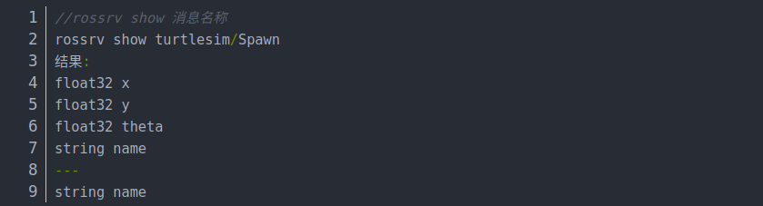  

# 7. rosparam

`rosparam` contains a command-line tool for retrieving and setting ROS parameters using YAML-encoded files on the parameter server.  
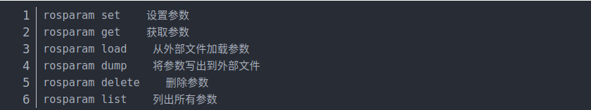  

### 7.1 rosparam set

Set a parameter.  
> `rosparam set name xxx`  

### 7.2 rosparam get

Get a parameter.  
> `rosparam get name`  

### 7.3 rosparam delete

Delete a parameter.  
> `rosparam delete name`  

### 7.4 rosparam load (Prepare the YAML file)

Load parameters from an external file.  
> `rosparam load xxx.yaml`  

### 7.5 rosparam dump

Dump parameters to an external file.  
> `rosparam dump yyy.yaml`  

# 8. Introduction to URDF

- Unified Robot Description Format (URDF) is an XML format used to describe a robot model. The URDF package in ROS contains a C++ parser, and URDF files are used to describe robot models.  
- URDF cannot be used alone. It needs to be rendered into a graphical model in Rviz or Gazebo. URDF is just a file that must be visualized in Rviz or Gazebo.

### 8.1 URDF File Description

Code example (only part of the code is shown here):  
    
  

As can be seen, the URDF file is not complex. It is mainly composed of **link** and **joint** elements that repeat.

### 8.2 link Section

The `link` element describes rigid bodies with inertia, visual features, and collision properties.

#### 8.2.1 Attributes

- `name`: Describes the name of the link itself.  

#### 8.2.2 Elements

- **visual**  
  - The visualization properties of the link. It specifies the shape of the link (e.g., box, cylinder). Multiple visual elements can be used to form the shape of the link. More complex shapes can be imported from STL files generated in software like SolidWorks, while simpler shapes (e.g., end effectors) can be written directly. You can also adjust the geometry of the link to match theoretical models or actual models.  

  - **name** (optional): The name of the link's geometry shape.

  - **origin** (optional, defaults to identity if not specified):  
    - Specifies the coordinate system for the geometry relative to the link's coordinate system.  
    - `xyz` (optional, defaults to zero vector): Represents offsets in the x, y, and z directions (in meters).  
    - `rpy` (optional, defaults to identity if not specified): Represents rotation along the RPY axes (in radians).

- **geometry** (required):  
  - Describes the shape of the visual object, which can be one of the following:  
    - **box**: Rectangular, with length, width, and height.  
    - **cylinder**: Cylindrical, with radius and length.  
    - **sphere**: Spherical, with radius.  
    - **mesh**: A mesh, defined by a file, with an optional scale. Recommended to use Collada (.dae) files, though STL files are also supported, but they must be local files.

- **collision** (optional):  
  - Collision properties of the link. They are used for simplifying collision calculations and differ from visualization properties. A link can have multiple collision properties.  
  - **name** (optional): Specifies the name of the link's geometry.  
  - **origin** (optional, defaults to identity if not specified): Specifies the reference coordinate system for the collision component relative to the link's coordinate system.  
  - **geometry**: Same as the geometry element described above.

For detailed elements and their usage, refer to the [official documentation](http://wiki.ros.org/urdf/XML/link).

### 8.3 joint Section

The `joint` section describes the kinematics and dynamics of a joint and specifies its relationship with other links. The main attributes and elements are as follows:

#### 8.3.1 Joint Attributes:

- **name**:  
  Specifies the unique name of the joint.

- **type**:  
  Specifies the type of joint, which can be one of the following:

  - **revolute**: A revolute joint that rotates along an axis, with the range specified by upper and lower limits.
  - **continuous**: A continuous revolute joint that rotates around an axis without upper or lower limits.
  - **prismatic**: A prismatic joint that slides along an axis, with the range specified by upper and lower limits.
  - **fixed**: This is not a real joint as it cannot move. All degrees of freedom are locked. A fixed joint does not require an axis, calibration, dynamics, limits, or safety_controller.
  - **floating**: This joint allows motion in all 6 degrees of freedom.
  - **planar**: This joint allows motion in a plane perpendicular to the axis.

#### 8.3.2 Joint Elements

- **origin** (optional, defaults to identity if not specified):  
  The transformation from the parent link to the child link. The joint is located at the origin of the child link. Modifying this parameter can adjust the position of the links. It can be useful for adjusting discrepancies between the actual model and the theoretical model, but large modifications are not recommended as this can affect the link’s STL file position and may interfere with collision detection.
  - **xyz** (optional, defaults to zero vector): Specifies the offset in the x, y, and z directions in meters.
  - **rpy** (optional, defaults to zero vector): Specifies the rotation angles around the fixed axes: roll (around the x-axis), pitch (around the y-axis), and yaw (around the z-axis), in radians.

- **parent** (required):  
  The name of the parent link. This is a mandatory attribute.
  - The name of the parent link refers to the link’s name in the robot’s structure tree.

- **child** (required):  
  The name of the child link. This is a mandatory attribute.
  - The name of the child link refers to the link’s name in the robot’s structure tree.

- **axis** (optional, defaults to (1,0,0)):  
  The axis of the joint in the joint's coordinate system. This is the axis of rotation (for revolute joints), the axis of motion (for prismatic joints), or the standard plane for planar joints. This axis is specified in the joint’s coordinate system. Modifying this parameter can adjust the axis around which the joint rotates, and it’s commonly used to adjust the rotation direction. If the model rotates in the opposite direction to the actual model, simply multiply by -1. Fixed and floating joints do not require this element.
  - **xyz** (required): Specifies the components of the axis vector in x, y, and z directions as a normalized vector.

- **calibration** (optional):  
  Specifies the reference point for the joint, used to correct the absolute position of the joint.
  - **rising** (optional): When the joint moves in the positive direction, a rising edge is triggered at the reference point.
  - **falling** (optional): When the joint moves in the positive direction, a falling edge is triggered at the reference point.

- **dynamics** (optional):  
  This element specifies the physical properties of the joint. The values are used to describe the joint's behavior, especially in simulations.

- **limit** (required for revolute or prismatic joints):

  - This element defines the kinematic constraints of the joint.
  - **lower** (optional, defaults to 0): Specifies the lower limit of the joint's motion (in radians for revolute joints, in meters for prismatic joints). Continuous joints ignore this attribute.
  - **upper** (optional, defaults to 0): Specifies the upper limit of the joint's motion (in radians for revolute joints, in meters for prismatic joints). Continuous joints ignore this attribute.
  - **effort** (required): Specifies the maximum force that the joint can apply during its operation.
  - **velocity** (required): Specifies the maximum speed at which the joint can move.

For more detailed information about the elements and their usage, refer to the [documentation](http://wiki.ros.org/urdf/XML/joint).

---

[← Previous page](2_workcode.md) | [Next page →](4_communication.md)
