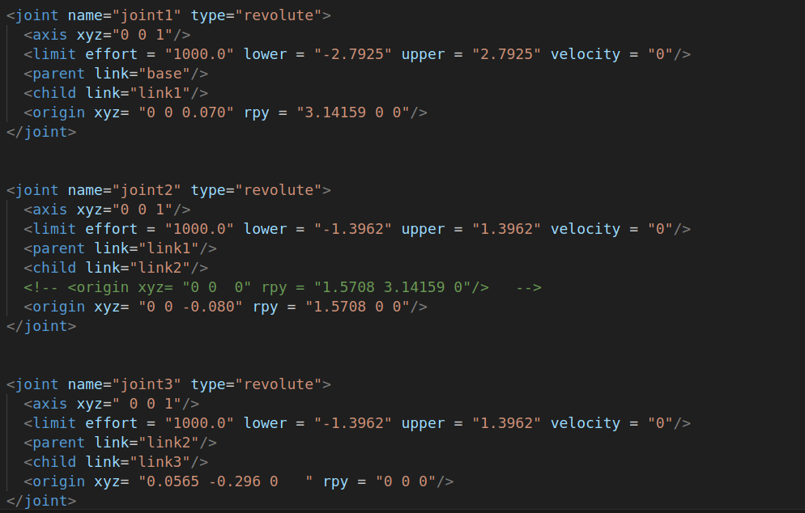

# 一、前言

在 ROS 同提供了一些实用的命令行工具，可以用于获取不同节点的各类信息，常用的命令如下:

rosnode : 操作节点  
rostopic : 操作话题  
rosservice : 操作服务  
rosmsg : 操作msg消息  
rossrv : 操作srv消息  
rosparam : 操作参数  
官方参考网址：http://wiki.ros.org/ROS/CommandLineTools  

# 二、rosnode

rosnode 是用于获取节点信息的命令  
   

# 三、rostopic

rostopic包含rostopic命令行工具，用于显示有关ROS 主题的调试信息，包括发布者，订阅者，发布频率和ROS消息。它还包含一个实验性Python库，用于动态获取有关主题的信息并与之交互。  
   

### 3.1 rostopic list

直接调用即可，控制台将打印当前运行状态下的主题名称  
rostopic list -v : 获取话题详情(比如列出：发布者和订阅者个数…)  
### 3.2 rostopic pub

可以直接调用命令向订阅者发布消息  
为roboware 自动生成的 发布/订阅 模型案例中的 订阅者 发布一条字符串  
  

以小海龟为例的发布一条运动信息：  
   

### 3.3 rostpic echo
获取指定话题当前发布的消息  

### 3.4 rostopic info
获取当前话题的信息  
1. 消息类型  
2. 发布者信息  
3. 订阅者信息  

# 四、rosservice

rosservice包含用于列出和查询ROSServices的rosservice命令行工具。  
调用部分服务时，如果对相关工作空间没有配置 path，需要进入工作空间调用 **source devel/setup.bash**  
   

### 4.1 rosservice args  
打印服务参数  
   

### 4.2 rosservice call

调用服务  生成一只 **新的乌龟**  
   

# 五、rosmsg

rosmsg是用于显示有关 ROS消息类型的 信息的命令行工具。  
   

### 5.1 rosmsg package

列出某个包下的所有msg   
   

### 5.2 rosmsg show

显示消息描述  
  

# 六、rossrv

rossrv是用于显示有关ROS服务类型的信息的命令行工具，与 rosmsg 使用语法高度雷同。  
  

### 6.1 rossrv package  
  

### 6.2 rossrv show

显示消息描述  
  

# 七、rosparam

rosparam包含rosparam命令行工具，用于使用YAML编码文件在参数服务器上获取和设置ROS参数。  
  

### 7.1r osparam set

设置参数  
> rosparam set name xxx  

### 7.2 rosparam get

获取参数  
> rosparam get name  

### 7.3 rosparam delete

删除参数  
> rosparam delete name  

### 7.4 rosparam load(先准备 yaml 文件)

从外部文件加载参数  
> rosparam load xxx.yaml  

### 7.5 rosparam dump

将参数写出到外部文件  
> rosparam dump yyy.yaml

# 八、URDF介绍

- Unified Robot Description Format，统一机器人描述格式，简称为URDF。ROS中的urdf功能包包含一个URDF的C++解析器，URDF文件使用XML格式描述机器人模型。
- URDF 不能单独使用，需要结合 Rviz 或 Gazebo，URDF 只是一个文件，需要在 Rviz 或 Gazebo 中渲染成图形化的机器人模型。

### 8.1 urdf文件描述

代码示例：  
本处只截取部分代码进行展示：  
    
  

可以看出，urdf文件并不复杂，主要是由 **link** 和 **joint** 两个部分不断重复而成。  

### 8.2 link部分
link元素描述具有惯性、可视特征和碰撞属性的刚体  

#### 8.2.1 属性
name： 用来描述链接本身的名称  

#### 8.2.2 元素  
- **visual**    
  - 连杆的可视化属性。用于指定连杆显示的形状（矩形、圆柱体等），同一连杆可以存在多个visual元素，连杆的形状为多个元素两个形成。一般情况下模型较为复杂可以通过soildwork绘制后生成stl调用，简单的形状如添加末端执行器等可以直接编写。同时可以在此处可根据理论模型和实际模型差距调整几何形状的位置。  

  - **namel** (可选) 连杆几何形状的名字。

  - **origin** (可选，defaults to identity if not specified)
    - 相对于连杆的坐标系的几何形状坐标系。
    - xyz (optional: defaults to zero vector) 表示x , y , z x,y,zx,y,z 方向的偏置，单位为米。
    - rpy (optional: defaults to identity if not specified) 表示坐标轴在RPY方向上的旋转，单位为弧度。

- **geometry** （必需） 
  - 可视化对象的形状，可以是下面的其中一种：  
  - **box** 矩形，元素包含长、宽、高。原点在中心。
  - **cylinder** 圆柱体，元素包含半径、长度。原点中心。
  - **sphere** 球体，元素包含半径。原点在中心。
  - **mesh** 网格，由文件决定，同时提供 scale ，用于界定其边界。推荐使用 Collada .dae 文件， 也支持.stl文件，但必须为一个本地文件。   

- **collision** (可选)
  - 连杆的碰撞属性。碰撞属性和连杆的可视化属性不同，简单的碰撞模型经常用来简化计算。同一个连杆可以有多个碰撞属性标签，连杆的碰撞属性表示由其定义的几何图形集构成。  
  - **name** (可选) 指定连杆几何形状的名称  
  - **origin** (可选，defaults to identity if not specified)  
    - 碰撞组件的参考坐标系相对于连杆坐标系的参考坐标系。  
    - xyz (可选， 默认零向量) 表示x , y , z x,y,zx,y,z 方向的偏置，单位为米。
    - rpy (可选， defaults to identity if not specified) 表示坐标轴在RPY方向上的旋转，单位为弧度。
  - **geometry** 与上述geometry元素描述相同

详细元素以及各个元素的作用可以前往[官方文档](http://wiki.ros.org/urdf/XML/link)进行查看  

### 8.3 joint部分
joint部分描述了关节的运动学和动力学，并指定了关节的安全限值。

#### 8.3.1 joint的属性：

name：  
指定关节的唯一名称

type：  
指定关节的类型，其中类型可以是下列类型之一：

  - revolute - 沿轴线旋转的铰链接头，其范围由上限和下限指定。
  - 连续 - 一种连续铰链接头，围绕轴旋转，没有上限和下限。
  - 棱柱形 - 沿轴滑动的滑动接头，其范围由上限和下限指定。
  - 固定 - 这不是真正的关节，因为它不能移动。所有自由度都被锁定。这种类型的接头不需要轴，校准，动力学，极限或safety_controller。
  - 浮动 - 此接头允许所有 6 个自由度的运动。
  - 平面 - 此接头允许在垂直于轴的平面上运动。  

#### 8.3.2 joint的元素

  - **origin** (可选，defaults to identity if not specified) 从parent link到child link的变换，joint位于child link的原点，修改该参数可以调整连杆的位置，可用在调整实际模型与理论模型误差，但不建议大幅度修改，因为该参数影响连杆stl的位置，容易影响碰撞检测效果。
    - xyz (可选: 默认为零向量) 代表x , y , z x,y,zx,y,z轴方向上的偏移，单位米。
    - rpy (可选: 默认为零向量) 代表绕着固定轴旋转的角度：roll绕着x轴,pitch绕着y轴，yaw绕着z轴，用弧度表示。

  - **parent** (必需)
    - parent link的名字是一个强制的属性。
    - link parent link的名字，是这个link在机器人结构树中的名字。

  - **child** (必需)
    - child link的名字是一个强制的属性。
    - link child link的名字，是这个link在机器人结构树中的名字。

  - **axis**(可选: 默认为(1,0,0))
    - joint的axis轴在joint的坐标系中。这是旋转轴(revolute joint)，prismatic joint移动的轴，是planar joint的标准平面。这个轴在joint坐标系中被指定。修改该参数可以调整关节的旋转所绕着的轴，常用于调整旋转方向，若模型旋向与实际相反，只需乘-1即可。固定(fixed)和浮动(floating)类型的joint不需要用到这个元素。
    - xyz(必需) 代表轴向量的x , y , z x,y,zx,y,z分量，为标准化的向量。

  - **calibration** (可选)
    - joint的参考点，用来矫正joint的绝对位置。
    - rising (可选) 当joint正向运动时，参考点会触发一个上升沿。
    - falling (可选) 当joint正向运动时，参考点会触发一个下降沿。

  - **dynamics**(可选)
    - 该元素用来指定joint的物理性能。它的值被用来描述joint的建模性能，尤其是在仿真的时候。

  - **limit** (当关节为旋转或移动关节时为必需)

    - 该元素为关节运动学约束。
    - lower (可选, 默认为0) 指定joint运动范围下界的属性(revolute joint的单位为弧度，prismatic joint的单位为米)，连续型的joint忽略该属性。
    - upper (可选, 默认为0) 指定joint运动范围上界的属性(revolute joint的单位为弧度，prismatic joint的单位为米)，连续型的joint忽略该属性。
    - effort (必需) 该属性指定了joint运行时的最大的力。
    - velocity (required) 该属性指定了joint运行时的最大的速度。  

详细元素以及各个元素的作用可以前往 [文档](http://wiki.ros.org/urdf/XML/joint) 进行查看

---

[← 上一页](2_workcode.md) | [下一页 →](4_communication.md)