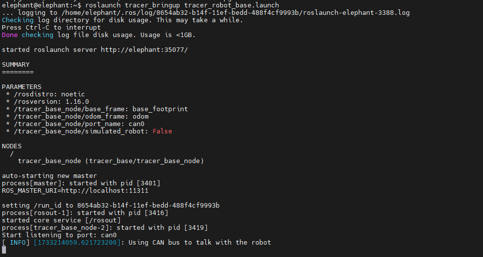
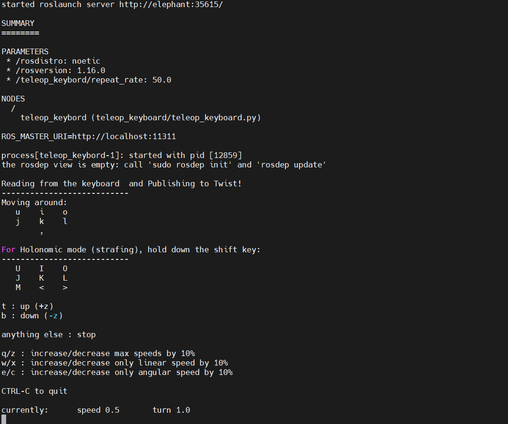

## 1. CAN总线连接

- 将TRACER顶部航空插头或者尾部插头CAN线引出，将CAN线中的CAN_H和CAN_L分别CAN_TO_USB适配器相连；
- 打开TRACER移动机器⼈底盘旋钮开关，检查来两侧的急停开关是否释放；
- 将CAN_TO_USB连接⾄笔记本的usb口。连接示意如图所示。


## 2. 开启Tracer小车底盘节点

- 为确保CAN总线使能，每次打开电源、系统重启都需要运行此命令：

```bash
rosrun tracer_bringup setup_can2usb.bash
```

- 启动底盘小车ROS节点：

```bash
roslaunch tracer_bringup tracer_robot_base.launch
```



如果已经将can-to-usb连接到TRACER机器人，并且小车已经开机、CAN总线已经使能、底盘节点已经开启，使用以下命令监控TRACER底盘的数据

```bash
candump can0
```

若底盘数据正常，终端会一直输出如下数据：


## 3. 启动键盘控制节点

打开一个终端，输入以下命令：

```bash
roslaunch tracer_bringup tracer_teleop_keyboard.launch
```



| 按键 | 说明               |
| :--- | :----------------- |
| i    | 向前移动           |
| ,    | 向后移动           |
| u    | 逆时针旋转         |
| o    | 顺时针旋转         |
| k    | 停止               |
| q    | 提高线速度和角速度 |
| z    | 降低线速度和角速度 |
| w    | 提高线速度         |
| x    | 降低线速度         |
| e    | 增加角速度         |
| c    | 降低角速度         |

现在，小车可以在键盘控制下开始移动。

---

[← 上一页](./4_communication.md) | [下一页 →](./6_tracer_map_navigation.md)