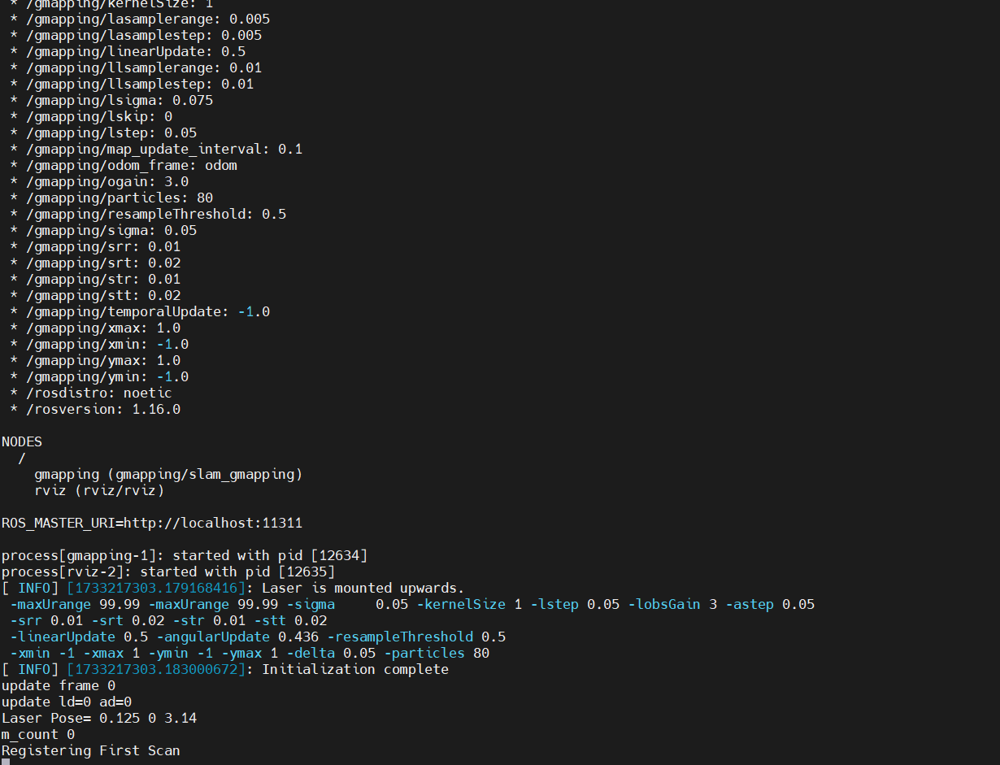
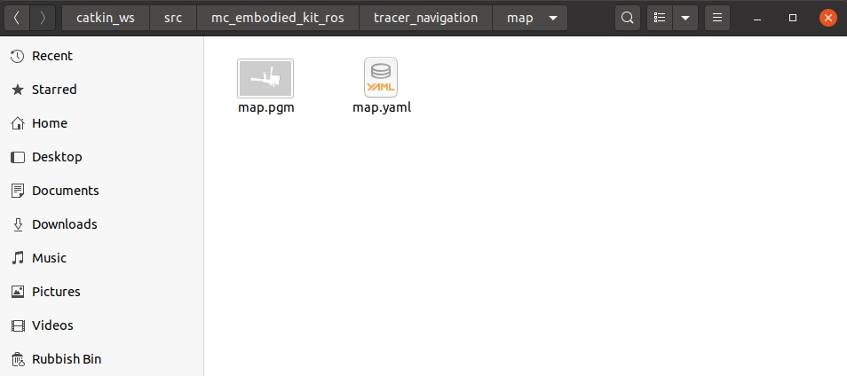

# Tracer底盘导航实现

## 1 雷达建图

### 1.1 CAN总线使能

为确保CAN总线使能，每次打开电源、系统重启都需要运行此命令：

```bash
rosrun tracer_bringup setup_can2usb.bash
```

### 1.2 启动小车底层通信

打开一个终端，运行以下命令：

```bash
roslaunch tracer_odometry tracer_active.launch
```


**注意：** 启动底盘节点前需确保CAN总线已经使能，系统重启或者重新拔插CAN总线，都需要执行使能指令： `rosrun tracer_bringup setup_can2usb.bash`

### 1.3 运行建图程序

打开一个终端，运行以下命令：

```bash
roslaunch tracer_navigation mapping.launch
```



### 1.4 启动键盘控制

打开一个终端，运行以下命令：

```bash
roslaunch tracer_bringup tracer_teleop_keyboard.launch
```


| 按键 | 说明               |
| :--- | :----------------- |
| i    | 向前移动           |
| ,    | 向后移动           |
| u    | 逆时针旋转         |
| o    | 顺时针旋转         |
| k    | 停止               |
| q    | 提高线速度和角速度 |
| z    | 降低线速度和角速度 |
| w    | 提高线速度         |
| x    | 降低线速度         |
| e    | 增加角速度         |
| c    | 降低角速度         |

### 1.5 开始建图

现在底盘小车可以在键盘控制下移动。同时，您可以在 Rviz 空间中观察到，随着小车的移动，我们的地图也在逐渐构建。

注意：使用键盘操作小车时，请确保运行 `tracer_teleop_keyboard.launch` 文件的终端是当前选定的终端；否则，键盘控制程序将无法识别按键。此外，为了获得更好的映射效果，建议在键盘控制时将线速度设为 0.2，角速度设为 0.3，因为较低的速度往往会产生更好的映射效果。


### 1.6 保存构建的地图

打开另一个新的终端控制台，在命令行中输入以下命令，保存 tracer 扫描的地图：

```bash
cd ~/catkin_ws/src/mc_mebodied_kit_ros/tracer_navigation/map

rosrun map_server map_saver
```


执行成功后，将在当前路径(`~/catkin_ws/src/mc_mebodied_kit_ros/tracer_navigation/map`)下生成两个默认地图参数文件，即map.pgm和map.yaml。



移动底盘建图实际效果如下（**视频已加速**），仅供参考：

<video id="my-video" class="video-js" controls preload="auto" width="100%"
poster="" data-setup='{"aspectRatio":"16:9"}'>
  <source src="../../../resources/4-FunctionsAndApplications/6-SDKDevelopment/5.2-DevelopmentAndUseBasedOnROS1/tracer_use/SLAM_mapping.mp4" type='video/mp4' >
</video>

## 2 地图导航

>> 注意：开始导航之前，建议将小车的初始位置放在绘制地图时小车所在的起点位置。

在此之前，我们已经成功创建了空间地图，并获得了一组地图文件，即位于 `~/catkin_ws/src/mc_mebodied_kit_ros/tracer_navigation/map` 目录下的 map.pgm 和 map.yaml。


### 2.1 启动小车底层通信

>> 注意：若已经启动，则忽略此操作

打开一个终端，运行以下命令：

```bash
roslaunch tracer_odometry tracer_active.launch
```


### 2.2 运行导航程序

打开一个终端，输入以下命令运行：

```bash
roslaunch tracer_navigation navigation_active.launch
```


 您将看到一个 Rviz 仿真窗口已经打开。

- **左下角导航控制面板说明**


① **Maximum number of targets**：目标点的最大数量，您可以设置目标点的最大数量。设置的目标点数量不能超过此参数（但可以少于此参数）。

② **Loop**：循环，如果选中此选项，则在导航到最后一个目标点后，机器人将导航回第一个目标点。例如：1 -> 2 -> 3 -> 1 -> 2 -> 3 -> ...开始导航前必须选中该选项。

③ **Mission target point list**：任务目标点列表，x/y/yaw，地图上给定目标点的姿态（xy 坐标和 yaw）。设置目标点最大数量并保存后，该列表将生成相应数量的条目。


Cancel
Reset

④ **Start Navigation**：开始导航，开始目标点导航任务。

⑤ **Cancel**：取消当前目标点导航任务，机器人将停止移动。再次点击 "Start Navigation"，机器人将从下一个目标点继续前进。

例如：1 -> 2 -> 3。如果在 1 -> 2 过程中点击 "Cancel"，机器人将停止。再次点击 "Start Navigation"，机器人将从当前位置前进到 3。

⑥ **Reset**：重置，清除所有当前目标点。

- **开始导航**

设置任务的目标点数量，点击确认并保存。然后点击工具栏上的 "**2D Nav Goal**"，在地图上定义目标点。（每次设置点时，都要先点击 "**2D Nav Goal**"）。目标点区分方向，箭头代表车辆的航向。点击 "Start Navigation "开始导航。在 Rviz 中，您将看到一条从起点到目标点的规划路径，车辆将沿着这条路线行驶到达目的地。


导航效果如下（**视频已加速**），仅供参考：

<video id="my-video" class="video-js" controls preload="auto" width="100%"
poster="" data-setup='{"aspectRatio":"16:9"}'>
  <source src="../../../resources/4-FunctionsAndApplications/6-SDKDevelopment/5.2-DevelopmentAndUseBasedOnROS1/tracer_use/navigation.mp4" type='video/mp4' >
</video>

---

[← 上一页](./5_tracer_keyboard_control.md) | [下一节 →](../5.3-DevelopmentAndUseBasedOnROS2/1_download.md)