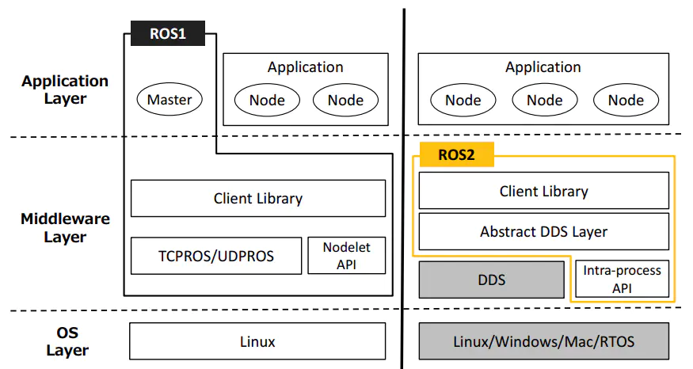
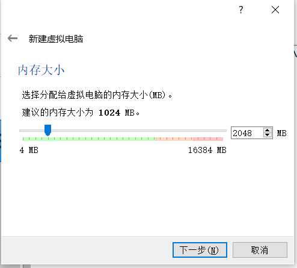
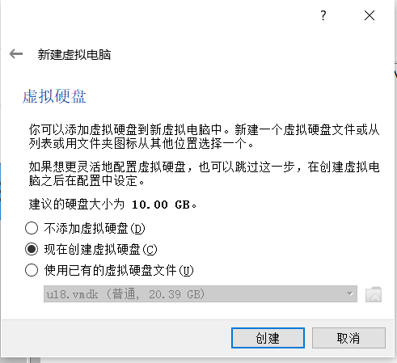
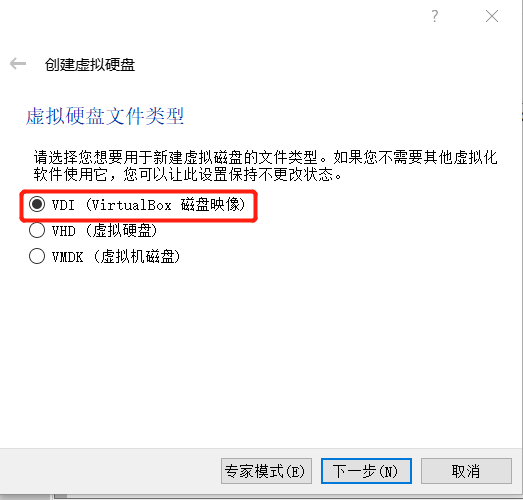
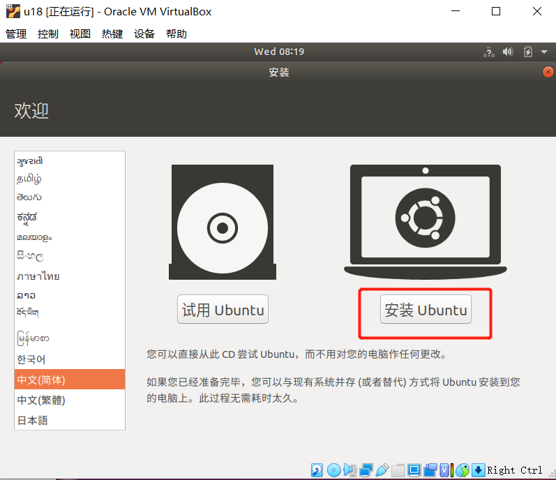
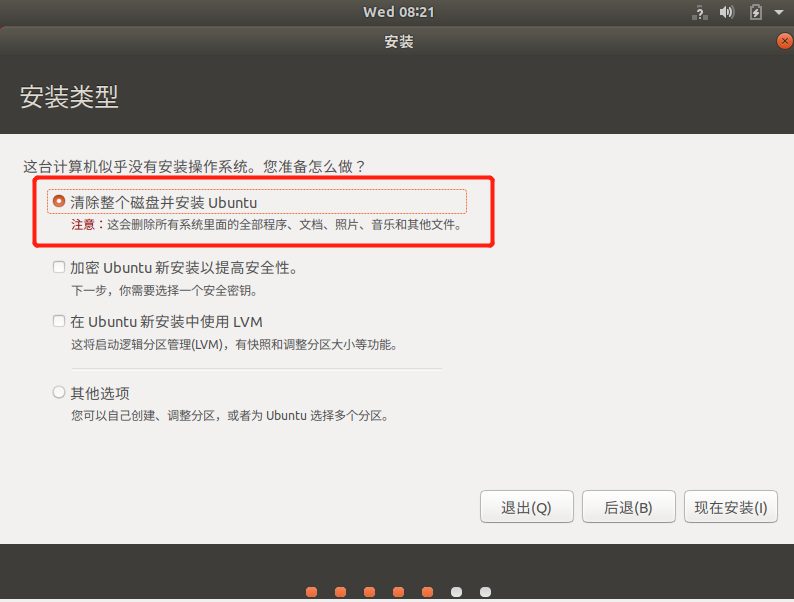
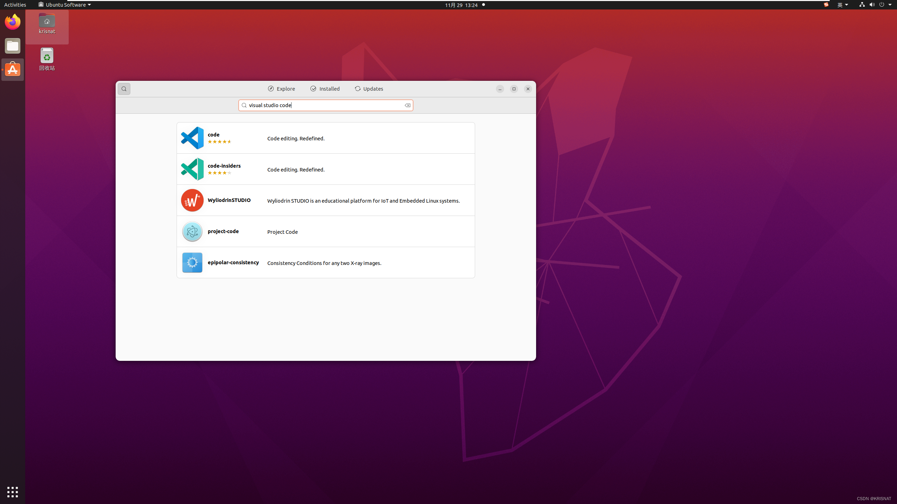
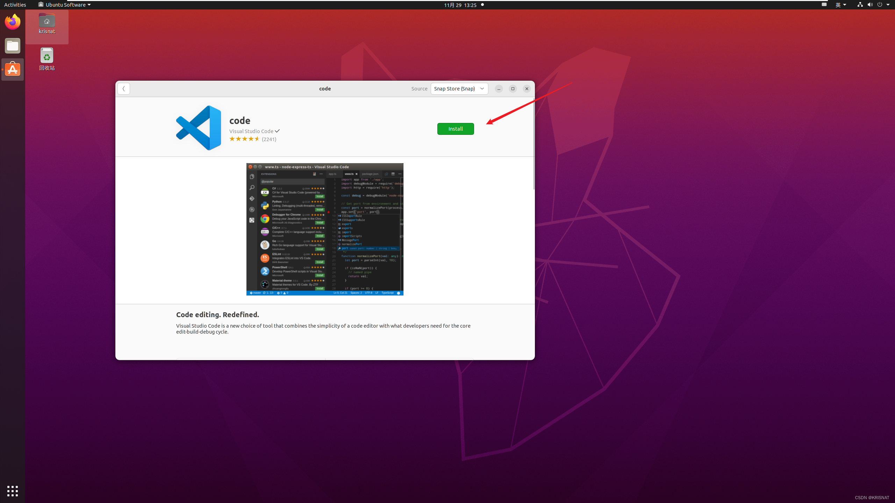
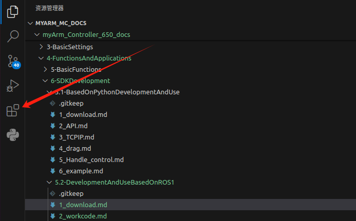
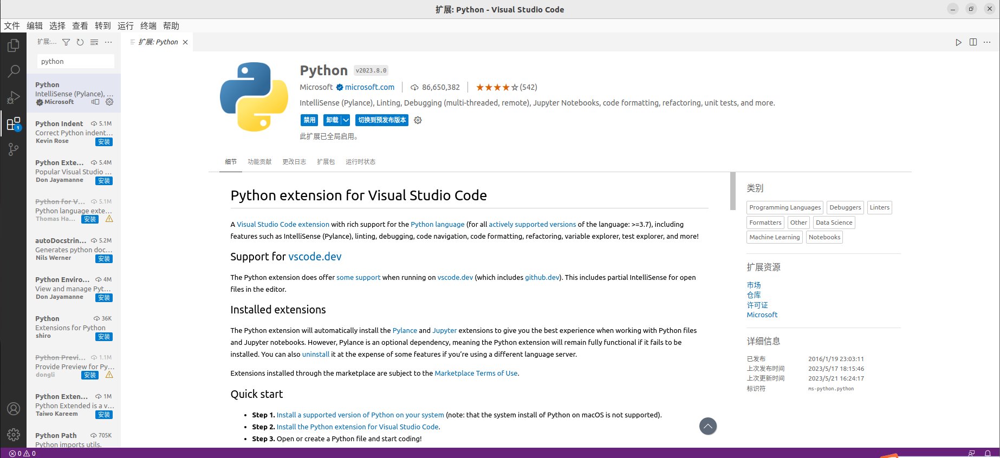

# ROS2 介绍

        ROS2的前身是ROS，ROS就是机器人操作系统（Robot Operating System）。 但ROS本身并不是一个操作系统，而是一个软件库和工具集。 Ros的出现解决了机器人各个部件的通信问题。 后来，越来越多的机器人算法被集成到ROS中。 ROS2继承了ROS，比ROS更强大更好用。
## ROS2的设计目标和特点

ROS2肩负着改变智能机器人时代的历史使命。 在设计之初，就考虑到满足各种机器人应用的需求。

   - 多机器人系统： 未来机器人不再是独立的个体，机器人之间也需要交流和协作。 ROS2为多机器人系统的应用提供了标准的方法和通信机制。

   - 跨平台： 机器人应用场景不同，使用的控制平台也会有很大差异。 为了让所有的机器人都能运行ROS2，ROS2可以跨平台运行在Linux、Windows、MacOS、RTOS上。

   - 实时： 机器人运动控制和许多行为策略都要求机器人是实时的。 例如，机器人必须在 100 毫秒内可靠地检测到前方的行人，或在 1 毫秒内完成运动学和动力学计算。 ROS2 是像这样实时提供基本要求的。

   - 产品化： 大量的机器人已经进入我们的生活，未来还会越来越多，ROS2不仅可以用于机器人研发阶段，还可以直接安装在 产品并进入消费市场。 这也对ROS2的稳定性和鲁棒性提出了巨大的挑战。

   - 项目管理： 机器人开发是一项复杂的系统工程。 设计、开发、调试、测试、部署全过程的项目管理工具和机制也将在ROS2中得到体现，方便我们开发机器人。  

## 发行版本
ROS2和Ubuntu对应的发行版本和维护周期。  

| ROS2版本 | 发布日期 | 维护期限 | Ubuntu 版本 |
| :----:| :----:| :----: | :----: |
| [Dashing](http://docs.ros.org/en/dashing/index.html) | 2019.5 | 2021.5 | Ubuntu 18.04 (Bionic Beaver) |
| [Eloquent](http://docs.ros.org/en/eloquent/index.html) | 2019.11 | 2020.11 | Ubuntu 18.04 (Bionic Beaver) |
| [Foxy](http://docs.ros.org/en/foxy/index.html) | 2020.6 | 2023.5 | Ubuntu 20.04(Focal Fossa) |
| [Galactic](http://docs.ros.org/en/galactic/index.html) | 2021.5 | 2022.11 | Ubuntu 20.04(Focal Fossa) |
| [Humble](http://docs.ros.org/en/humble/index.html) | 2022.5 | 2027.5 | Ubuntu 22.04(Jammy Jellyfish) |   

## ROS和ROS2的比较

ROS2重新设计了系统架构。 两代ROS的架构变化如下：  
  

- **OS Layer**： OS层。在ROS2中，它可以构建在linux或其他系统上，甚至是没有操作系统的裸机。 

- **Middleware Layer**： 中间件层。ROS1的通信系统基于TCPROS/UDPROS，而ROS2的通信系统基于DDS。 DDS是分布式实时系统中数据发布/订阅的标准解决方案。  

- **Application Layer**： 应用层。ROS1依赖于ROS Master，而在ROS2中，节点之间使用了一种名为“Discovery”的发现机制来帮助彼此建立连接。  

ROS设计了一套完整的通信机制（主题、服务、参数、动作）来简化机器人开发。 通过这种机制，可以连接机器人的各个部件。 这种机制设计了一个叫做Ros Master的节点，所有其他组件的通信都必须经过master节点。 一旦主节点挂掉，就会导致整个机器人系统的通信崩溃！ 所以不能利用Ros的不稳定性来做一些自动驾驶等高风险的机器人。 此外，还有以下缺点：  
- 基于TCP的通信实时性差，系统开销大
- 对 python3 支持不友好
- 消息机制不兼容
- 无加密机制，安全性低  

ROS2首先移除ROS中存在的master节点。 去掉主节点后，各个节点可以通过DDS节点相互发现，各个节点是平等的，可以实现一对一、一对多、多对多的通信。 使用DDS进行通信后，可靠性和稳定性得到了增强。

与只支持Linux系统的**ROS**相比，**ROS2**还支持windows、mac甚至RTOS平台。

# Myarm M750版本:
## 在Linux中安装不同版本的ubuntu系统
### 1 虚拟机安装

前往[官方网站](https://www.virtualbox.org/wiki/Downloads)下载虚拟机Virtual Box 或者前往[官方网站](https://www.vmware.com/products/desktop-hypervisor.html)下载虚拟机 VM ware

当然，如果您已经拥有您的虚拟机，您可以跳过该步骤。  
我们选择下载Virtual box，因为它是免费的。

  

### 2 新建虚拟机
#### 2.1 创建虚拟机

**在控制中选择新建**  
输入虚拟机名称和虚拟机存放的位置，选择虚拟机类型为Linux，选择ubuntu64位版本，进行下一步。

按照自己的需求配置内存大小，进行下一步。  

选择现在**创建虚拟硬盘**，进行创建。   

虚拟硬盘类型选择**VDI**类型，进行下一步。  

分配虚拟硬盘大小，由于需要安装ubuntu系统，而且还会在该系统中进行操作，建议大小不要低于20G。   
  

#### 2.2 导入ubuntu系统
##### 2.2.1 下载ubuntu系统。

请根据自己的需要选择ubuntu版本进行安装

注意： ROS2需要下载20.04版本。  
> [16.04版本](https://releases.ubuntu.com/16.04.7/)  
> [18.04版本](https://releases.ubuntu.com/18.04.6/)  
> [20.04版本](https://old-releases.ubuntu.com/releases/20.04.3/)

**三种版本的安装方法和过程都是相同的，这里以18.04版本作为例子进行安装**  
  

下载完成后有如图文件：  
  

##### 2.2.2 导入ubuntu到虚拟机中

在Virtual box中找到之前安装的虚拟机，进入**设置**，并在**存储**中给控制器分配光盘：
  
  
然后打开虚拟机进行ubuntu安装，并点击启动。  

##### 2.2.3 ubuntu安装

等待系统启动，进入**欢迎**界面，选中“中文（简体）”，并点击“安装 Ubuntu”按钮；
  

点击“继续”按钮；  
  

选中“清除整个磁盘并安装 Ubuntu”选项，点击“现在安装”按钮；
  

在弹出的对话框中点击“继续”按钮；  
   

设置地理位置，点击“继续”按钮；  
  

设置用户名和密码，点击“继续”按钮；  
   

进入系统安装界面，请耐心等待；  
    

待安装完成，在弹出的对话框中，点击“现在重启”按钮，完成安装。  

##  3 ROS2 环境搭建
### 3.1 ROS2 安装

基本的开发环境搭建需要安装机器人操作系统 ROS2、MoveIt2 以及 git 版本管理器，以下分别介绍其安装方法及流程。

### 3.1.1 版本选择

ROS2 跟 ubuntu 有一一对应的关系，不同版本的 ubuntu 对应不同版本的 ROS2，参考网站见下：http://docs.ros.org/en/foxy/Releases.html

这里给出对应Ubuntu支持的 ROS2 版本:  
| ROS2版本 | 发布日期 | 维护期限 | Ubuntu 版本 |
| :----:| :----:| :----: | :----: |
| [Foxy](http://docs.ros.org/en/foxy/index.html) | 2020.6 | 2023.5 | Ubuntu 20.04(Focal Fossa) |
| [Galactic](http://docs.ros.org/en/galactic/index.html) | 2021.5 | 2022.11 | Ubuntu 20.04(Focal Fossa) |
| [Humble](http://docs.ros.org/en/humble/index.html) | 2022.5 | 2027.5 | Ubuntu 22.04(Jammy Jellyfish) |  

**请根据自己安装的Ubuntu版本进行对应ROS2版本的安装**

如果版本不同，下载将会失败.在这里我们选择的系统为 Ubuntu 20.04 (推荐), 对应 ROS2 版本为 ROS2 Foxy

NOTE: 目前我们不提供 windows 安装 ROS2 的任何参考, 若有需要请参考 [ http://docs.ros.org/en/foxy/Installation/Alternatives/Windows-Development-Setup.html]( http://docs.ros.org/en/foxy/Installation/Alternatives/Windows-Development-Setup.html)

## 3.1.2 开始安装
### 1 添加源

Ubuntu 本身的软件源列表中没有 ROS2 的软件源，所以需要先**将 ROS2 软件源配置到软件列表仓库中**，才能下载 ROS2 。打开一个控制台终端(快捷键Ctrl+Alt+T),输入如下指令：  

- 官方源：  
> echo "deb [arch=\$(dpkg --print-architecture) signed-by=/usr/share/keyrings/ros-archive-keyring.gpg] http://packages.ros.org/ros2/ubuntu $(source /etc/os-release && echo $UBUNTU_CODENAME) main" | sudo tee /etc/apt/sources.list.d/ros2.list > /dev/null

- 若下载速度缓慢，推荐就近选择一个镜像源替换上面的命令。例如，huawei cloud为：    

> echo "deb [arch=\$(dpkg --print-architecture)] https://repo.huaweicloud.com/ros2/ubuntu/ $(lsb_release -cs) main" | sudo tee /etc/apt/sources.list.d/ros2.list > /dev/null

### 2 设置秘钥

配置公网秘钥,这一步是为了让系统确认我们的路径是安全的的，这样下载文件才没有问题，不然下载后会被立刻删掉：

> sudo apt install curl gnupg2 -y  
curl -s https://gitee.com/ohhuo/rosdistro/raw/master/ros.asc | sudo apt-key add -

### 3 安装

在加入了新的软件源后，需要**更新软件源列表**，打开一个控制台终端(快捷键Ctrl+Alt+T),输入如下指令：  
> sudo apt-get update  

执行**安装 ROS2**，打开一个控制台终端(快捷键Ctrl+Alt+T),请按照自己的Ubuntu版本选择输入以下指令：

> \# Ubuntu 20.04 foxy版本  
> - sudo apt install ros-foxy-desktop

> \# Ubuntu 20.04 galactic版本  
> - sudo apt install ros-galactic-desktop

> \# Ubuntu 22.04 humble版本  
> - sudo apt install ros-humble-desktop

安装过程耗时比较长，需要耐心等待  

安装完成后刷新环境变量：

> source /opt/ros/foxy/setup.bash

## 3.1.3 设置ROS2环境

为了避免每次关掉终端窗口后都需要重新生效 ROS2 功能路径，我们可以**把路径配置到环境变量中**，这样在每次打开新的终端时便可自动生效 ROS2 功能路径，在终端依次执行以下命令，打开一个控制台终端(快捷键Ctrl+Alt+T)执行以下命令：  
> \# Ubuntu 20.04 foxy版本  
> \# 将 ros 环境加入到当前控制台的环境变量
> - echo "source /opt/ros/foxy/setup.bash" >> ~/.bashrc

> \# Ubuntu 20.04 galactic版本
> - echo "source /opt/ros/galactic/setup.bash" >> ~/.bashrc

> \# Ubuntu 22.04 humble版本
> - echo "source /opt/ros/humble/setup.bash" >> ~/.bashrc

> - source ~/.bashrc  

安装 ROS2 额外依赖项

在终端输入以下命令**安装ROS2额外依赖项**，打开一个控制台终端(快捷键Ctrl+Alt+T)：

> - sudo apt install python3-argcomplete -y

> - sudo apt install ros-foxy-xacro

> - sudo apt-get install python3-colcon-common-extensions

> \# Ubuntu 20.04 foxy版本  
> - sudo apt install ros-foxy-joint-state-publisher-gui

> \# Ubuntu 20.04 galactic版本
> - sudo apt install ros-galactic-joint-state-publisher-gui

> \# Ubuntu 22.04 humble版本
> - sudo apt install ros-humble-joint-state-publisher-gui

## 3.1.4 验证安装

为了验证 ROS2 是否安装成功，打开一个控制台终端(快捷键Ctrl+Alt+T)，在终端执行以下命令：

> ros2

当显示如下界面，则表示 ROS2 安装成功  
      

# 二、MoveIt2安装
MoveIt2 是 ros2 中一系列移动操作的功能包的组成，主要包含运动规划，碰撞检测，运动学，3D 感知，操作控制等功能。

## 2.1 更新软件源列表

打开一个控制台终端(快捷键Ctrl+Alt+T)，在终端窗口输入以下命令，以更新软件源列表：
> sudo apt-get update

## 2.2 安装 MoveIt2

打开一个控制台终端(快捷键Ctrl+Alt+T)，在终端窗口输入以下命令，执行 MoveIt2 的安装：
> \# Ubuntu 20.04 foxy版本
> - sudo apt-get install ros-foxy-moveit

> \# Ubuntu 20.04 galactic版本
> - sudo apt-get install ros-galactic-moveit

> \# Ubuntu 22.04 galactic版本
> - sudo apt-get install ros-humble-moveit

# 三、 git 安装
## 3.1 添加软件源
将 git 安装的软件源添加到 ubuntu 的软件源列表中，打开一个控制台终端(快捷键Ctrl+Alt+T)，在终端窗口输入以下命令：
>sudo add-apt-repository ppa:git-core/ppa

## 3.2 更新软件源列表
打开一个控制台终端(快捷键Ctrl+Alt+T)，在终端窗口输入以下命令，以更新软件源列表：
> sudo apt-get update

## 3.3 安装 git
打开一个控制台终端(快捷键Ctrl+Alt+T)，在终端窗口输入以下命令，执行 git 的安装：
> sudo apt-get install git

## 3.4 验证安装
读取 git 版本，打开一个控制台终端(快捷键Ctrl+Alt+T)，在终端窗口输入以下命令：
> git --version

在终端中可以显示 git 版本号，如下，即为安装成功
>

## 3.5 使用

在后续下载 ros2 包需要用到git，git 的使用可以参考下面链接：  
https://git-scm.com/book/zh/v2    
https://www.runoob.com/git/git-tutorial.html

# MyarmM750 安装

MyarmM750 是 ElephantRobotics 推出的，适配旗下桌面型六轴机械臂 Myarm系列 的ROS2 包。

项目地址：https://github.com/elephantrobotics/mycobot_ros2/tree/myArmC650_M750

##  前提

在安装包之前，请保证拥有 ros2 工作空间。  
这里我们给出**创建工作空间**的样例命令，默认为colcon_ws, 打开一个控制台终端(快捷键Ctrl+Alt+T)，在命令行输入以下命令：

>mkdir -p ~/colcon_ws/src  # 创建文件夹  

**添加工作空间的环境**

官方默认的 ROS2 工作空间是 colcon_ws。

> echo "source ~/colcon_ws/install/setup.bash" >> ~/.bashrc

> source ~/.bashrc
  

## 2 安装

**NOTE：**

- 本包依赖于ROS2和MoveIT2，使用前确保以成功安装ROS2和MoveIT2。  
- 本包与真实机械臂的交互依赖于PythonApi - pymycobot  
- Api项目地为：[https://github.com/elephantrobotics/pymycobot](https://github.com/elephantrobotics/pymycobot)  

- 快速安装：pip install pymycobot --upgrade

执行pip install pymycobot --upgrade命令时，若出现如下图错误提示：  
   

根据提示输入以下命令安装pip

> sudo apt install python-pip
>
>> 如果你的Ubuntu系统是20.04版本，请执行命令sudo apt install python3-pip安装pip pip安装完成后，终端再次执行  
>>
>> pip install pymycobot --upgrade
>
>> 安装方式依赖于Git，请确保电脑中已安装Git。

官方默认的 ROS2 工作区是 colcon_ws。  

**打开终端：**
> cd colcon_ws/src  # 进入工作区的src文件夹中  
> git clone --depth 1 https://github.com/elephantrobotics/mycobot_ros2.git     # 克隆github上的代码  
> cd ..       # 返回工作区  
> colcon build --symlink-install # 构建工作区中的代码，--symlink-install：避免每次调整 python 脚本时都需要重新编译    
> source install/setup.bash # 添加环境变量  

## **至此，环境搭建部分完成**

### 为了后续的编程，我们还需要下载一个 VS code
#### 这里我们就选择最方便的一种方法： **在Ubuntu Software中安装【简单、方便】**  
   
   

**安装好之后，我们还需要安装一下python环境**  
要想运行python文件很简单，点击左边扩展(ctrl+shift+X)--搜索python，下载安装即可      
     
      

安装好后就可以点击左上文件，选择新建文件，选择文件类型为python，编写自己的python代码，然后点击上方菜单栏的运行就可以  

# rviz2的简单介绍及使用

rviz是ROS中一款三维可视化平台，一方面能够实现对外部信息的图形化显示，另外还可以通过 rviz 给对象发布控制信息，从而实现对机器人的监测与控制。
1 rviz2的简介

ros2安装成功表明rviz2也一起安装成功了，因为ros2的安装包含了rviz2。

打开一个一个新的终端(快捷键Ctrl+Alt+T)输入命令打开rviz2
> rviz2

打开rviz2,显示如下界面：  
   

## 1 各个区域介绍

- 左侧为显示器列表，显示器是在3D世界中绘制某些内容的东西，并且可能在显示列表中具有一些可用的选项。
- 上方是工具栏，允许用户用各种功能按键选择多种功能的工具
- 中间部分为3D视图: 它是可以用三维方式查看各种数据的主屏幕。3D视图的背景颜色、固定框架、网格等可以在左侧显示的全局选项（Global Options）和网格（Grid）项目中进行详细设置。
- 下方为时间显示区域，包括系统时间和ROS2时间等。
- 右侧为观测视角设置区域，可以设置不同的观测视角。

本部分我们只进行粗略的介绍，如果您想了解更多详细的内容，可以前往[用户指南](http://wiki.ros.org/rviz/UserGuide)进行查看。

---

[← 上一节](../5.2-DevelopmentAndUseBasedOnROS1/1_download.md) | [下一页 →](2_workcode.md)

