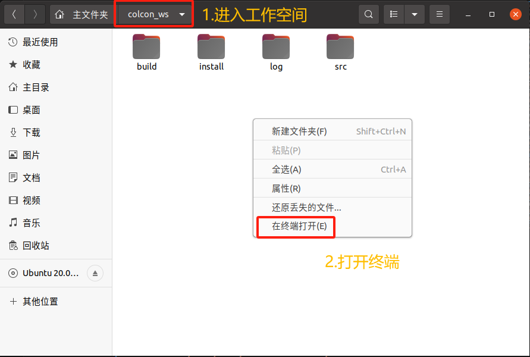
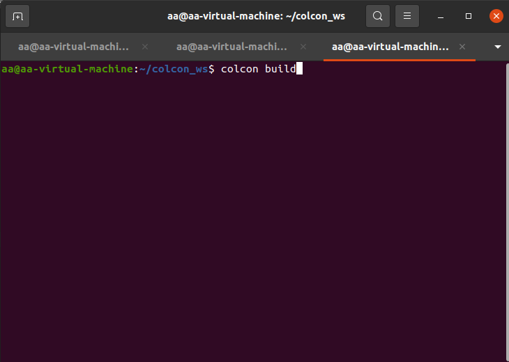
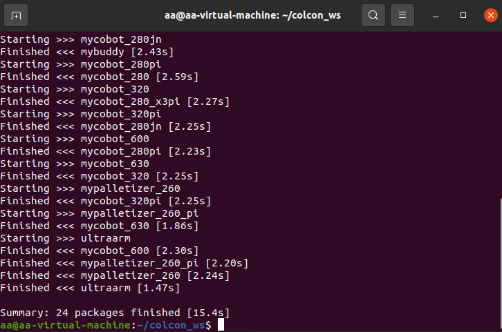
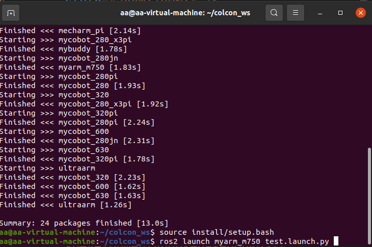
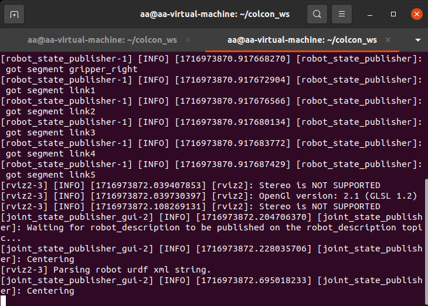
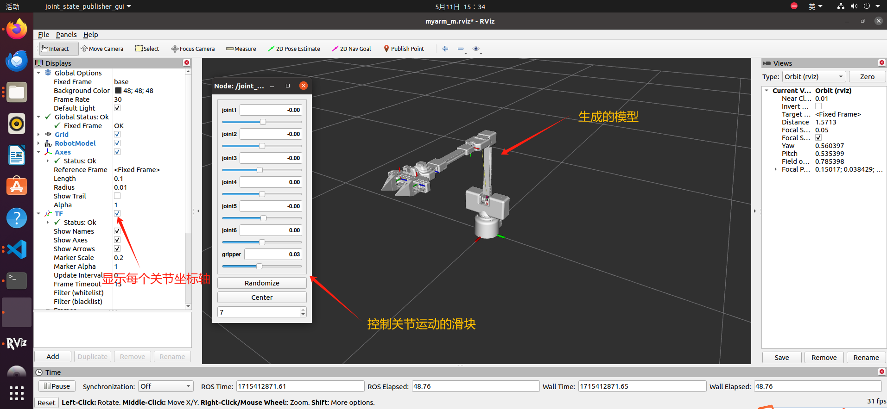
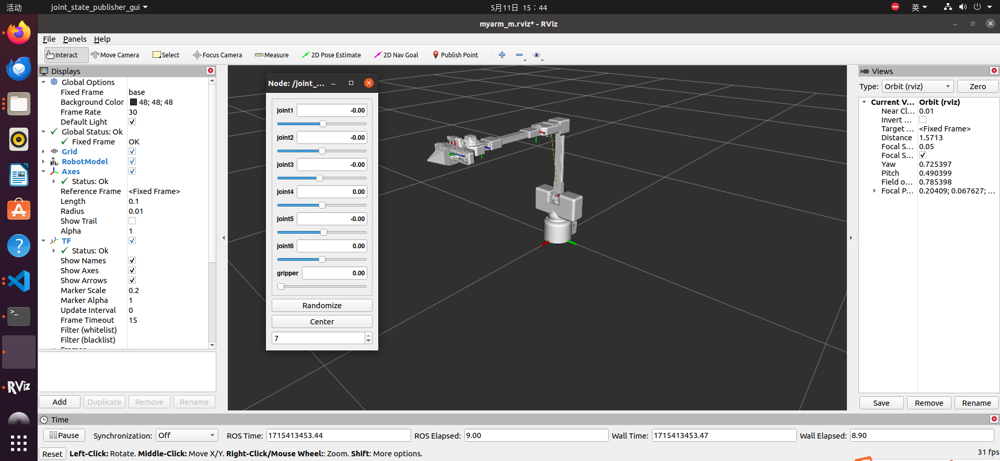
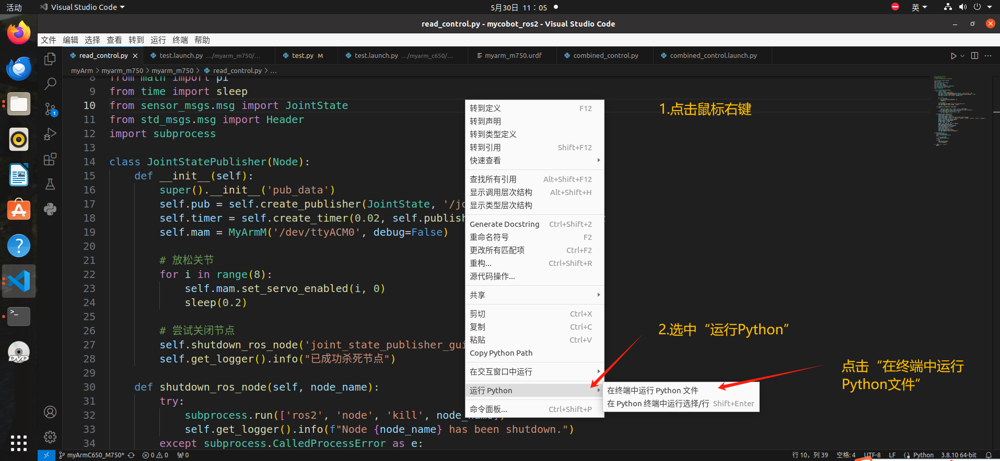

# 一、仿真

我们提供一些 **静态仿真** 和 **动态仿真**， 用以和 MyarmM750 交互。  

## 1.1 静态仿真
这里的静态仿真是指：用rviz2中的滑动模块与仿真中的MyarmM750交互  
在工作空间打开终端命令行中输入: 
> colcon build  

再新建一个终端输入：   
> source install/setup.bash # 添加环境变量  
> ros2 launch myarm_m750 test.launch.py  

   

   
   
   

**成功运行launch.py文件后，终端会显示：**

    

**同时会打开rviz2，生成MyarmM750的仿真模型**

  

## 1.2 动态仿真
这里的动态仿真是指：运动现实中的MyarmM750与仿真中的MyarmM750交互  

首先我们需要将MyarmM750机械臂通过USB转typeC线连接到我们的电脑上，并给其通电  
通过按钮选中 **Transponder** 再按“OK”按钮
  

然后屏幕会显示  
  

我们可以看到箭头指向 **“USB UART”** ，再按“OK”按钮，进入之后会显示 **“NO”**，再按 **“Exit”** 按钮，回到箭头指向 **“USB UART”** ，再按“OK”按钮，这时会显示 **“OK”**
  

#### 这时我们的MyarmM750已经成功连接上电脑

接下来在工作空间打开终端命令行中输入: 
> colcon build   
> source devel/setup.bash # 添加环境变量  
> roslaunch myarm_m demo_rviz.launch  

   

   
   
   

**成功运行launch.py文件后，终端会显示：**

    

**同时会打开rviz2，生成MyarmM750的仿真模型**

  

打开VS code中的项目，找到  myArm/myarm_m750/myarm_m750/read_control.py 这个 **read_control.py** 文件   

 

  
 

在工作空间里再新建一个终端，输入下面指令，先查看正在运行的节点，再查看**joint_state_publisher**节点的PID 最后kill这个节点生成的数字串： 
> ros2 node list  
> ps aux | grep joint_state_publisher   
>  kill 32695  #这串数字是随即生成的  

    

接下来我们用手移动现实中的MyarmM750机械臂，rviz中的机械臂也会跟着运动：      
    

#### 至此与MyarmM750机械臂的交互已全部完成

---

[← 上一页](1_download.md) | [下一页 →](3_ROScode.md)

