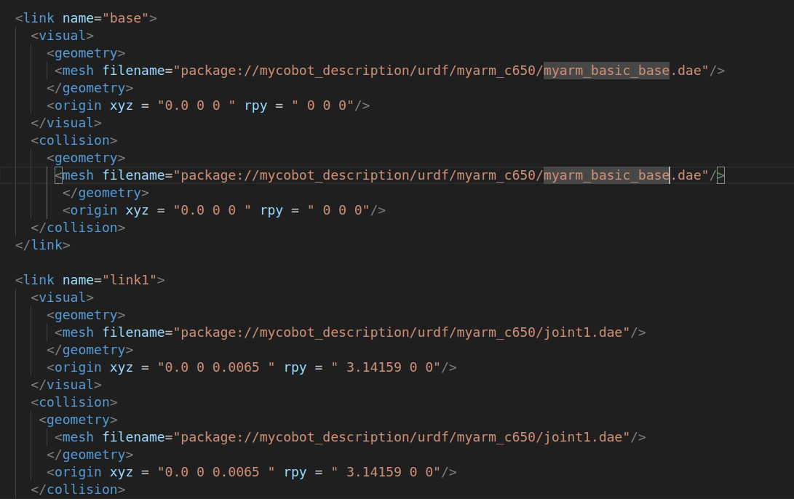
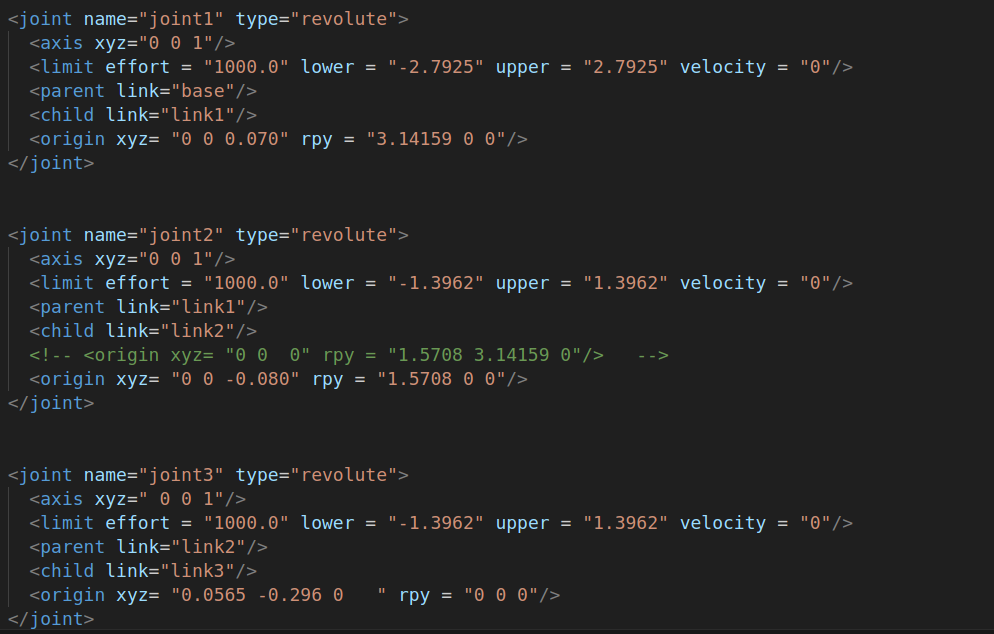

# 基本工具

在本章中，您将了解ROS2的常用命令工具。

# 1 Topics

ROS 2 将复杂的系统分解为许多模块化节点。 Topics是 ROS 图的重要元素，充当节点交换消息的总线。 Topics是数据在节点之间移动的主要方式之一，因此在系统的不同部分之间移动。

具体参考: [官方教程](https://docs.ros.org/en/foxy/Tutorials/Beginner-CLI-Tools/Understanding-ROS2-Topics/Understanding-ROS2-Topics.html)

-  topics 帮助  
> ros2 topics -h

- 启动turtlesim和键盘控制  
> ros2 run turtlesim turtlesim_node  
> ros2 run turtlesim turtle_teleop_key  

- 节点关系图
> rqt_graph

- 了解topics相关命令
> ros2 topics -h

- 话题列表
> ros2 topic list  
> ros2 topic list -t # 显示相应的消息类型

- 查看话题内容
> ros2 topic echo <topic_name>  
> ros2 topic echo /turtle1/cmd_vel

- 显示话题相关信息，类型
> ros2 topic info <topic_name>  
> \# 输出 /turtle1/cmd_vel 话题接口相关信息  
> ros2 topic info /turtle1/cmd_vel

- 显示接口相关信息
> ros2 interface show <msg_type>  
> \# 输出 geometry_msgs/msg/Twist接口相关信息  
> ros2 interface show geometry_msgs/msg/Twist

- 发布命令
> ros2 topic pub <topic_name> <msg_type> '<args>'   
> \# 发布速度命令   
> ros2 topic pub --once /turtle1/cmd_vel geometry_msgs/msg/Twist "{linear: {x: 2.0, y: 0.0, z: 0.0}, angular: {x: 0.0, y: 0.0, z: 1.8}}"  
> \# 按一定频率发布速度命令
> ros2 topic pub --rate 1 /turtle1/cmd_vel geometry_msgs/msg/Twist "{linear: {x: 2.0, y: 0.0, z: 0.0}, angular: {x: 0.0, y: 0.0, z: 1.8}}"  

- 查看话题发布的频率
> ros2 topic hz <topic_name>  
> \#输出/turtle1/cmd_vel发布频率  
> ros2 topic pub --rate 1 /turtle1/cmd_vel geometry_msgs/msg/Twist "{linear: {x: 2.0, y: 0.0, z: 0.0}, angular: {x: 0.0, y: 0.0, z: 1.8}}"  

# 2 Nodes
ROS2 中的每个节点都应该负责一个单一的模块用途（例如，一个节点用于控制车轮电机，一个节点用于控制激光测距仪等）。 每个节点都可以通过主题、服务、操作或参数向其他节点发送和接收数据。 一个完整的机器人系统由许多协同工作的节点组成。 在 ROS 2 中，单个可执行文件（C++ 程序、Python 程序等）可以包含一个或多个节点。

具体参考: [官方教程](https://docs.ros.org/en/foxy/Tutorials/Beginner-CLI-Tools/Understanding-ROS2-Nodes/Understanding-ROS2-Nodes.html)  

- nodes 帮助
> ros2 nodes -h

- 启动turtlesim和键盘控制
> ros2 run turtlesim turtlesim_node  
> ros2 run turtlesim turtle_teleop_key

- 查看节点列表
> ros2 node list

- 查看节点关系图
> rqt_graph

- 重映射
> ros2 run turtlesim turtlesim_node --ros-args --remap __node:=my_turtle  
> ros2 node list

- 查看节点信息
> ros2 node info <node_name>  
> ros2 node info /my_turtle

# 3 Services

服务是 ROS 图中节点的另一种通信方法。 服务基于调用和响应模型，而不是主题的发布者-订阅者模型。 虽然主题允许节点订阅数据流并获得持续更新，但服务仅在客户端专门调用时才提供数据。

具体参考: [官方教程](https://docs.ros.org/en/foxy/Tutorials/Beginner-CLI-Tools/Understanding-ROS2-Services/Understanding-ROS2-Services.html)  

- ervices 帮助
> ros2 service -h

- 启动turtlesim和键盘控制
> ros2 run turtlesim turtlesim_node  
> ros2 run turtlesim turtle_teleop_key

- 查看服务列表
> ros2 service list  
> \# 显示服务列表及消息类型  
> ros2 service list -t

- 查看服务接收到的消息类型
> ros2 service type <service_name>  
> ros2 service type /clear

- 找到使用某类消息类型的服务
> ros2 service find <type_name>  
> ros2 service find std_srvs/srv/Empty

- 查看服务消息类型定义
> ros2 interface show <type_name>.srv  
> ros2 interface show std_srvs/srv/Empty.srv

- 调用服务命令,清除行走轨迹
> ros2 service call <service_name> <service_type>  
> ros2 service call /clear std_srvs/srv/Empty

- 生成新乌龟
> ros2 service call /spawn turtlesim/srv/Spawn "{x: 2, y: 2, theta: 0.2, name: 'turtle2'}"

# 4 Parameters
参数是节点的配置值。 您可以将参数视为节点设置。 节点可以将参数存储为整数、浮点数、布尔值、字符串和列表。 在 ROS 2 中，每个节点都维护自己的参数。 有关参数的更多背景信息，请参阅概念文档。

具体参考: [官方教程](https://docs.ros.org/en/foxy/Tutorials/Beginner-CLI-Tools/Understanding-ROS2-Parameters/Understanding-ROS2-Parameters.html)  

- parameters 帮助
> ros2 param -h

- 启动turtlesim和键盘控制
> ros2 run turtlesim turtlesim_node  
> ros2 run turtlesim turtle_teleop_key

- 查看服务列表
> ros2 param list

- 获取参数值
> ros2 param get <node_name> <parameter_name>  
> ros2 param get /turtlesim background_g

- 设置参数值
> ros2 param set <node_name> <parameter_name> <value>  
> ros2 param set /turtlesim background_r 150

- 导出参数值
> ros2 param dump <node_name>  
> ros2 param dump /turtlesim

- 独立导入参数
> ros2 param load <node_name> <parameter_file>  
> ros2 param load /turtlesim ./turtlesim.yaml

- 启动节点同时导入参数
> ros2 run <package_name> <executable_name> --ros-args --params-file <file_name>  
> ros2 run turtlesim turtlesim_node --ros-args --params-file ./turtlesim.yaml  

# 5 Actions

动作是 ROS 2 中的一种通信类型，用于长时间运行的任务。 它们由三部分组成：目标、反馈和结果。

操作基于主题和服务。 它们的功能类似于服务，除了操作是可抢占的（您可以在执行时取消它们）。 他们还提供稳定的反馈，而不是返回单一响应的服务。

操作使用客户端-服务器模型，类似于发布者-订阅者模型（在主题教程中描述）。 “动作客户端”节点将目标发送到“动作服务器”节点，该节点确认目标并返回反馈流和结果。

具体参考: [官方教程](https://docs.ros.org/en/foxy/Tutorials/Beginner-CLI-Tools/Understanding-ROS2-Actions/Understanding-ROS2-Actions.html)  

- action 帮助
> ros2 action -h

- 启动turtlesim和键盘控制
> ros2 run turtlesim turtlesim_node  
> ros2 run turtlesim turtle_teleop_key

按G|B|V|C|D|E|R|T 实现旋转，按F键盘取消l

- 查看节点action的服务端和客户端
> ros2 node info /turtlesim

- 查看动作列表
> ros2 action list  
> ros2 action list -t # 显示动作类型

- 查看动作信息
> ros2 action info <action>  
> ros2 action info /turtle1/rotate_absolute

- 查看动作消息内容
> ros2 interface show turtlesim/action/RotateAbsolute

- 发送动作目标信息
> ros2 action send_goal <action_name> <action_type>  
> ros2 action send_goal /turtle1/rotate_absolute turtlesim/action/RotateAbsolute "{theta: 1.57}"  
> \# 带反馈信息  
> ros2 action send_goal /turtle1/rotate_absolute turtlesim/action/RotateAbsolute "{theta: 0}" --feedback  

# 6 RQt

RQt 是一个图形用户界面框架，它以插件的形式实现各种工具和界面。 可以将所有现有的 GUI 工具作为 RQt 中的可停靠窗口运行！ 这些工具仍然可以以传统的独立方式运行，但 RQt 可以更轻松地在单个屏幕布局中管理所有不同的窗口。

具体参考: [官方教程](https://docs.ros.org/en/foxy/Concepts/About-RQt.html)

您可以通过以下方式轻松运行任何 RQt 工具/插件：

> rqt  

- rqt 帮助
> rqt -h

- 启动turtlesim和键盘控制
> ros2 run turtlesim turtlesim_node  
> ros2 run turtlesim turtle_teleop_key  

- 动作浏览器: / Plugins -> Actions ->Action Type Browser

- 参数重配置: / Plugins -> configuration ->Parameter Reconfigure

- 节点图: /Node Graph

- 控制转向: /Plugins -> Robot Tools -> Robot Steering

- 服务调用: /Plugins -> Services -> Service Caller

- 服务类型浏览器: Plugins -> Services -> Service Type Browser

- 消息发布: Plugins -> Topics -> Message Publisher

- 消息类型浏览器: Plugins -> Topics -> Message Type Browser

- 话题列表: Plugins -> Topics -> Topic Monitor

- 绘制曲线图: Plugins -> Visualization -> Plot

- **查看日志: rqt_console**

> ros2 run rqt_console rqt_console  
> ros2 run turtlesim turtlesim_node  
> ros2 topic pub -r 1 /turtle1/cmd_vel geometry_msgs/msg/Twist "{linear: {x: 2.0, y: 0.0, z: 0.0}, angular: {x: 0.0,y: 0.0,z: 0.0}}"

# 7 TF2

tf2 是变换库，它允许用户随着时间的推移跟踪多个坐标系。 tf2 以时间缓冲的树结构维护坐标系之间的关系，并让用户在任何需要的时间点在任意两个坐标系之间变换点、向量等。

具体参考: [官方教程](https://docs.ros.org/en/foxy/Tutorials/Intermediate/Tf2/Introduction-To-Tf2.html)

让我们从安装演示包及其依赖项开始。
> sudo apt-get install ros-foxy-turtle-tf2-py ros-foxy-tf2-tools ros-foxy-tf-transformations  

- 跟随  
- launch启动2个小乌龟，第一个小乌龟自动跟随第二个
> ros2 launch turtle_tf2_py turtle_tf2_demo.launch.py

- 通过键盘控制第一个小乌龟移动
> ros2 run turtlesim turtle_teleop_key

- 查看TF树
> ros2 run tf2_tools view_frames.py
evince frames.pdf

- 查看两个坐标系之间的关系
> ros2 run tf2_ros tf2_echo [reference_frame] [target_frame]  
> ros2 run tf2_ros tf2_echo turtle2 turtle1

- 在rviz上查看TF关系
> ros2 run rviz2 rviz2 -d $(ros2 pkg prefix --share turtle_tf2_py)/rviz/turtle_rviz.rviz  

# 8 URDF介绍

- Unified Robot Description Format，统一机器人描述格式，简称为URDF。ROS中的urdf功能包包含一个URDF的C++解析器，URDF文件使用XML格式描述机器人模型。
- URDF 不能单独使用，需要结合 Rviz2 或 Gazebo，URDF 只是一个文件，需要在 Rviz2 或 Gazebo 中渲染成图形化的机器人模型。 

具体参考: [官方教程](https://docs.ros.org/en/foxy/Tutorials/Intermediate/URDF/Adding-Physical-and-Collision-Properties-to-a-URDF-Model.html)  

### 8.1 urdf文件描述

代码示例：  
本处只截取部分代码进行展示：  
    
  

- 安装依赖库
> sudo apt install ros-foxy-joint-state-publisher-gui ros-foxy-joint-state-publisher  
> sudo apt install ros-foxy-xacro

- 下载源代码
> cd ~/dev_ws    
> git clone -b ros2 https://github.com/ros/urdf_tutorial.git src/urdf_tutorial

- 编译源代码
> colcon build --packages-select urdf_tutorial

- 运行示例
> ros2 launch urdf_tutorial display.launch.py model:=urdf/01-myfirst.urdf  

---

[← 上一页](2_workcode.md) | [下一页 →](4_communication.md)