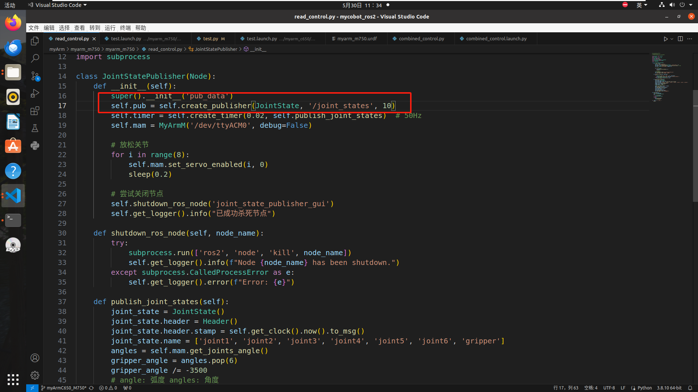
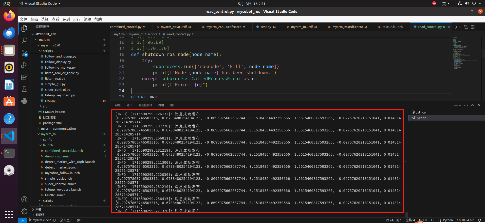
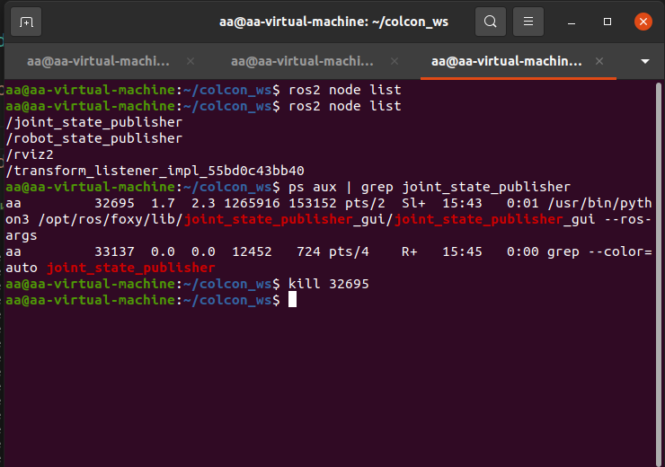
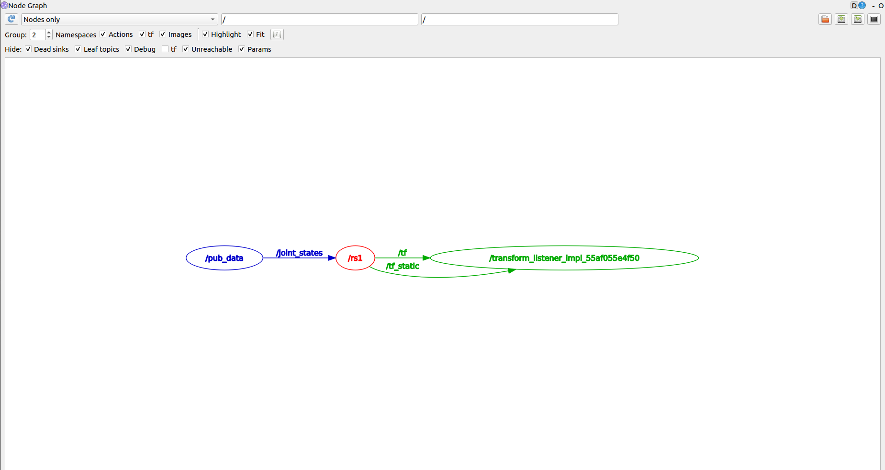
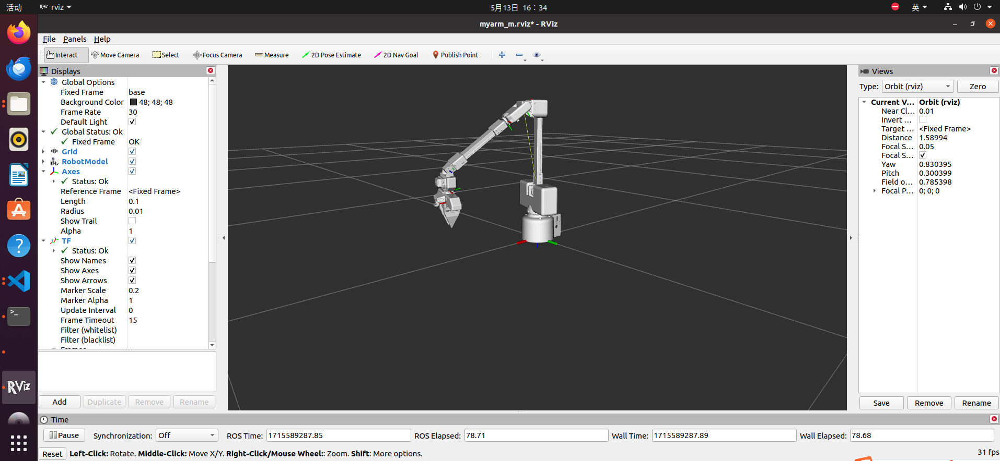

# 通信
  我们的MyarmM750主要是采用的是 **话题（Topic）** 的方式进行通信  
   
   > 话题（Topic）是ROS最常用的通信机制之一、它基于发布者-订阅者模式，其中一个节点作为发布者（Publisher）发布消息，而其他节点作为订阅者（Subscriber）接收消息。发布者可以同时向多个订阅者发布消息，而订阅者可以从多个发布者接收消息。这种方式非常适用于需要实时数据更新的情况，例如传感器数据的处理和实时控制。  

首先在.py文件中创建一个Publisher，将我们的消息发布给MyarmM750   
   

接下来在工作空间打开终端,先编译：  
> colcon build

再新建一个终端，输入：  
> soure install/setup.bash  
> ros2 launch myarm_m750 test.launch.py

打开rviz2后再启动我们的 **read_control.py** 文件  
   

在工作空间里再新建一个终端，输入下面指令，先查看正在运行的节点，再查看**joint_state_publisher**节点的PID 最后kill这个节点生成的数字串： 
> ros2 node list  
> ps aux | grep joint_state_publisher   
>  kill 32695  #这串数字是随即生成的  

    

最后我们再在终端中输入：
> rqt_graph 

我们能看到节点的所有信息  
  

MyarmM750是处于可以用手控制其运动的状态  
 

---

[← 上一页](3_ROScode.md) | [下一节 →](../5.4-DevelopmentBasedOnCommunicationProtocolPackage/5.4.1-CommunicationDoc.md)