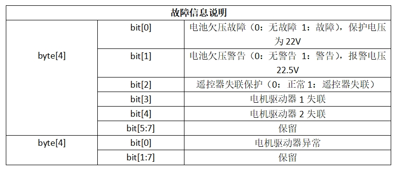

# 通信和信息命令

TRACER 移动底盘针对⽤户的开发提供了 CAN 的接⼝，⽤户可选择其中⼀种接⼝对⻋体进⾏指
令控制。

## CAN接口协议

TRACER产品中 CAN 通信标准采⽤的是 CAN2.0B 标准，通讯波特率为 500K，报⽂格式采
⽤ MOTOROLA 格式。通过外部 CAN总线接⼝可以控制底盘的移动的线速度以及旋转的⻆速
度；TRACER会实时反馈当前的运动状态信息以及 TRACER 底盘的状态信息等。协议包含系统状态回馈帧、运动控制回馈帧、控制帧，查询配置帧。

### 1 系统状态回馈帧

系统状态回馈指令包含了当前⻋体状态回馈、控制模式状态回馈、电池电压回馈以及故障回
馈，协议内容如表所示。

### 2 故障信息说明

### 3 运动控制回馈帧

运动控制回馈帧指令包含了当前⻋体的运动线速度、运动⻆速度回馈，协议具体内容如表：

### 4 指令控制帧

控制帧包含了线速度控制开度、⻆速度控制开度，其具体协议内容如表：

### 5 灯光控制指令帧

灯光控制回馈帧指令包含了当前前向灯光状态的反馈 具体内容如表：

注[5]: 此值自在⾃定义模式下有效

### 6 灯光控制反馈帧

灯光控制帧指令包含了灯光控制的模式和开度 具体内容如表：

### 7 控制模式帧

控制模式帧包⽤于设定底盘的控制⽅式，具体如表：

- 注 [1]控制模式说明
默认是待机模式，需要切换到指令模式才能发送运动控制指令。若打开遥控器，遥控器拥有最⾼权限，可以屏蔽指令的控制。当遥控器切换到指令模式时，还是需要先发送控制模式设定指令才能响应速度指令。

### 8 状态位置帧

状态置位帧包⽤于清除错误信息：

### 9 里程计反馈帧

### 10 电机信息反馈帧

除了底盘的状态信息会进⾏反馈以外，底盘反馈的信息还包括电机信息。下⾯的帧反馈是电机信息反馈：在底盘中两个电机电机编号对应为如下图所示

- 电机高速信息反馈帧

- 电机低速信息反馈帧

  
- 电机故障信息说明
  

## CAN指令的实现

正常启动TRACER移动机器⼈底盘，打开FS遥控器，然后将控制模式切换⾄指令控制，即将FS遥控器SWB模式选择拨⾄最上⽅，此时TRACER底盘会接受来⾃CAN接⼝的指令，同时主机也可以通过CAN总线回馈的实时数据，解析当前底盘的状态，具体协议内容参考CAN通讯协议。

---

[← 上一节](../5.2-DevelopmentAndUseBasedOnROS1/1_download.md) | [下一章 →](../../7-SuccessfulCases/7-SuccessfulCases.md)
