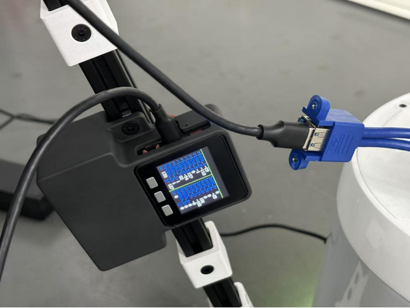
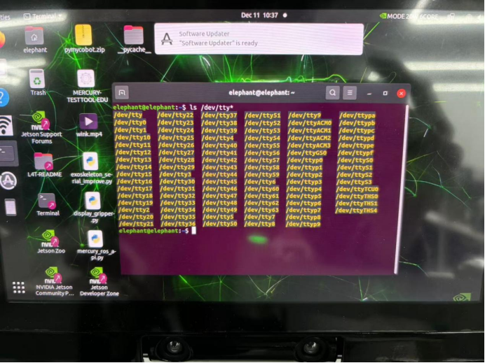
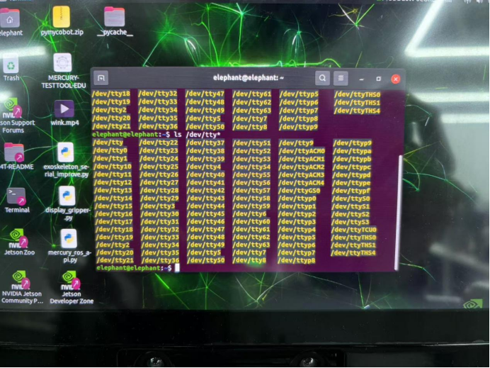
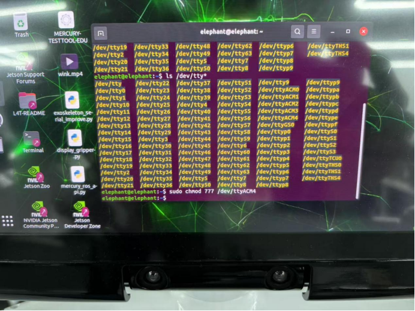
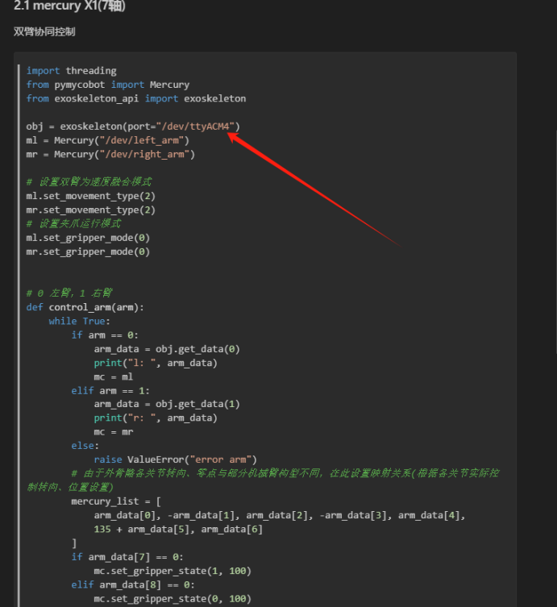

# MyController S570 Wearing Method

## 1. USB Serial Connection

### 【Step 1】 First, wear the vest and fasten it properly. Then, fix the exoskeleton onto the vest.
 

 

### 【Step 2】 After connecting, turn on the red power button on the exoskeleton. Once the power is on, the built-in screen on the exoskeleton will start up, displaying the specific values of each joint and the button values.
 

### 【Step 3】 Connect the exoskeleton to the robot using a USB to Type-C cable (make sure the power is on before connecting the robot).
 

## Using Mercury as an Example to Explain the Process of Selecting and Connecting the Serial Port

### 【Step 4】 After connecting the robotic arm, open a terminal in the system and input the following command. Then, by unplugging and plugging the serial cable connected to the exoskeleton, identify the serial port number.
 

 

> **The serial port number here is: /dev/ttyACM4**
>
> **The serial port number may change after unplugging and plugging in the serial cable or when the cable is replaced.**

### 【Step 5】 Grant authorization to the serial port and modify the corresponding serial port number in the source code.
 

### 【Step 6】 Modify the serial port number in the source code as required.
 

## 2. Bluetooth Connection

**Power-On Situation:**

**Communication:** Serial port is enabled by default.

**UI:** The top bar will display the IP and port number after powering on, followed by a green horizontal line. Below that, the angles of each joint will be displayed (7 joint angles for each robotic arm). Each robotic arm also has two buttons and one sensor. Below the joint angles, the button statuses and sensor coordinates will be shown.

**Button Instructions:**
- Press the first button to enable the WLAN service.
- Press the second button to enable the Bluetooth service.
- Press the third button to turn off the current service.

WLAN and Bluetooth cannot be active at the same time. When switching between these two functions, the current service must be closed first. However, serial communication can be used regardless of whether Bluetooth or WLAN is in use. In other words, as long as the exoskeleton is powered on, the serial port can be used without restrictions.

**Bluetooth Service Interface Description:**
- After pressing the second button, the top bar will change to: BT: Disconnect     Name: BLE. This indicates that the Bluetooth service has been created but not yet connected. After connecting the exoskeleton with a mobile phone via Bluetooth, the top bar will change to: BT: Connected     Name: BLE. If it is not connected, it will remain in the state of "Bluetooth service created but not connected." Once the Bluetooth service is closed, it will return to the power-on state as described in the power-on situation.

**WLAN Service Interface Description:**
- After pressing the first button, the top bar will show the set IP address. Regardless of whether the computer successfully connects or not, the top bar will remain unchanged. When the service is turned off, the interface will return to the power-on state as described in the power-on situation.

**Serial, WLAN, and Bluetooth Service Protocol Description:**
- You can use the command in the protocol document to send data. If you are using Bluetooth communication, set the MTU (Maximum Transmission Unit) of the Bluetooth Debug Assistant on the phone to 50 or higher.

#### This is the method for wearing the exoskeleton. If you have any questions, please contact customer service in time.
