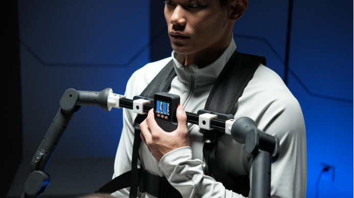

# MyController S570 穿戴方式
## 1. USB 串口连接
### 【第一步】 使用人员先穿戴好背心并扣好，再将外骨骼固定在背心上
 

 

### 【第二步】 连接好之后即可打开外骨骼上红色的电源按钮，电源开启之后，外骨骼上的内置屏幕即可启动，并能看到各个关节的具体数值及按键的数值
 

### 【第三步】 通过USB转type-C的方式连接上外骨骼与机器人（注意要先通电在连机器人）
 

## 以Mercury 为例讲解选择串口并连接的方式

### 【第四步】连接上机械臂之后在系统中打开一个终端，并输入以下指令，并通过拔插与外骨骼连接的串口线来确定串口号
 

 

> **此处的串口号为：/dev/ttyACM4**
>
> **串口号可能会在每次插拔或者更换串口线之后发生变化**

### 【第五步】 下一步给串口号进行授权并修改源码中对应的串口号
 

### 【第六步】 修改源码中对应的串口号即可
 

## 2.蓝牙连接

**开机情况:**

**通信：**	默认开启串口

**UI：**		开机顶部栏默认会显示ip以及端口号,随后一条绿色横线隔开,其下数据为当前各个关节的角度,关节角度每个机械臂显示7个,同时每个机械臂具有两个按键和一个遥感,在关节的角度数据下显示按键状态和遥感的平面坐标

**按键说明:**
按下第一个按键开启wlan服务,按下第二个按键开启蓝牙服务,按下第三个按键关闭当前服务。

wlan和蓝牙不能同时存在，这两个功能进行切换时必须要先关闭当前正在进行的服务。但是无论是在使用蓝牙功能还是在使用wlan的情况下都可以使用串口通信，换句话说，只要外骨骼通了电，串口就可以使用，不受任何的限制。

**蓝牙服务界面说明：**
按下第二个按键后，其余部分不变。顶部文字替换为：BT：Disconnect     Name：BLE，此时处于已经创建蓝牙服务但是未连接状态。当手机与外骨骼进行蓝牙连接后，顶部文字替换为： BT:Connected     Name:BLE,若未连接上，将一直处于已经创建蓝牙服务但是未连接状态。蓝牙服务关闭后显示为开机状态,参考开机情况说明。

**Wlan服务界面说明：**
按下第一个按键后，其余部分不变。顶部文字的ip地址更改为设定好的ip地址，此时电脑成功或失败连接后顶部文字也不会有变化。服务关闭后显示为开机状态,参考开机情况说明

**串口，wlan，蓝牙服务协议说明：**
可以使用协议文档中的命令发送数据，若使用蓝牙通信，请将手机中的蓝牙调试助手的MTU（最大传输单元）设置为50及以上

#### 以上便是外骨骼的穿戴方式，如有问题请及时联系客服