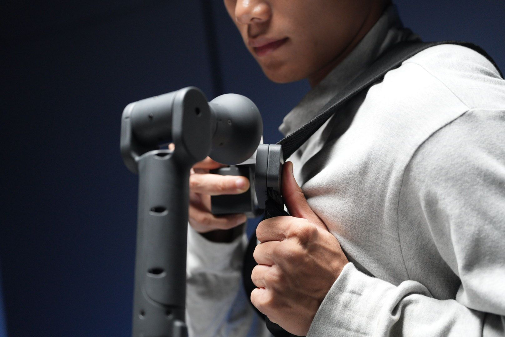

# MyController S570 穿戴方式

### 【第一步】 使用人员先穿戴好背心并扣好，再将外骨骼固定在背心上
 

 

### 【第二步】 连接好之后即可打开外骨骼上红色的电源按钮，电源开启之后，外骨骼上的内置屏幕即可启动，并能看到各个关节的具体数值及按键的数值
 

### 【第三步】 通过USB转type-C的方式连接上外骨骼与机器人（注意要先通电在连机器人）
 

## 以Mercury 为例讲解选择串口并连接的方式

### 【第四步】连接上机械臂之后在系统中打开一个终端，并输入以下指令，并通过拔插与外骨骼连接的串口线来确定串口号
 

 

> **此处的串口号为：/dev/ttyACM4**
>
> **串口号可能会在每次插拔或者更换串口线之后发生变化**

### 【第五步】 下一步给串口号进行授权并修改源码中对应的串口号
 

### 【第六步】 修改源码中对应的串口号即可
 

#### 以上便是外骨骼的穿戴方式，如有问题请及时联系客服