# MyArm MC遥操作案例
该案例效果为M750会跟随C650进行相应动作的移动
## 1 环境配置

### 1.1 下载python
[下载地址](https://www.python.org/downloads/windows/)

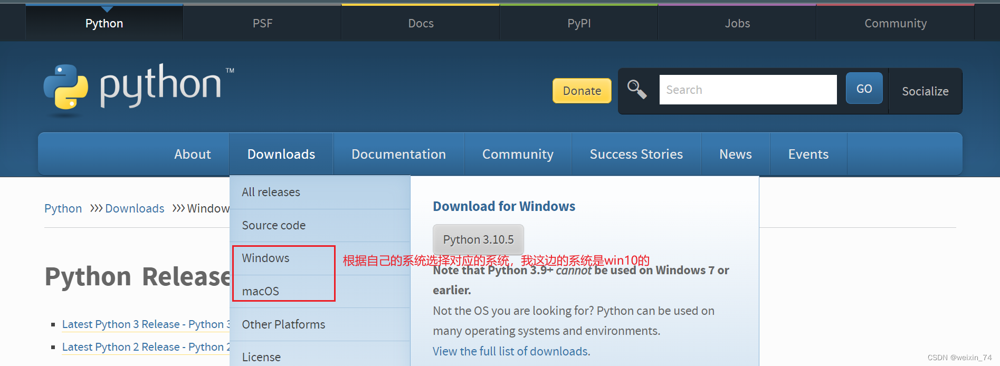

选择你要安装的版本,推荐安装3.7以上版本
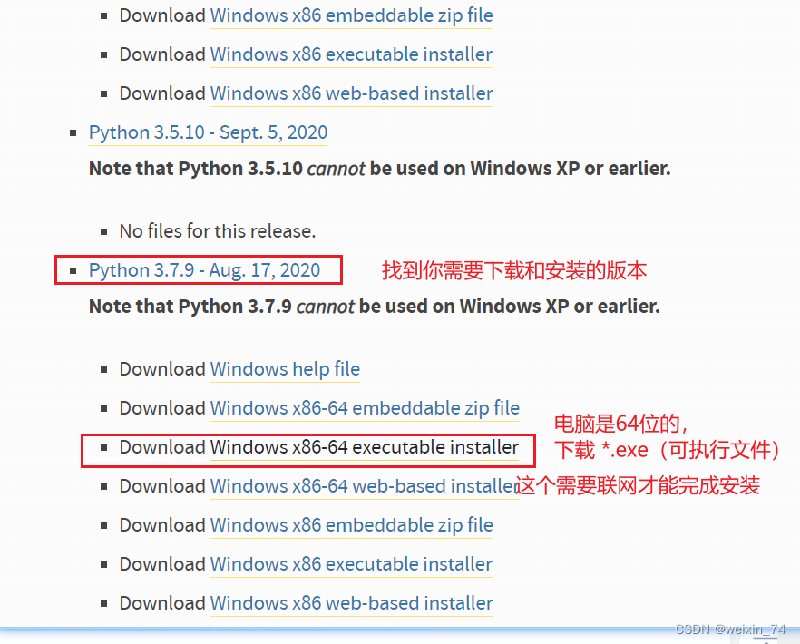


双击安装包后
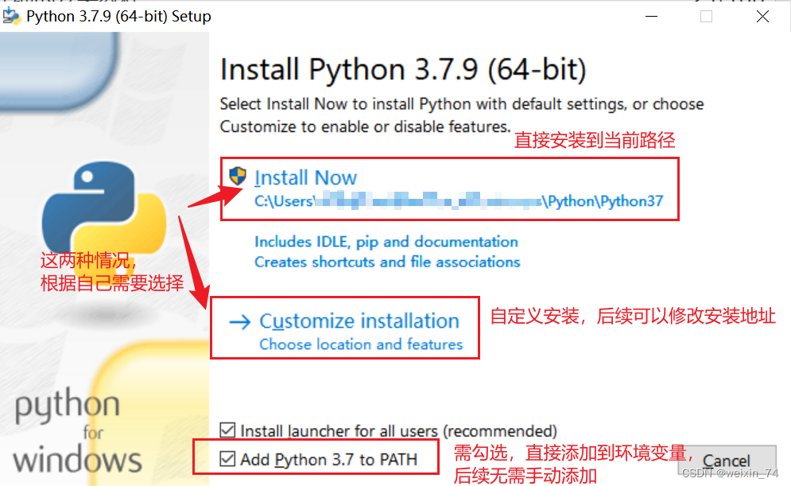

保持默认配置，直接点击Next

若选择自定义软件安装位置后，点击Install
（建议安装的文件路径是全英路径，因为有些软件安装遇到中文会打不开）


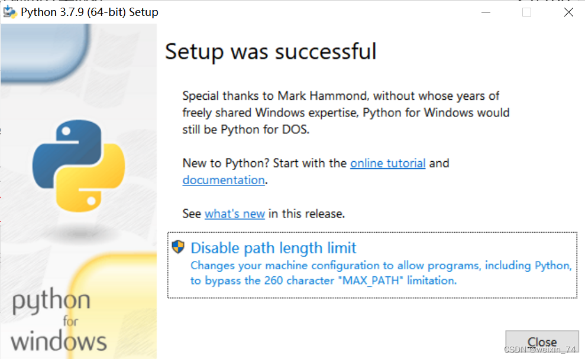

安装完成后，可以完毕当前页面，然后按键盘的 Windows键 + r键，并输入 cmd
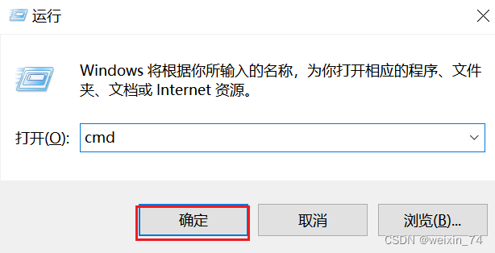
pymycobot安装
  ```python
  pip install pymycobot --upgrade --user
  ```
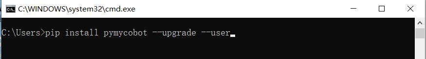

### 1.2 案例程序下载
[程序下载地址：](https://github.com/elephantrobotics/pymycobot/tree/main)https://github.com/elephantrobotics/pymycobot/tree/main

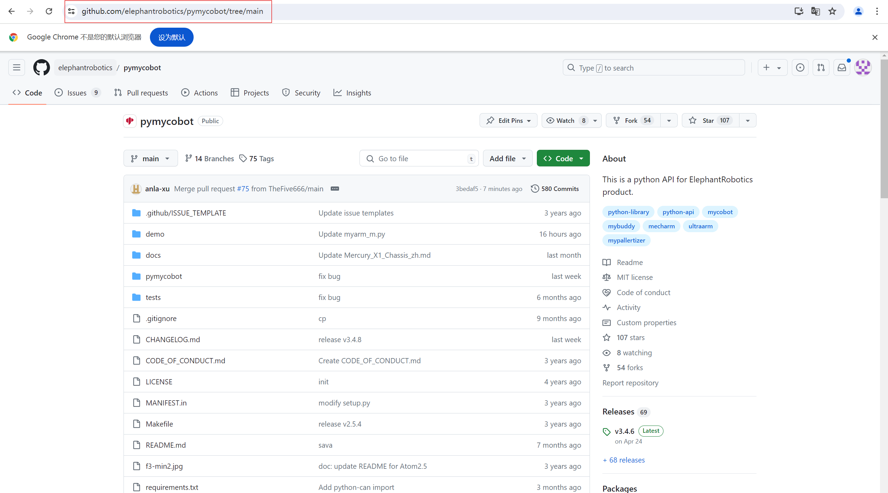

将程序下载到本地
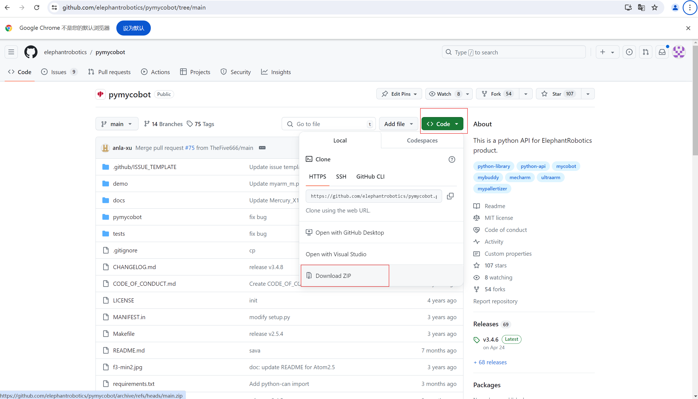

将文件进行解压，进入案例程序的所在的路径

> 注意：固件v1.1及以上版本应使用`myArm_M&C_demo_v1.1`文件夹下的案例

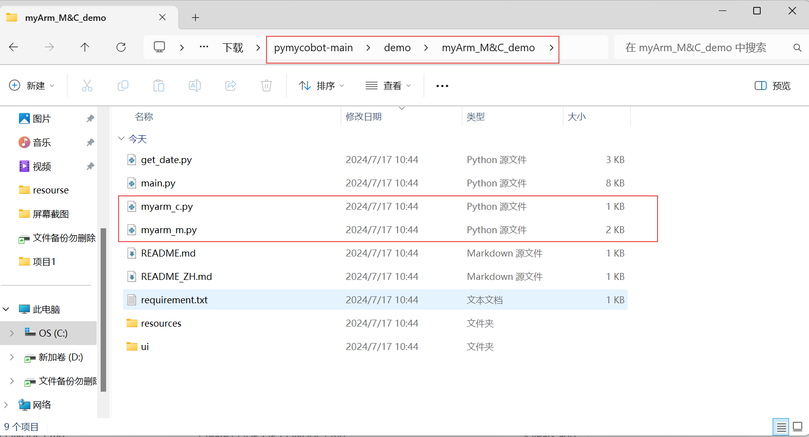

## 2 案例复现
将两个机械臂固定好后，先将M750手动调整至下图姿态，再接入24V,之后再接入USB数据线到电脑
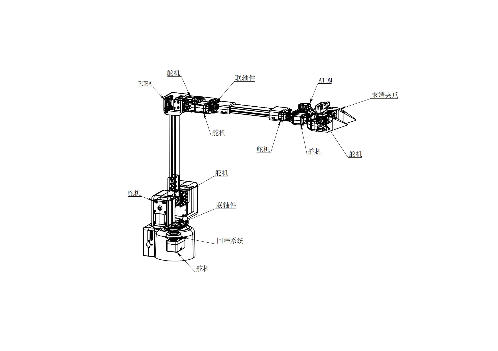

确保两个机械臂底座的显示屏都显示OK
C650

M750


然后利用设备管理器确认好两个机械臂对应的串口号，可通过插拔USB数据线来确认串口号
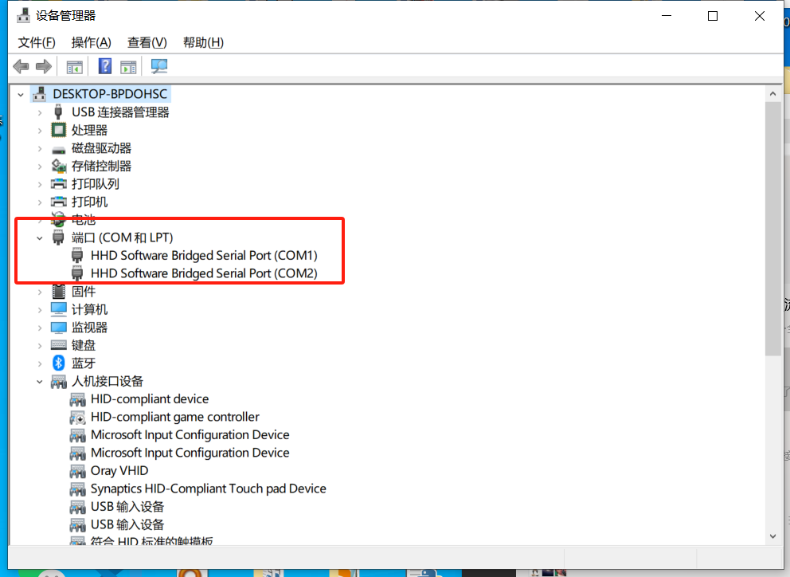

然后先运行myarm_m.py程序，填入M750的串口号，按下键盘回车键即可
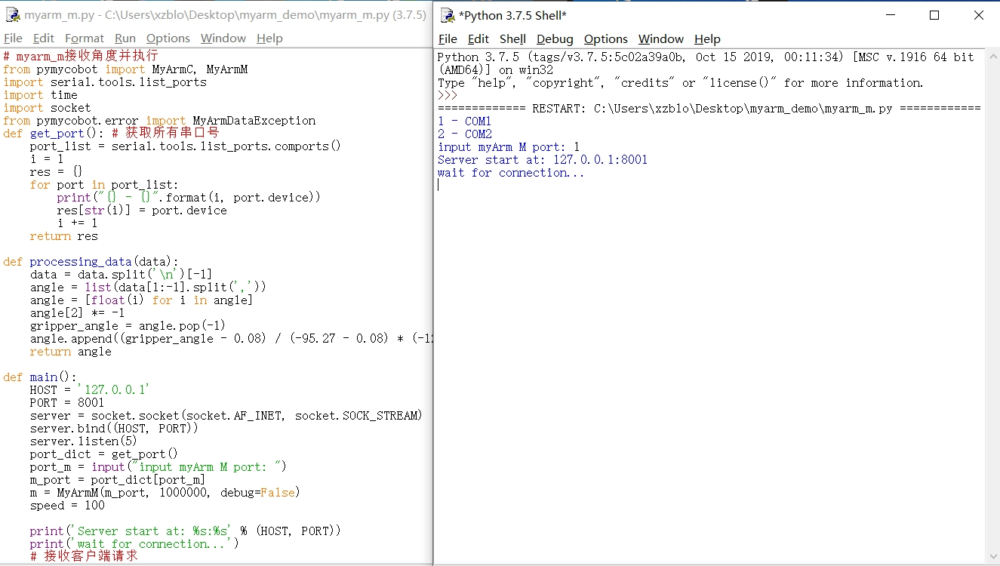

之后先将C650人手调整到下图姿态
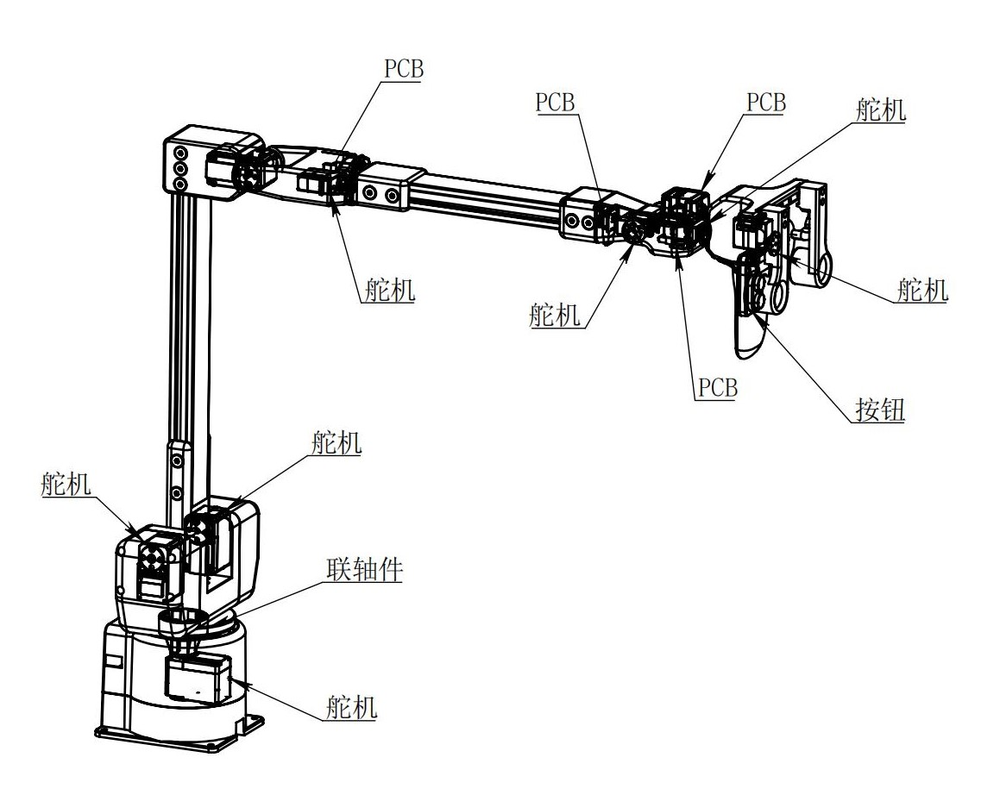

最后再运行myarm_c.py程序，填入C650的串口号，按下键盘回车键即可
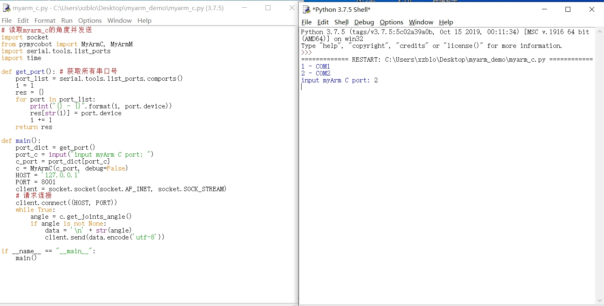

---

[← 上一章](./7-SuccessfulCases.md) | [下一章 →](../../5-SupportAndService/5-SupportAndService.md)