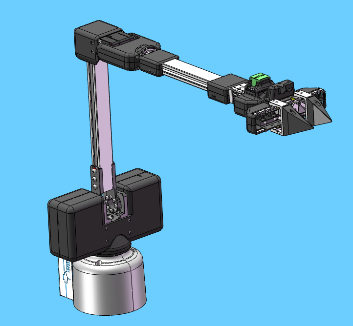
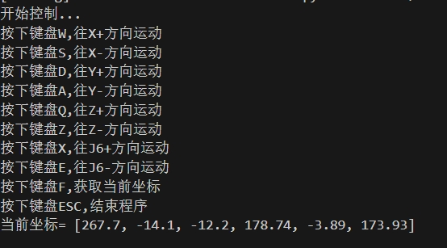

# 机器人码垛搬运案例

**功能说明**：机器人将木块从A点搬运到B点

## 1 固件烧录
由于机器人需要使用笛卡尔运动，所以需要烧录支持笛卡尔运动的pico固件和basic的固件，但目前支持笛卡尔运动的固件并未发布到mystudio上，只能通过联系售后人员进行获取。


## 2 pymycobot安装
如果要使用笛卡尔运动，需要安装或更新pynycobot,打开电脑终端，执行下面指令进行安装或更新pymycobot
```bash
pip install pymycobot --upgrade
```

## 3 准备工作
在机械臂接入24V前，先手动将机械臂调整到下图姿态，再依次接入24V电源和通信数据线，机械臂周围不要有杂物，避免发生碰撞



确保底座屏幕显示ok


## 4 键盘控制
运行下面程序后，机械臂会先移动到一个初始位置，之后会在终端打印按键提示信息，根据终端信息按下对应按键即可控制机器人运动


```python
import threading
from pymycobot import MyArmMControl, utils
import keyboard
import time
m = MyArmMControl(utils.get_port_list()[0],1000000)
def init():
    # 设置初始角度
    m.write_angles([-10.19, 8.62, 30.65, 2.19, 50.53, -4.83], 100)
    time.sleep(1)
    m.set_gripper_state(0,100)
    time.sleep(1)

# 用于键盘输入检测的函数
def keyborad_ctrl():
    print("开始控制...")
    print("按下键盘W,往X+方向运动")
    print("按下键盘S,往X-方向运动")
    print("按下键盘D,往Y+方向运动")
    print("按下键盘A,往Y-方向运动")
    print("按下键盘Q,往Z+方向运动")
    print("按下键盘Z,往Z-方向运动")
    print("按下键盘X,往J6+方向运动")
    print("按下键盘E,往J6-方向运动")
    print("按下键盘F,获取当前坐标")
    print("按下键盘ESC,结束程序")  
    blocked_keys = ['w', 'a', 's', 'd', 'q', 'z','f','e','x']
    for key in blocked_keys:
        keyboard.block_key(key)    
    key_processed = {
        'w': False,
        'a': False,
        's': False,
        'd': False,
        'q': False,
        'z': False,
        'f':False,
        'e': False,
        'x':False,
    }
    else_executed = False  
    try:
        while True:
            if keyboard.is_pressed('esc'):
                print("退出控制...")
                break           
            for key in blocked_keys:
                if keyboard.is_pressed(key) and not key_processed[key]:
                    threading.Thread(target=handle_key, args=(key,)).start()
                    key_processed[key] = True
                    else_executed = False            
            if all(not keyboard.is_pressed(key) for key in blocked_keys) and not else_executed:
                m.stop()
                else_executed = True      
            for key in key_processed:
                if not keyboard.is_pressed(key):
                    key_processed[key] = False
            time.sleep(0.01)     
    finally:
        keyboard.unhook_all()

def handle_key(key):
    if key == 'w':
        m.jog_coord(1, 1, 60)
    elif key == 'a':
        m.jog_coord(2, 0, 60)
    elif key == 'd':
        m.jog_coord(2, 1, 60)
    elif key == 's':
        m.jog_coord(1, 0, 60)
    elif key == 'q':
        m.jog_coord(3, 1, 60)
    elif key == 'z':
        m.jog_coord(3, 0, 60)
    elif key == 'e':
        m.jog_angle(6,0,50)   
    elif key == 'x':
        m.jog_angle(6,1,50)
    elif key == 'f':
        print("当前坐标=",m.get_coords())

if __name__ == "__main__": 
    init()
    keyborad_ctrl()  
```
当控制机器人到达目标点后，记录下当前坐标，再关闭程序




## 5 案例复现

```python
from pymycobot import MyArmMControl, utils
import time
init_angles=[-10.19, 8.62, 30.65, 2.19, 50.53, -4.83]#初始位置的6个关节角度
target_point=[277.7, -14.6, -7.5, 178.74, -2.04, 174.17]#抓取目标的坐标位置

m = MyArmMControl(utils.get_port_list()[0],1000000)
if __name__=="__main__":    
    m.set_gripper_state(0,100)#先张开夹爪
    time.sleep(1)  
    m.write_angles(init_angles,100)#运动初始位置
    time.sleep(2)
    m.write_coords([target_point[0],target_point[1],target_point[2]+50,target_point[3],target_point[4],target_point[5]],100,1)#运动到抓取点上方50mm
    time.sleep(2)
    m.write_coords([target_point[0],target_point[1],target_point[2],target_point[3],target_point[4],target_point[5]],100,1)#运动到抓取点
    time.sleep(2)
    m.set_gripper_state(1,100)#夹爪闭合 
    time.sleep(1)
    m.write_coords([target_point[0],target_point[1],target_point[2]+50,target_point[3],target_point[4],target_point[5]],100,1)#运动到抓取点上方50mm
    time.sleep(2)

    m.write_coords([target_point[0],target_point[1]+100,target_point[2]+50,target_point[3],target_point[4],target_point[5]],100,1)#运动到放置点上方50mm
    time.sleep(2)
    m.write_coords([target_point[0],target_point[1]+100,target_point[2],target_point[3],target_point[4],target_point[5]],100,1)#运动到放置点
    time.sleep(2)
    m.set_gripper_state(0,100)#夹爪张开  
    time.sleep(1)
    m.write_coords([target_point[0],target_point[1]+100,target_point[2]+50,target_point[3],target_point[4],target_point[5]],100,1)#运动到放置点上方50mm
    time.sleep(2)
```

## 6 效果展示


