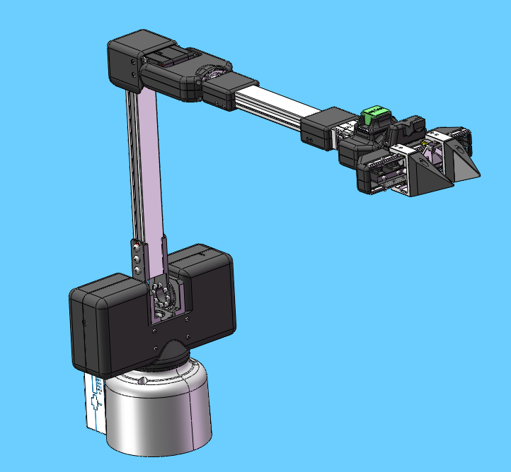
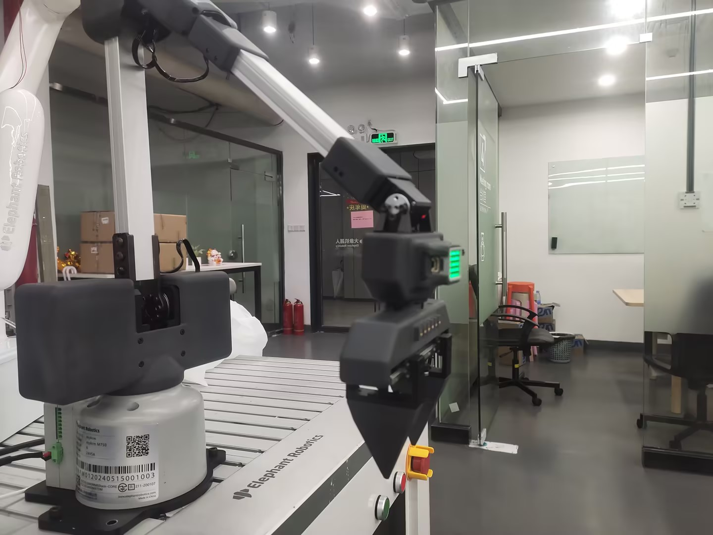
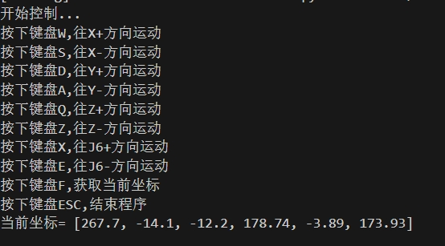

# 键盘控制案例

**功能说明**：基于笛卡尔运动，通过键盘控制机械臂在XYZ方向运动
## 1 固件烧录
由于机器人需要使用笛卡尔运动，所以需要烧录支持笛卡尔运动的pico固件和basic的固件，但目前支持笛卡尔运动的固件并未发布到mystudio上，只能通过联系售后人员进行获取。


## 2 pymycobot安装
如果要使用笛卡尔运动，需要安装或更新pynycobot,打开电脑终端，执行下面指令进行安装或更新pymycobot
```bash
pip install pymycobot --upgrade
```

## 3 准备工作
在机械臂接入24V前，先手动将机械臂调整到下图姿态，再依次接入24V电源和通信数据线，机械臂周围不要有杂物，避免发生碰撞



确保底座屏幕显示ok


## 4 案例复现
运行下面程序后，机械臂会先移动到一个初始位置，之后会在终端打印按键提示信息，根据终端信息按下对应按键即可控制机器人运动





**注意** :在进行键盘控制时，机械臂的固件版本不能使用v1.1的。

```python
import threading
from pymycobot import MyArmMControl, utils
import keyboard
import time
m = MyArmMControl(utils.get_port_list()[0],1000000)
def init():
    # 设置初始角度
    m.write_angles([-10.19, 8.62, 30.65, 2.19, 50.53, -4.83], 100)
    time.sleep(1)
    m.set_gripper_state(0,100)
    time.sleep(1)

# 用于键盘输入检测的函数
def keyborad_ctrl():
    print("开始控制...")
    print("按下键盘W,往X+方向运动")
    print("按下键盘S,往X-方向运动")
    print("按下键盘D,往Y+方向运动")
    print("按下键盘A,往Y-方向运动")
    print("按下键盘Q,往Z+方向运动")
    print("按下键盘Z,往Z-方向运动")
    print("按下键盘X,往J6+方向运动")
    print("按下键盘E,往J6-方向运动")
    print("按下键盘F,获取当前坐标")
    print("按下键盘G,控制夹爪开合")
    print("按下键盘ESC,结束程序")

    blocked_keys = ['w', 'a', 's', 'd', 'q', 'z', 'f', 'e', 'x', 'g']
    for key in blocked_keys:
        keyboard.block_key(key)
    key_processed = {key: False for key in blocked_keys}
    else_executed = False
    gripper_opened = True  # 默认状态为夹爪打开

    try:
        while True:
            if keyboard.is_pressed('esc'):
                print("退出控制...")
                break
            for key in blocked_keys:
                if keyboard.is_pressed(key) and not key_processed[key]:
                    if key == 'g':  # 特殊处理G键
                        gripper_opened = handle_gripper(gripper_opened)
                    else:
                        threading.Thread(target=handle_key, args=(key,)).start()
                    key_processed[key] = True
                    else_executed = False
            if all(not keyboard.is_pressed(key) for key in blocked_keys) and not else_executed:
                m.stop()
                else_executed = True
            for key in key_processed:
                if not keyboard.is_pressed(key):
                    key_processed[key] = False
            time.sleep(0.01)
    finally:
        keyboard.unhook_all()


def handle_key(key):
    if key == 'w':
        m.jog_coord(1, 1, 60)
    elif key == 'a':
        m.jog_coord(2, 0, 60)
    elif key == 'd':
        m.jog_coord(2, 1, 60)
    elif key == 's':
        m.jog_coord(1, 0, 60)
    elif key == 'q':
        m.jog_coord(3, 1, 60)
    elif key == 'z':
        m.jog_coord(3, 0, 60)
    elif key == 'e':
        m.jog_angle(6, 0, 50)
    elif key == 'x':
        m.jog_angle(6, 1, 50)
    elif key == 'f':
        print("当前坐标=", m.get_coords())


def handle_gripper(gripper_opened):
    if gripper_opened:
        m.set_gripper_state(1, 100)  # 关闭夹爪
        # print("夹爪已闭合")
    else:
        m.set_gripper_state(0, 100)  # 打开夹爪
        # print("夹爪已打开")
    return not gripper_opened  # 切换状态

if __name__ == "__main__": 
    init()
    keyborad_ctrl()  

```

## 5 效果展示

