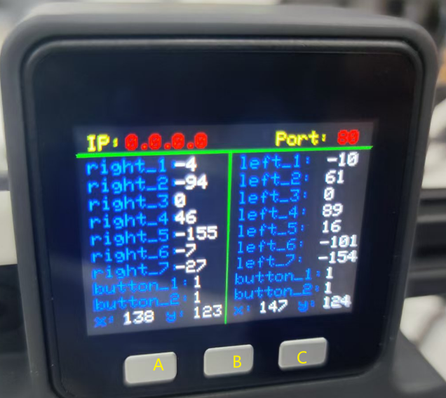

# MyController S570 Control X1 program case

Connect the exoskeleton to Mercury via USB and save the following script file.
**Note: Make sure each serial number corresponds to the correct device**
## 1.Python API instructions

API (ApplicationProgrammingInterface), also known as application programming interface function, are predefined functions. When using the following functional interface, please enter the following code at the beginning to import our API library, otherwise it will not run successfully:

#### `get_all_data()`

- **Features:** Get dual-arm data

- **Parameters:** None

- **Return value:** Floating point list of Angle parameters and hand controllers:
  
  [[Left arm J1, J2, J3, J4, J5, J6, J7, atom button, stick button, button 1, button 2, stick x, stick y],

  [Right arm J1, J2, J3, J4, J5, J6, J7, atom button, joystick button, button 1, button 2, joystick x, joystick y]

  

#### `get_arm_data(arm)`

- **Features：** Get one-arm data
- **Parameters：** 
  - `arm`：1 left arm, 2 right arm
- **Return value：** Floating point list of Angle parameters and hand controllers: [J1, J2, J3, J4, J5, J6, J7, atom button, joystick button, button 1, button 2, joystick x, joystick y]


#### `get_joint_data(arm, arm_id)`

- **Features：** Obtain single arm and single joint data
- **Parameters：** 
  - `arm`：1 left arm, 2 right arm
  - `arm_id`：Joint id，Radius int 1-7
- **Return value：** angle (int)


#### `set_zero(arm, arm_id)`

- **Features：** Set the current position to joint zero
- **Parameters：** 
  - `arm`：1 left arm, 2 right arm
  - `arm_id`：Joint id，Radius int 1-7
- **Return value：** None


#### `set_color(arm, red, green, blue)`

- **Features：** Set the atom screen color
- **Parameters：** 
  - `arm`：      1 left arm, 2 right arm
  - `red` ：     Radius int 0-255
  - `green` ： Radius int 0-255
  - `blue`：     Radius int 0-255
- **Return value：** None


## 2.Use example

Operation tutorial:

Turn on the side switch before inserting Type-C

  

Turn on wifi:

Press button A, IP is displayed for use, wifi account number: elephant, wifi password elephant

Turn off wifi: press button C


Turn on Bluetooth:

Press button B, display BT can be used, Bluetooth name BLE

Turn off Bluetooth: press button C

  


###  2.1 Serial communication

```python
# example
from exoskeleton_api import Exoskeleton

# Connect the serial port
obj = Exoskeleton(port="COM5")

# Get dual-arm data
all_data = obj.get_all_data()
print(all_data)

# Get left arm data
left_data = obj.get_arm_data(1)
print(left_data)

# Get right arm data
right_data = obj.get_arm_data(2)
print(right_data)

# Obtain single arm and single joint data
joint_data = obj.get_joint_data(1, 1)
print(joint_data)

# Set the current position to zero on right arm J7
obj.set_zero(2, 7)

# Set the left arm atom screen color
obj.set_color(1, 0, 255, 0)
```


###  2.2 socket communication

```python
# example
from exoskeleton_api import ExoskeletonSocket

# Connection server
obj = ExoskeletonSocket()

# Get dual-arm data
all_data = obj.get_all_data()
print(all_data)

# Get left arm data
left_data = obj.get_arm_data(1)
print(left_data)

# Get right arm data
right_data = obj.get_arm_data(2)
print(right_data)

# Obtain single arm and single joint data
joint_data = obj.get_joint_data(1, 1)
print(joint_data)

# Set the current position to zero on right arm J7
obj.set_zero(2, 7)

# Set the left arm atom screen color
obj.set_color(1, 0, 255, 0)
```


```bash
# The data processing script file is named exoskeleton_api.py
import threading
import time
import serial

lock = threading.Lock()


data_list = [0, 0, 0, 0, 0, 0, 0, 0, 0, 0, 0]
set_zero_data = [0xA5, 0x01, 0x00, 0x02, 0x5A]
# The command represents the left and right arms
hex_array_l = bytearray([0xA5, 0x01, 0x00, 0x06, 0x5A])  # Left arm
hex_array_r = bytearray([0xA5, 0x01, 0x00, 0x07, 0x5A])  # Right arm


class exoskeleton:

    def __init__(self, port):
        self.ser = serial.Serial(port=port, baudrate=1000000)

    # 0: Left arm
    # 1: Right arm
    def get_data(self, arm):
        with lock:
            if arm == 0:
                self.ser.write(hex_array_l)
            elif arm == 1:
                self.ser.write(hex_array_r)
            else:
                raise ValueError("error arm")
            time.sleep(0.01)
            count = self.ser.in_waiting
            data = self.ser.read(count).hex()
            print(data)
            if len(data) == 84 and data[0:2] == "d5" and data[-2:] == "5d":
                for i in range(7):
                    data_h = data[8 + i * 10: 10 + i * 10]
                    data_l = data[10 + i * 10: 12 + i * 10]
                    encode = int(data_h + data_l, 16)
                    if encode == 2048:
                        angle = 0
                    elif encode < 2048:
                        angle = -180 * (2048 - encode) / 2048
                    else:
                        angle = 180 * (encode - 2048) / 2048
                    data_list[i] = round(angle, 2)
                button = bin(int(data[-10: -8]))[2:].rjust(4, "0")
                data_list[7] = int(button[1])
                data_list[8] = int(button[2])
                data_list[9] = int(data[-6: -4], 16)
                data_list[10] = int(data[-4: -2], 16)
                return data_list
            else:
                return None

    # 0: Left arm
    # 1: Right arm
    def set_zero(self, arm, arm_id):
        with lock:
            if arm == 0:
                set_zero_data[3] = 0x12
            elif arm == 1:
                set_zero_data[3] = 0x02
            else:
                raise ValueError("error arm")
            if 1 <= arm_id <= 7:
                set_zero_data[1] = arm_id
            else:
                raise ValueError("error id")
            self.ser.write(bytearray(set_zero_data))
```

```bash
# This is a control file named MercuryControl.py
import threading
from pymycobot import Mercury
from exoskeleton_api import Exoskeleton

obj = Exoskeleton(port="/dev/ttyACM4")
ml = Mercury("/dev/left_arm")
mr = Mercury("/dev/right_arm")

ml.set_vr_mode(1)
mr.set_vr_mode(1)
# 设置双臂为速度融合模式
ml.set_movement_type(2)
mr.set_movement_type(2)
# 设置夹爪运行模式
ml.set_gripper_mode(0)
mr.set_gripper_mode(0)


# 1 左臂，2 右臂
def control_arm(arm):
    while True:
        if arm == 1:
            arm_data = obj.get_arm_data(1)
            print("l: ", arm_data)
            mc = ml
        elif arm == 2:
            arm_data = obj.get_arm_data(2)
            print("r: ", arm_data)
            mc = mr
        else:
            raise ValueError("error arm")
        # 由于外骨骼各关节转向、零点与部分机械臂构型不同，在此设置映射关系(根据各关节实际控制转向、位置设置)
        mercury_list = [
            arm_data[0], -arm_data[1], arm_data[2], -arm_data[3], arm_data[4],
            135 + arm_data[5], arm_data[6]
        ]
        if arm_data[9] == 0:
            mc.set_gripper_state(1, 100)
        elif arm_data[10] == 0:
            mc.set_gripper_state(0, 100)
        mc.send_angles(mercury_list, 6)


# 左臂
threading.Thread(target=control_arm, args=(1, )).start()
# 右臂
threading.Thread(target=control_arm, args=(2, )).start()
```

#### Note: Keep the two files in the same path

#### After successful operation of the program, Mercury X1 can be controlled with the exoskeleton
<video src="../../resources/7-SuccessfulCases/s570.mp4" controls="controls" width="800" height="500"></video>


---


---