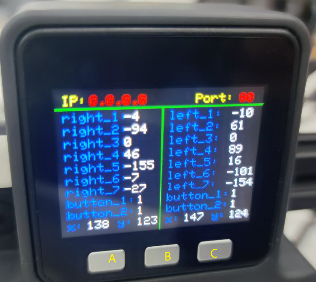

# MyController S570 控制X1程序案例

### 将外骨骼通过USB的方式连接上水星上，并保存以下脚本文件。
**注意：确保每个串口号对应的设备是正确的**

## 1.Python API使用说明

API（ApplicationProgrammingInterface），也称为应用程序编程接口函数，是预定义的函数。 使用以下功能接口时，请在开始时输入以下代码导入我们的API库，否则无法成功运行：


#### `get_all_data()`

- **功能：** 获取双臂数据

- **参数：** 无

- **返回值：** 角度参数和手部控制器浮点列表：

  ​	[[ 左臂J1, J2, J3, J4, J5, J6, J7, atom按钮，摇杆按钮，按钮1，按钮2，摇杆x, 摇杆y], 

  ​	[ 右臂J1, J2, J3,  J4,  J5,  J6,  J7,  atom按钮，摇杆按钮， 按钮1，按钮2，摇杆x, 摇杆y]]

  

#### `get_arm_data(arm)`

- **功能：** 获取单臂数据
- **参数：** 
  - `arm`：1左臂，2右臂
- **返回值：** 角度参数和手部控制器浮点列表：[ J1, J2, J3,  J4,  J5,  J6,  J7,   atom按钮，摇杆按钮，按钮1，按钮2，摇杆x, 摇杆y]


#### `get_joint_data(arm, arm_id)`

- **功能：** 获取单臂单关节数据
- **参数：** 
  - `arm`：1左臂，2右臂
  - `arm_id`：关节id，范围 int 1-7
- **返回值：** angle (int)


#### `set_zero(arm, arm_id)`

- **功能：** 将当前位置设置为关节零位
- **参数：** 
  - `arm`：1左臂，2右臂
  - `arm_id`：关节id，范围 int 1-7
- **返回值：** 无


#### `set_color(arm, red, green, blue)`

- **功能：** 设置atom屏幕颜色
- **参数：** 
  - `arm`：      1左臂，2右臂
  - `red` ：     范围 int 0-255
  - `green` ： 范围 int 0-255
  - `blue`：     范围 int 0-255
- **返回值：** 无


## 2.使用示例

操作教程：

先打开侧边开关再插入Type-C

  

打开wifi:

按下按键A，显示IP即可使用，wifi账号：elephant，wifi密码elephant

关闭wifi：按下按键C


打开蓝牙:

按下按键B，显示BT即可使用，蓝牙名称BLE

关闭蓝牙：按下按键C

  


###  2.1 串口通信

```python
# 例子
from exoskeleton_api import Exoskeleton

# 连接串口
obj = Exoskeleton(port="COM5")

# 获取双臂数据
all_data = obj.get_all_data()
print(all_data)

# 获取左臂数据
left_data = obj.get_arm_data(1)
print(left_data)

# 获取右臂数据
right_data = obj.get_arm_data(2)
print(right_data)

# 获取单臂单关节数据
joint_data = obj.get_joint_data(1, 1)
print(joint_data)

# 设置当前位置为右臂J7零点
obj.set_zero(2, 7)

# 设置左臂atom屏幕颜色
obj.set_color(1, 0, 255, 0)
```


###  2.2 socket通信

```python
# 例子
from exoskeleton_api import ExoskeletonSocket

# 连接服务端
obj = ExoskeletonSocket()

# 获取双臂数据
all_data = obj.get_all_data()
print(all_data)

# 获取左臂数据
left_data = obj.get_arm_data(1)
print(left_data)

# 获取右臂数据
right_data = obj.get_arm_data(2)
print(right_data)

# 获取单臂单关节数据
joint_data = obj.get_joint_data(1, 1)
print(joint_data)

# 设置当前位置为右臂J7零点
obj.set_zero(2, 7)

# 设置左臂atom屏幕颜色
obj.set_color(1, 0, 255, 0)
```


## 3.遥操控制机械臂案例

###  mercury X1(7轴)

双臂协同控制  pymycobot 库版本：3.5.0b66

```bash
# 数据处理的脚本文件 命名为：exoskeleton_api.py
import socket
import threading
import serial

lock = threading.Lock()


class Exoskeleton:
    def __init__(self, port):
        self.ser = serial.Serial(port=port, baudrate=1000000)

    def _parse_data(self, data):
        parsed_data = []
        for i in range(7):
            data_h = data[0 + i * 4: 2 + i * 4]
            data_l = data[2 + i * 4: 4 + i * 4]
            encode = int(data_h + data_l, 16)
            angle = 0 if encode == 2048 else (180 * (encode - 2048) / 2048 if encode > 2048 else -180 * (2048 - encode) / 2048)
            parsed_data.append(round(angle, 2))

        button = bin(int(data[28: 30], 16))[2:].rjust(4, "0")
        parsed_data.extend([int(button[-4]), int(button[-1]), int(button[-3]), int(button[-2]), int(data[30: 32], 16), int(data[32: 34], 16)])
        return parsed_data

    def _commmon(self, command_array):
        with lock:
            commmon_id = command_array[3]
            self.ser.write(command_array)
            start1 = self.ser.read().hex()
            if start1 != "fe" or self.ser.read().hex() != "fe":
                return None
            data_len = int(self.ser.read().hex(), 16)
            count = self.ser.in_waiting
            if data_len == count:
                data = self.ser.read(count).hex()
                if data[-2:] == "fa" and int(data[0: 2], 6) == commmon_id:
                    return data[2: -2]
        return None

    def get_all_data(self):
        get_all_array = [0xFE, 0xFE, 0x02, 0x01, 0xFA]
        data = self._commmon(get_all_array)
        if data is None:
            return None
        left_data = self._parse_data(data)
        right_data = self._parse_data(data[34:])
        return [left_data, right_data]

    def get_arm_data(self, arm):
        if arm not in [1, 2]:
            raise ValueError("error arm")

        send_array = [0xFE, 0xFE, 0x03, 0x02, arm, 0xFA]
        data = self._commmon(send_array)
        if data is None:
            return None
        return self._parse_data(data)

    def get_joint_data(self, arm, id):
        if arm not in [1, 2] or id < 1 or id > 7:
            raise ValueError("error arm or id")

        send_array = [0xFE, 0xFE, 0x04, 0x03, arm, id, 0xFA]
        data = self._commmon(send_array)
        if data is None:
            return None
        encode = int(data[0: 2] + data[2: 4], 16)
        angle = 0 if encode == 2048 else (180 * (encode - 2048) / 2048 if encode > 2048 else -180 * (2048 - encode) / 2048)
        return round(angle, 2)

    def set_zero(self, arm, id):
        if arm not in [1, 2] or id < 1 or id > 7:
            raise ValueError("error arm or id")

        send_array = [0xFE, 0xFE, 0x04, 0x04, arm, id, 0xFA]
        with lock:
            self.ser.write(bytearray(send_array))

    def set_color(self, arm, red, green, blue):
        if arm not in [1, 2]:
            raise ValueError("error arm")
        send_array = [0xFE, 0xFE, 0x06, 0x05, arm, red, green, blue, 0xFA]
        with lock:
            self.ser.write(bytearray(send_array))


class ExoskeletonSocket:
    def __init__(self, ip='192.168.4.1', port=80):
        self.client = socket.socket(socket.AF_INET, socket.SOCK_STREAM)
        self.client.connect((ip, port))

    def _commmon(self, command_array):
        with lock:
            commmon_id = command_array[3]
            self.client.sendall(bytearray(command_array))
            if self.client.recv(1).hex() != "fe" or self.client.recv(1).hex() != "fe":
                return None
            data_len = int(self.client.recv(1).hex(), 16) * 2
            data = self.client.recv(1024).hex()
            if len(data) == data_len and data[-2:] == "fa" and int(data[0: 2], 6) == commmon_id:
                return data[2: -2]
        return None

    def _parse_data(self, data):
        parsed_data = []
        for i in range(7):
            data_h = data[0 + i * 4: 2 + i * 4]
            data_l = data[2 + i * 4: 4 + i * 4]
            encode = int(data_h + data_l, 16)
            angle = 0 if encode == 2048 else (180 * (encode - 2048) / 2048 if encode > 2048 else -180 * (2048 - encode) / 2048)
            parsed_data.append(round(angle, 2))

        button = bin(int(data[28: 30], 16))[2:].rjust(4, "0")
        parsed_data.extend([int(button[-4]), int(button[-1]), int(button[-3]), int(button[-2]), int(data[30: 32], 16), int(data[32: 34], 16)])
        return parsed_data

    def get_all_data(self):
        get_all_array = [0xFE, 0xFE, 0x02, 0x01, 0xFA]
        data = self._commmon(get_all_array)
        if data is None:
            return None
        left_data = self._parse_data(data)
        right_data = self._parse_data(data[34:])
        return [left_data, right_data]

    def get_arm_data(self, arm):
        if arm not in [1, 2]:
            raise ValueError("error arm")

        send_array = [0xFE, 0xFE, 0x03, 0x02, arm, 0xFA]
        data = self._commmon(send_array)
        if data is None:
            return None
        return self._parse_data(data)

    def get_joint_data(self, arm, id):
        if arm not in [1, 2] or id < 1 or id > 7:
            raise ValueError("error arm or id")

        send_array = [0xFE, 0xFE, 0x04, 0x03, arm, id, 0xFA]
        data = self._commmon(send_array)
        if data is None:
            return None
        encode = int(data[0: 2] + data[2: 4], 16)
        angle = 0 if encode == 2048 else (180 * (encode - 2048) / 2048 if encode > 2048 else -180 * (2048 - encode) / 2048)
        return round(angle, 2)

    def set_zero(self, arm, id):
        if arm not in [1, 2] or id < 1 or id > 7:
            raise ValueError("error arm or id")

        send_array = [0xFE, 0xFE, 0x04, 0x04, arm, id, 0xFA]
        with lock:
            self.client.sendall(bytearray(send_array))

    def set_color(self, arm, red, green, blue):
        if arm not in [1, 2]:
            raise ValueError("error arm")
        send_array = [0xFE, 0xFE, 0x06, 0x05, arm, red, green, blue, 0xFA]
        with lock:
            self.client.sendall(bytearray(send_array))


```

```bash
# 本文件为控制文件，命名为：MercuryControl.py
import threading
from pymycobot import Mercury
from exoskeleton_api import Exoskeleton

obj = Exoskeleton(port="/dev/ttyACM4")
ml = Mercury("/dev/left_arm")
mr = Mercury("/dev/right_arm")

ml.set_vr_mode(1)
mr.set_vr_mode(1)
# 设置双臂为速度融合模式
ml.set_movement_type(2)
mr.set_movement_type(2)
# 设置夹爪运行模式
ml.set_gripper_mode(0)
mr.set_gripper_mode(0)


# 1 左臂，2 右臂
def control_arm(arm):
    while True:
        if arm == 1:
            arm_data = obj.get_arm_data(1)
            print("l: ", arm_data)
            mc = ml
        elif arm == 2:
            arm_data = obj.get_arm_data(2)
            print("r: ", arm_data)
            mc = mr
        else:
            raise ValueError("error arm")
        # 由于外骨骼各关节转向、零点与部分机械臂构型不同，在此设置映射关系(根据各关节实际控制转向、位置设置)
        mercury_list = [
            arm_data[0], -arm_data[1], arm_data[2], -arm_data[3], arm_data[4],
            135 + arm_data[5], arm_data[6]
        ]
        if arm_data[9] == 0:
            mc.set_gripper_state(1, 100)
        elif arm_data[10] == 0:
            mc.set_gripper_state(0, 100)
        mc.send_angles(mercury_list, 6)


# 左臂
threading.Thread(target=control_arm, args=(1, )).start()
# 右臂
threading.Thread(target=control_arm, args=(2, )).start()
```

#### 注意：要将这两个文件放在同一路径下

### 程序成功运行之后即可用外骨骼控制水星X1
<video src="../../resources/7-SuccessfulCases/s570.mp4" controls="controls" width="800" height="500"></video>


## 外骨骼控制水星X1具体案例

### 案例一：外骨骼控制水星X1+三指灵巧手进行电钻打孔

源码
```python
# 本文件为控制文件，命名为：MercuryControl.py
import threading
from pymycobot import Mercury
import time
from exoskeleton_api import Exoskeleton, ExoskeletonSocket
import os

os.system("sudo chmod 777 /dev/ttyACM*")

obj = Exoskeleton(port="/dev/ttyACM4")

ml = Mercury("/dev/left_arm")
mr = Mercury("/dev/right_arm")

l_control_mode = 1
r_control_mode = 1

l_last_mode = 0
r_last_mode = 0

# 设置双臂为速度融合模式
ml.set_movement_type(3)
mr.set_movement_type(3)
# 设置VR模式
ml.set_vr_mode(1)
mr.set_vr_mode(1)

ml.set_hand_gripper_angle(14, 4, 90)
ml.set_hand_gripper_angle(14, 5, 20)
ml.set_hand_gripper_angle(14, 6, 30)
ml.set_hand_gripper_angle(14, 1, 50)
ml.set_hand_gripper_angle(14, 3, 90)


def jointlimit(angles):
    max = [165, 120, 175, 0, 175, 180, 175]
    min = [-165, -50, -175, -175, -175, 60, -175]
    for i in range(7):
        if angles[i] > max[i]:
            angles[i] = max[i]
        if angles[i] < min[i]:
            angles[i] = min[i]


def gripper_control_open_2(mc):
    mc.set_hand_gripper_angle(14, 2, 0)


def gripper_control_close_2(mc):
    mc.set_hand_gripper_angle(14, 2, 90)


# 1 左臂，2 右臂
def control_arm(arm):
    global l_control_mode, l_last_mode, r_control_mode, r_last_mode
    st = 0
    while True:
        try:
            if arm == 1:
                arm_data = obj.get_arm_data(1)
                print("l: ", arm_data)
                mc = ml
            elif arm == 2:
                arm_data = obj.get_arm_data(2)
                print("r: ", arm_data)
                mc = mr
            else:
                raise ValueError("error arm")
            time_err = 1000 * (time.time() - st)
            st = time.time()
            if arm == 1:
                mercury_list = [
                    arm_data[0] - 10, -arm_data[1], arm_data[2], -arm_data[3], 105, 38, 0
                ]
                jointlimit(mercury_list)
                if arm_data[7] == 0 and l_last_mode == 0:
                    print(6)
                    l_last_mode = 1
                    l_control_mode += 1
                    if l_control_mode > 3:
                        l_control_mode = 1

                    if l_control_mode == 1:
                        obj.set_color(arm, 0, 255, 0)
                    elif l_control_mode == 2:
                        obj.set_color(arm, 0, 0, 255)
                    else:
                        obj.set_color(arm, 255, 0, 0)

                if arm_data[7] == 1:
                    l_last_mode = 0

                if l_control_mode == 1:
                    TI = 10
                elif l_control_mode == 2:
                    TI = 5
                else:
                    TI = 3
                if arm_data[9] == 0:
                    threading.Thread(target=gripper_control_close_2, args=(mc,)).start()

                elif arm_data[10] == 0:
                    threading.Thread(target=gripper_control_open_2, args=(mc,)).start()
                if arm_data[9] == 0 and arm_data[10] == 0:
                    time.sleep(0.01)
                    continue

            else:  # 右臂
                mercury_list = [
                    arm_data[0], -arm_data[1], -0.524, -41.862, -90.686, 101.273, 25.257
                ]
                jointlimit(mercury_list)
                if arm_data[7] == 0 and r_last_mode == 0:
                    print(6)
                    r_last_mode = 1
                    r_control_mode += 1
                    if r_control_mode > 3:
                        r_control_mode = 1
                    if r_control_mode == 1:
                        obj.set_color(arm, 0, 255, 0)
                    elif r_control_mode == 2:
                        obj.set_color(arm, 0, 0, 255)
                    else:
                        obj.set_color(arm, 255, 0, 0)

                if arm_data[7] == 1:
                    r_last_mode = 0
                if r_control_mode == 1:
                    TI = 10
                elif r_control_mode == 2:
                    TI = 5
                else:
                    TI = 3

            mc.send_angles(mercury_list, TI, _async=True)
            time.sleep(0.01)

        except Exception as e:
            print(e)
            pass


# 左臂
threading.Thread(target=control_arm, args=(1,)).start()
# 右臂
threading.Thread(target=control_arm, args=(2,)).start()

```
案例视频
<video src="../../resources/7-SuccessfulCases/0214.mp4" controls="controls" width="800" height="500"></video>

### 案例二：外骨骼控制水星X1+力控夹爪
源码
```python
import threading
from pymycobot import Mercury
import time
from exoskeleton_api import Exoskeleton, ExoskeletonSocket
import os

os.system("sudo chmod 777 /dev/ttyACM*")

obj = Exoskeleton(port="/dev/ttyACM4")

ml = Mercury("/dev/left_arm")
mr = Mercury("/dev/right_arm")

l_control_mode = 1
r_control_mode = 1

l_last_mode = 0
r_last_mode = 0

# 设置双臂为速度融合模式
ml.set_movement_type(3)
mr.set_movement_type(3)
# 设置VR模式
ml.set_vr_mode(1)
mr.set_vr_mode(1)


def jointlimit(angles):
    max = [165, 120, 175, 0, 175, 180, 175]
    min = [-165, -50, -175, -175, -175, 60, -175]
    for i in range(7):
        if angles[i] > max[i]:
            angles[i] = max[i]
        if angles[i] < min[i]:
            angles[i] = min[i]


def gripper_control_open(mc):
    mc.set_pro_gripper_angle(14, 80)


def gripper_control_close(mc):
    mc.set_pro_gripper_angle(14, 0)


# 1 左臂，2 右臂
def control_arm(arm):
    global l_control_mode, l_last_mode, r_control_mode, r_last_mode
    st = 0
    while True:
        try:
            if arm == 1:
                arm_data = obj.get_arm_data(1)
                print("l: ", arm_data)
                mc = ml
            elif arm == 2:
                arm_data = obj.get_arm_data(2)
                print("r: ", arm_data)
                mc = mr
            else:
                raise ValueError("error arm")
            mercury_list = [
                arm_data[0], -arm_data[1], arm_data[2], -arm_data[3], arm_data[4],
                135 + arm_data[5], arm_data[6] - 30
            ]
            jointlimit(mercury_list)
            time_err = 1000 * (time.time() - st)
            st = time.time()
            if arm == 1:
                if arm_data[7] == 0 and l_last_mode == 0:
                    print(6)
                    l_last_mode = 1
                    l_control_mode += 1
                    if l_control_mode > 3:
                        l_control_mode = 1

                    if l_control_mode == 1:
                        obj.set_color(arm, 0, 255, 0)
                    elif l_control_mode == 2:
                        obj.set_color(arm, 0, 0, 255)
                    else:
                        obj.set_color(arm, 255, 0, 0)

                if arm_data[7] == 1:
                    l_last_mode = 0

                if l_control_mode == 1:
                    TI = 10
                elif l_control_mode == 2:
                    TI = 5
                else:
                    TI = 3
            else:  # 右臂
                if arm_data[7] == 0 and r_last_mode == 0:
                    print(6)
                    r_last_mode = 1
                    r_control_mode += 1
                    if r_control_mode > 3:
                        r_control_mode = 1
                    if r_control_mode == 1:
                        obj.set_color(arm, 0, 255, 0)
                    elif r_control_mode == 2:
                        obj.set_color(arm, 0, 0, 255)
                    else:
                        obj.set_color(arm, 255, 0, 0)

                if arm_data[7] == 1:
                    r_last_mode = 0
                if r_control_mode == 1:
                    TI = 10
                elif r_control_mode == 2:
                    TI = 5
                else:
                    TI = 3

                if arm_data[9] == 0:
                    threading.Thread(target=gripper_control_close, args=(mc,)).start()

                elif arm_data[10] == 0:
                    threading.Thread(target=gripper_control_open, args=(mc,)).start()

                if arm_data[9] == 0 and arm_data[10] == 0:
                    time.sleep(0.01)
                    continue

            mc.send_angles(mercury_list, TI, _async=True)
            time.sleep(0.01)

        except Exception as e:
            print(e)
            pass


# 左臂
threading.Thread(target=control_arm, args=(1,)).start()
# 右臂
threading.Thread(target=control_arm, args=(2,)).start()
```


---


---