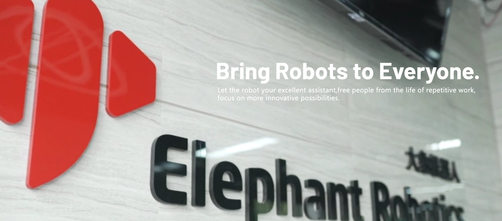
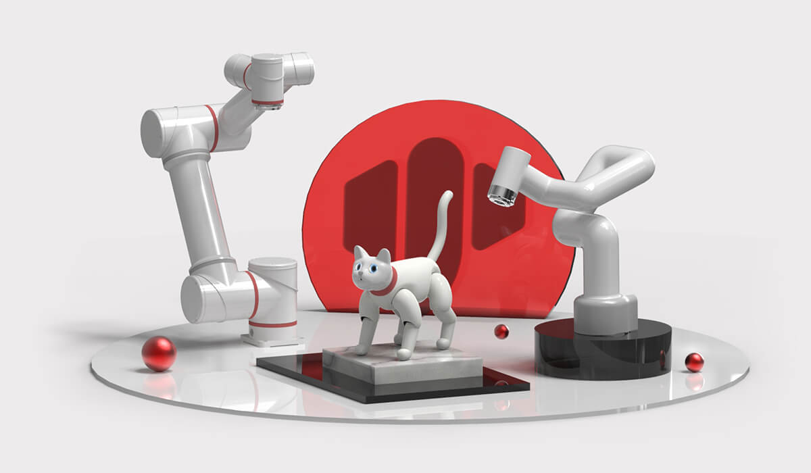

# Elephant Robotics

## 1. Company Introduction

Elephant Robotics, based in Shenzhen, China, is a high-tech enterprise focused on robotics R&D, design, and automation solutions.

We are committed to providing flexible collaborative robots, easy-to-learn operating systems, and intelligent automation solutions for robotic education and research institutions, commercial scenarios, and industrial production. Our product quality and smart solutions are highly recognized and praised by world-renowned Fortune 500 companies in countries like South Korea, Japan, the United States, Germany, Italy, and Greece.

Elephant Robotics adheres to the vision of "Enjoy Robots World," advocating for human-robot collaboration. Our goal is to make robots an excellent assistant to human work and life, helping people break free from simple, repetitive, and tedious tasks, fully leveraging the advantages of human-robot collaboration, thereby improving work efficiency and helping create a better life for humanity.

In the future, Elephant Robotics hopes to drive the development of the robotics industry through next-generation cutting-edge technology, working hand in hand with partners to usher in a new era of automation and intelligence.

---

## 2. Development History

  - 2016.08 ----- Elephant Robotics Co., Ltd. was officially established
  - 2016.08 ----- Entered HAX incubator, received SOSV seed funding
  - 2016.08 ----- Started developing Elephant S industrial collaborative robots
  - 2017.01 ----- Ranked among the "Top 10 Most Innovative Companies in China at CES"
  - 2017.04 ----- Attended Hannover Industrial Expo and Korea Automation Exhibition
  - 2017.07 ----- Two founders were selected for Forbes Asia's "30 Under 30"
  - 2017.10 ----- Released the fifth-generation single-arm industrial collaborative robot, Elephant S
  - 2018.04 ----- Received angel round investment from Yun Tian Shi Fund
  - 2018.06 ----- Made its first public appearance at the 2018 Hannover World Industrial Expo
  - 2018.06 ----- Awarded the "Smart Manufacturing Entrepreneur MBA Award" from Cheung Kong Graduate School of Business
  - 2018.06 ----- Awarded the "Entrepreneur Accelerator X-elerator Award" from Tsinghua University School of Economics and Management
  - 2018.11 ----- Ranked second in the Shenzhen division of the Asian Smart Hardware Competition
  - 2018.11 ----- Won the "Most Investment-Worthy Enterprise Award" at the Gaogong Golden Globe Awards
  - 2019.03 ----- Won the "Leading Talent Award" at the Gaogong Golden Globe Awards
  - 2019.04 ----- Catbot won the "Industrial Robot Innovation Award" in March 2019
  - 2019.09 ----- Attended Huawei European Ecosystem Conference (HCE), officially becoming a Huawei ecosystem partner
  - 2019.11 ----- Elephant Robotics and Harbin Institute of Technology attended IROS International Symposium on Intelligent Robots and Systems
  - 2019.12 ----- Officially opened the "Smart Robotics Joint Development Lab" with South China University of Technology
  - 2019.12 ----- Won the "Innovative Technology Award" at Gaogong in 2019
  - 2019.12 ----- Won the "Top 10 Rapidly Growing Enterprises" Award at Gaogong in 2019
  - 2019.12 ----- Won the "Rising Star Enterprise Award" in the industrial robot sector at Shenzhen Equipment Industry
  - 2019.12 ----- Released the world's first bionic robotic cat, MarsCat
  - 2020.05 ----- Founder received the "Rising Star of Shenzhen Robotics 2019" Award
  - 2020.10 ----- Released the world's lightest and smallest six-axis collaborative robot, myCobot
  - 2021.03 ----- Released the smallest collaborative robot for scientific research, myCobotPro 320
  - 2021.05 ----- MarsCat received extensive media coverage, including from Xinhua Finance, China Daily, Nanjing Daily, and Harbin Daily
  - 2021.07 ----- Released the smallest composite robot chassis – myAGV mobile robot
  - 2021.09 ----- Released the world’s first fully enclosed four-axis robotic arm – myPalletizer

## 3. Relevant Links  

#### Purchase Links
  - Taobao: https://shop504055678.taobao.com
  - Shopify: https://shop.elephantrobotics.com/
  - AliExpress: https://elephantrobotics.aliexpress.com/store/1101941423

#### Other Information
- Official Website: https://www.elephantrobotics.com
- Videos
  - Bilibili: https://space.bilibili.com/2126215657
  - YouTube: https://www.youtube.com/c/Elephantrobotics
- Facebook: https://www.facebook.com/mycobotcreator/
- LinkedIn: https://www.linkedin.com/company/18319865
- X (Twitter): https://twitter.com/CobotMy
- Discord: https://discord.gg/2MAherp7nt
- Hackster: https://www.hackster.io/elephant-robotics

## 4. Contact Us
---

> Our working hours are Monday to Friday, 10:00 AM to 6:00 PM (Beijing Time).

  - If you have any other questions, please contact us through the following methods:  
[E-mail](support@elephantrobotics.com) :

<pre>
<code class="copyable">
support@elephantrobotics.com
</code>
</pre>
  - If you have purchase intentions or any questions about parameters, please email us at:  
[E-mail](sales@elephantrobotics.com) :

<pre>
<code class="copyable">
sales@elephantrobotics.com
</code>
</pre>

  - If the listed problems don't resolve your issue, and you have additional after-sales questions, please email us at this address:  
[E-mail](support@elephantrobotics.com) :

<pre>
<code class="copyable">
support@elephantrobotics.com
</code>
</pre>

We will respond within 1-2 working days.

**WeChat**:  
We provide one-on-one service only to users who purchase MyCOntroller S570 series products via WeChat.

---

[← Previous Chapter](../4-FunctionsAndApplications/7-SuccessfulCases/7-SuccessfulCases.md) | [Next Chapter →](../6-Acknowledgments/6-Acknowledgments.md)
